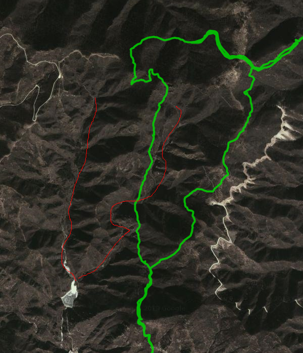
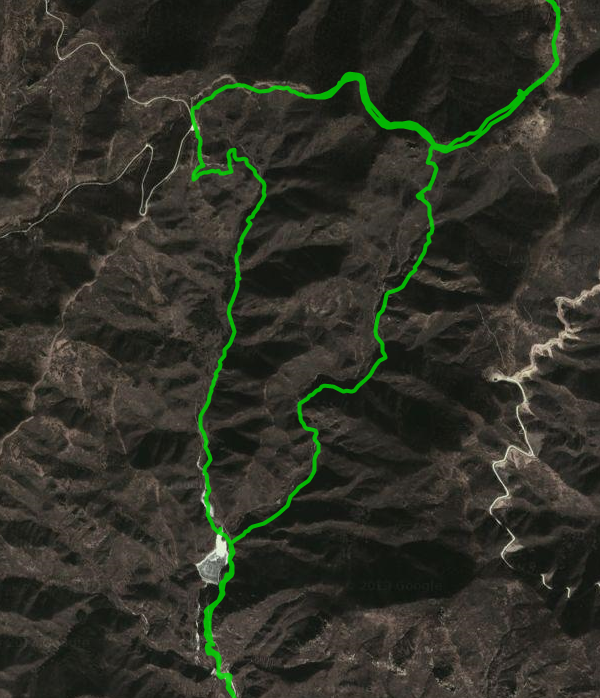

# 将Codoon的路径记录导出成GPX路径 #

新浪微博网友 @better_man__ 问道能不能将 Codoon 记录的轨迹文件导出为 GPX 或 TCX 文件，以方便与Garmin、Nike+ Fuelband进行轨迹交换。试了一下，能够完成。过程如下。

## GPX 和 TCX 文件 ##

以下内容转自维基百科。

[GPX](http://zh.wikipedia.org/wiki/GPX)（GPS eXchange Format, GPS交换格式)是一个XML格式,为应用软件设计的通用GPS数据格式。它可以用来描述路点、轨迹、路程。这个格式是免费的，可以在不需要付任何许可费用的前提下使用。它的标签保存位置，海拔和时间，可以用来在不同的GPS设备和软件之间交换数据。TCX, Garmin Training Center XML，功能类此。GARMIN 的 GPS 手表能够使用这两种格式的文件。

这两种格式之间已经有很多互相转换的工具。

## 实现说明 ##

在 GPX 中，一个没有顺序关系的点集合，叫路点。一个有顺序的点的集合叫轨迹或者路程。轨迹是一个人曾经走过的记录，路程是一个建议的下一步要走的地方。所以，一般来讲，轨迹里的点，包含时间信息，路程里的点，没有时间信息。

下面的代码实现的是将 Codoon 的轨迹数据，转换成 GPX 路径文件。

### 获取Codoon轨迹数据 ###

利用以前实现的咕咚 Codoon 运动的 API,能够获得某次用户运动的GPS轨迹。对应API详细说明参见 [获取咕咚运动移动应用中的数据——非官方API](how-to-fetch-codoon-data-unofficial-api_all.md)

**参考代码：**

	account = { "email" : "your@email" , "passwd" : "yourpassword" }

    imei = "000000000000000"

    device = DeviceCodoon ()

	# login
    device.get_users_login(account["email"], account["passwd"])

	# 获得用户的运动历史列表	
    routes = device.get_route_log( productId = imei )
	for r in routes["data"]:
    	routeId = r["route_id"]
    	print routeId

	# 获得特定某次的运动轨迹
	routeId = "03e1cd1e-07b1-11e3-b50f-00163e020001"
    route = device.get_single_log( routeId = routeId )
    device.saveJsonData( filename = "/single_log_20130817.json" , data = route)

取得的运动轨迹数据可以参考示例文件： [single_log_20130817.json](single_log_20130817.json)。这个轨迹是跟着绿野去长峪城腐败的轨迹。：D，摆两张照片放放毒。

### GPX文件输出 ###

Python 中有直接写 GPX 格式文件的包： [gpxpy](https://github.com/tkrajina/gpxpy) 。 用来创建 GPX 文件非常容易。函数中的参数 route 是 get\_single\_log 的结果。不过在使用中，如果将时间数据写入 GPX 文件时，gpxpy有个小Bug，需要对时间格式处理的部分做个小调整。

	import gpxpy
	import gpxpy.gpx

	DATE_FORMAT = '%Y-%m-%dT%H:%M:%S'

    def trans(route ):
        points = route["data"]["points"]

		# 创建 GPX 文件
        gpx = gpxpy.gpx.GPX()
        # Create first track in our GPX:
        gpx_route = gpxpy.gpx.GPXRoute()

        i = 1
        for p in points:
            tmpname = "#%5d" % i
            tmptime = strptime( p["time_stamp"] , DATE_FORMAT )
            lat = float(p["latitude"])
            lon = float(p["longitude"])
			
			# Create points
            gpx_point = gpxpy.gpx.GPXRoutePoint( name = tmpname , longitude = lon , latitude = lat ,
                elevation = p["elevation"] , time = tmptime )
            # print gpx_point
            gpx_route.points.append( gpx_point )
            i = i + 1

        gpx.routes.append(gpx_route)

        # print 'Created GPX:', gpx.to_xml()
        return gpx.to_xml()

gpxpy Bug 修正， gpx.py 文件

	class GPXRoutePoint(mod_geo.Location):
	    ...
	
	    def to_xml(self, version=None):
	        content = ''
	        if self.elevation is not None:
	            content += mod_utils.to_xml('ele', content=self.elevation)
	        if self.time:
				# 需要修改的时间格式化部分
	            # content += mod_utils.to_xml('time', content=self.time.strftime(DATE_FORMAT))
				content += mod_utils.to_xml('time', content=strftime(DATE_FORMAT , self.time))
			...

	class GPXTrackPoint(mod_geo.Location):
	    ...
	
	    def to_xml(self, version=None):
	        content = ''
	
	        if self.elevation is not None:
	            content += mod_utils.to_xml('ele', content=self.elevation)
	        if self.time:
	            # 需要修改的时间格式化部分
	            # content += mod_utils.to_xml('time', content=self.time.strftime(DATE_FORMAT))
				content += mod_utils.to_xml('time', content=strftime(DATE_FORMAT , self.time))

			...

所生成的数据文件参见： [single_log_20130817_shift.gpx](single_log_20130817_shift.gpx)。采用 [GPXEditor](http://sourceforge.net/projects/gpxeditor/) 显示所生成的文件，发现直接输出的GPX文件在地图上有比较大的漂移，如下图所示，其中红线为真实路径的大致所在：

 

### 漂移修正 ###

漂移修正首先需要有与经纬度相对应的offset文件，从 Codoon 的 APK 包中能够找到这个文件： [city\_offset\_txt.txt](city_offset_txt.txt)

在代码中增加读取漂移信息、以及根据起始点计算所需增加的漂移修正的代码即可。代码修正为以下内容：

	DATE_FORMAT = '%Y-%m-%dT%H:%M:%S'
	CITY_OFFSET = "city_offset_txt.txt"
	
	class CodoonRoute2Gpx:
	    offsetList = []
	
	    # 加载漂移数据文件
	    def loadCityOffset(self ):
	        fn = CITY_OFFSET
	        for line in fileinput.FileInput(fn):
	            cityInfo = line[:-1].split(";")
	
	            city = cityInfo[0].split(",")
	            offset = cityInfo[1].split(",")
	            self.offsetList.append( (city , offset) )
	            # print self.offsetList
	
	    # 计算与此点最近的偏移数据
	    def justifyCityOffset(self , lat ,lon):
	        if len( self.offsetList ) == 0 :
	            self.loadCityOffset()
	
	        nearest = 180 ** 2 + 180 ** 2
	
	        realoffset = None
	        for c in self.offsetList:
	            distance = (float(c[0][0]) - lat) ** 2 + (float(c[0][1]) - lon) ** 2
	            if distance < nearest :
	                nearest = distance
	                realoffset = c
	
	        return realoffset[1]
	
	    def trans(self , route ):
			points = route["data"]["points"]
	
	        # 利用GPS起始点，计算在地图上的漂移
	        lat = points[0]["latitude"]
	        lon = points[0]["longitude"]
	
	        realoffset = self.justifyCityOffset( float(lat) ,float(lon) )
	        print realoffset
	
			# 创建 GPX 文件
	        gpx = gpxpy.gpx.GPX()
	        # Create first track in our GPX:
	        gpx_route = gpxpy.gpx.GPXRoute()
	
	
	        i = 1
	        for p in points:
	            tmpname = "#%5d" % i
	            tmptime = strptime( p["time_stamp"] , DATE_FORMAT )
				# 漂移修正
	            lat = float(p["latitude"]) + float(realoffset[0])
	            lon = float(p["longitude"]) + float(realoffset[1])
				
				# Create points
	            gpx_point = gpxpy.gpx.GPXRoutePoint( name = tmpname , longitude = lon , latitude = lat ,
	                elevation = p["elevation"] , time = tmptime )
	            # print gpx_point
	            gpx_route.points.append( gpx_point )
	            i = i + 1
	
	        gpx.routes.append(gpx_route)
	
	        # print 'Created GPX:', gpx.to_xml()
	        return gpx.to_xml()

所生成的数据文件参见： [single_log_20130817.gpx](single_log_20130817.gpx)。采用 GPXEditor 显示所生成的文件，漂移已基本修正了：

### 调用 ###

	account = { "email" : "your@email" , "passwd" : "yourpassword" }

    imei = "000000000000000"

    device = DeviceCodoon ()

	# login
    device.get_users_login(account["email"], account["passwd"])

    # Trans Codoon GPS Data to GPX format
    routeId = "03e1cd1e-07b1-11e3-b50f-00163e020001"

    trans = CodoonRoute2Gpx()
    trans.loadCityOffset()

    route = device.get_single_log( routeId = routeId )
    device.saveJsonData( filename = "/single_log_20130817.json" , data = route)

    gtx = trans.trans( route = route )
    device.saveXmlData( filename = "/single_log_20130817.gpx" , data = gtx)

---
## 代码地址 ##

[https://github.com/iascchen/VisHealth/](https://github.com/iascchen/VisHealth/)

源代码在 device/codoon.py 中。

---

玩的开心！

---

Author : iascchen(at)gmail(dot)com

Date : 2013-09-06

新浪微博 : [@问天鼓](http://www.weibo.com/iascchen)

---