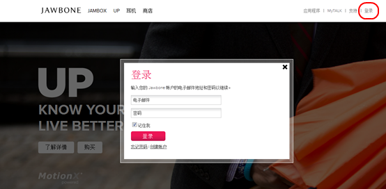
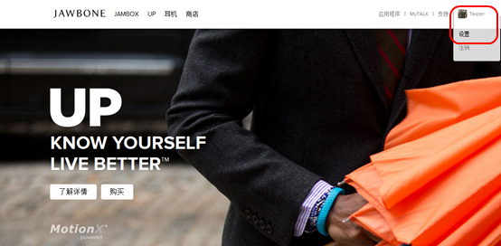
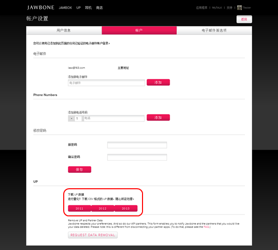
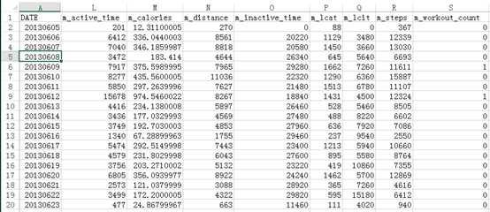

# 获取Jawbone UP中的个人数据（一）官方下载 #

---

Author : iascchen (at) gmail(dot)com

Date : 2013-06-1

新浪微博 : [@问天鼓](http://www.weibo.com/iascchen)

---

从Jawbone网站上，能够下载个人数据。这个数据能够满足我们以天为单位，对个人的饮食、运动、睡眠进行统计的需要。

## 操作步骤 ##

1. 打开[Jawbone.com](https://jawbone.com/ "jawbone.com")网站，登陆。

2. 选择屏幕右上角的用户名，选择“设置”菜单。

3. 进入“账户”标签，在屏幕下端的“下载UP数据”区域，点击对应年份，下载数据。

## 数据说明 ##

例如，下载2013年数据得到具有如下格式的csv文件。这个文件中包括以日为颗粒度的汇总数据。

具体数据项如下：

- 日期：
    *DATE*
- 饮食：
    *e\_calcium, e\_calories, e\_carbs, e\_cholesterol, e\_fiber, e\_protein, e\_sat_fat, e\_sodium, e\_sugar, e\_unsat\_fat*
- 运动：
    *m\_active\_time, m\_calories, m\_distance, m\_inactive\_time, m\_lcat, m\_lcit, m\_steps, m\_workout\_count, m\_workout\_time*
- 小憩：
    *n\_asleep\_time, n\_awake, n\_awake_time, n\_awakenings, n\_bedtime, n\_deep, n\_duration, n\_light, n\_quality*
- 睡眠：
    *s\_asleep\_time, s\_awake, s\_awake\_time, s\_awakenings, s\_bedtime, s\_deep, s\_duration, s\_light, s\_quality*
- 其他：
    *o\_count, o\_mood*
