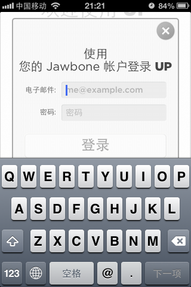

# 获取Jawbone UP中的个人数据（二）非官方API #

# 1. 概述和登陆 #

## 客户端请求基本说明 ##

典型的 Jawbone UP 客户端请求形式如下，其中形如 **v.1.34** 的版本部分用于指明所需的Server端服务版本号，此信息可以省略：

	https://jawbone.com/nudge/api/...
	https://jawbone.com/nudge/api/v.1.34/...

在进行其他访问之前，必须先登录。正确登录之后，只需在每次请求的HTTP中，将认证时的所获得Token值设置到 HTTP Header：**x-nudge-token** 里，即可保持会话。

    x-nudge-token ： 1BkkscbY2RvUUQXF9TewzzDEEuGrKl7nJIuimAfcp8E

## 用户登录 ##

Eric Blue 提到的登录方式 "**user/signin/login**" 方法仍然可用。不过在新的UP客户端版本中，还能够通过 “**users/login**” API进行登陆。

### 利用 user/signin/login 登陆 ###

**Request：**

	POST	
	https://jawbone.com/nudge/api/user/signin/login

**Params：**
	
	'email': email, 
	'pwd':  password, 
	'service': 'nudge'

**Return :**

Token 值为 JSON 内容中最下端的 `"token" : "un_ZHV8Uiq1pyJCPnqCljjDEEuGrKl7nURWQYUScC6E"` 

用户 XID 值取 `"user"."xid” : "RGaCBFg9CsDYVvm2kchbcw"` ：

完整JSON示例如下：
	
	{
	    "newly": false, 
	    "user": {
	        "last_name": "VisHealth", 
	        "uid": 37291881, 
	        "image": "user/image/i/51b4916b03eb185d1c1948a5_RGaCBFg9CsDYVvm2kchbcw_137078820345_2781804_photo.jpeg", 
	        "time_removed": 0, 
	        "basic_info": {
	            "weight": 56.2, 
	            "dob": "1976-06-09", 
	            "gender": "female", 
	            "metric": 1, 
	            "height": 1.58, 
	            "locale": "zh-cn"
	        }, 
	        "share_move": true, 
	        "birth_day": "09", 
	        "text_1": "", 
	        "first_name": "Tester", 
	        "xid": "RGaCBFg9CsDYVvm2kchbcw", 
	        "smart_alarm": {
	            "stopTimeMinsPastMidnight": 390, 
	            "dayMask": 62, 
	            "enable": true, 
	            "startTimeMinsPastMidnight": 370
	        }, 
	        "apps": [
	            {
	                "xid": "bVvQvURXOKc", 
	                "share": true
	            }, 
	            {
	                "xid": "__3Ao7ntG68", 
	                "share": true
	            }
	        ], 
	        "share_eat": false, 
	        "birth_month": "06", 
	        "type": 0, 
	        "email": "iasc@163.com", 
	        "birth_year": "1976", 
	        "band_name": "iasc's jawbone up", 
	        "up_goals": {
	            "move": {
	                "steps": 10000, 
	                "workout_time": null
	            }, 
	            "sleep": {
	                "total": 27000, 
	                "bedtime": null, 
	                "deep": null
	            }, 
	            "meals": {
	                "carbs": null, 
	                "fiber": null, 
	                "sodium": null, 
	                "sugar": null, 
	                "calcium": null, 
	                "unsat_fat": null, 
	                "cholesterol": null, 
	                "protein": null, 
	                "sat_fat": null
	            }
	        }, 
	        "first": "Tester", 
	        "share_mood": true, 
	        "primary_address": {
	            "city": "", 
	            "xid": "P9Q5vjiI-M0", 
	            "country": "CN", 
	            "zipcode": "", 
	            "state": "", 
	            "street_1": "", 
	            "street_2": ""
	        }, 
	        "share_sleep": false, 
	        "power_nap": {
	            "use_optimal_duration": 0, 
	            "custom_duration": 2400, 
	            "maximum_duration": 3600
	        }, 
	        "active_alert": {
	            "stopTimeMinsPastMidnight": 1020, 
	            "threshold": 0, 
	            "durationMins": 60, 
	            "type": 1, 
	            "startTimeMinsPastMidnight": 480
	        }, 
	        "last": "VisHealth", 
	        "name": "Tester VisHealth", 
	        "gender": "female", 
	        "profile_privacy": "friends", 
	        "data_2": 0, 
	        "data_1": 0, 
	        "flags": 1, 
	        "time_created": 1370439133, 
	        "mail_opts": {
	            "mail_opt_in_new_products": null, 
	            "mail_opt_in": null, 
	            "mail_opt_in_products_owned_updates": null, 
	            "mail_opt_in_customer_surveys": null, 
	            "mail_opt_in_deals_n_promotions": null
	        }, 
	        "goals": {
	            "move": 3500, 
	            "sleep": 21600, 
	            "eat": 2
	        }
	    }, 
	    "token": "un_ZHV8Uiq1pyJCPnqCljjDEEuGrKl7nURWQYUScC6E", 
	    "rc": 0
	}	

### 利用 users/login 登陆 ###

**users/login** 是目前Jawbone UP客户端采用的登录方式，由于其将用户密码进行 SHA-1 之后再传递，所以更加安全。

**Request：**

	POST
	https://jawbone.com/nudge/api/users/login

**Params：**
	
    'email' : email,
	'hash_pwd' : hash #将 password 进行 SHA-1 之后，再转换成 HEX 格式

**Return :** 

Token 值为 JSON 内容中的 `"data"."session_uid" : "1BkkscbY2RvUUQXF9TewzzDEEuGrKl7nJIuimAfcp8E"` 

用户 XID 值为 `"data"."user"."xid" : "RGaCBFg9CsDYVvm2kchbcw"`：

完整JSON示例如下：

	{
	    "meta": {
	        "message": "OK", 
	        "code": 200, 
	        "time": 1371960908
	    }, 
	    "data": {
	        "session_uid": "1BkkscbY2RvUUQXF9TewzzDEEuGrKl7nJIuimAfcp8E", 
	        "config": {
	            "i18n": null, 
	            "configuration": {
	                "twitter_character_count": 24, 
	                "system_message": ""
	            }, 
	            "features": {
	                "up_food_gallery": [
	                    "off", 
	                    null
	                ], 
	                "up_twitter_share": [
	                    "on", 
	                    null
	                ], 
	                "up_fooditem_search_typeahead": [
	                    "on", 
	                    null
	                ], 
	                "up_app_gallery": [
	                    "off", 
	                    null
	                ], 
	                "up_addressbook_import": [
	                    "on", 
	                    null
	                ], 
	                "up_daily_dashboards": [
	                    "off", 
	                    null
	                ], 
	                "up_search": [
	                    "on", 
	                    null
	                ], 
	                "up_fb_share": [
	                    "on", 
	                    null
	                ], 
	                "system": [
	                    "on", 
	                    null
	                ], 
	                "up_cheers": [
	                    "off", 
	                    null
	                ], 
	                "barcode_search": [
	                    "on", 
	                    null
	                ], 
	                "up_twitter_import": [
	                    "on", 
	                    null
	                ], 
	                "up_twitter_friend_suggestions": [
	                    "on", 
	                    null
	                ], 
	                "up_fb_import": [
	                    "on", 
	                    null
	                ], 
	                "up_slideshow": [
	                    "on", 
	                    {}
	                ], 
	                "up_fb_friend_suggestions": [
	                    "on", 
	                    null
	                ]
	            }
	        }, 
	        "user": {
	            "xid": "RGaCBFg9CsDYVvm2kchbcw", 
	            "name": "Tester VisHealth", 
	            "short_name": "Tester", 
	            "image": "user/image/i/51b4916b03eb185d1c1948a5_RGaCBFg9CsDYVvm2kchbcw_137078820345_2781804_photo.jpeg", 
	            "has_settings": true, 
	            "last": "VisHealth", 
	            "type": "user", 
	            "first": "Tester"
	        }
	    }
	}

---
[返回](how-to-fetch-jawbone-data-unofficial-api.md)