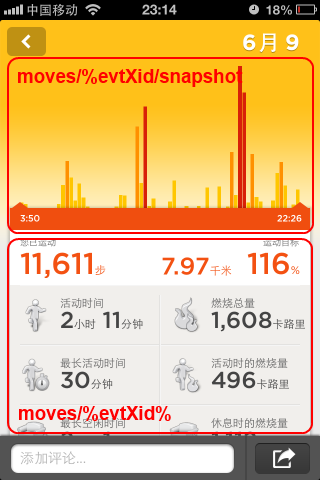

# 获取Jawbone UP中的个人数据（二）非官方API #

# 4. 运动情况细节——Moves #

在 Jawbone UP 的数据中， Move 指的是你的运动情况，Move 的数据是你从醒来之后到睡觉之间的所有运动。这有点废话。之所以这么说，是因为Jawbone UP 中还有一种行为叫做 workout ， 即锻炼，锻炼是对一段时间 Move 情况的一个标注。

除了前面介绍的 user/%userXid%/social 等用户行为概述 API 之外，与运动相关的 API 还有以下几个：
	
	moves/%evtXid%
	moves/%evtXid%/snapshot

从 user/%userXid%/social 结果中的 "data"."feed"."xid" 获得 %evtXid% ， 用于调用 moves/%evtXid% 和 moves/%evtXid%/snapshot 。

### moves/%evtXid% ###

从 user/%userXid%/social 结果中的 **"data"."feed"."xid"** 获得 %evtXid% ， 用于调用 moves/%evtXid% 。

**Request：**
	
	GET
	https://jawbone.com/nudge/api/moves/EJpCkyAtwoMwc2uwpORIFw/

**Params：**

	无

**Return :**

	{
	    "meta": {
	        "code": 200, 
	        "message": "OK", 
	        "user_xid": "RGaCBFg9CsDYVvm2kchbcw", 
	        "time": 1372432000
	    }, 
	    "data": {
	        "time_completed": 1371221340, 
	        "xid": "EJpCkyAtwoMwc2uwpORIFw", 
	        "details": {
	            "distance": 4569, 
	            "tzs": [
	                [
	                    1371141660, 
	                    "Asia/Shanghai"
	                ]
	            ], 
	            "wo_active_time": 0, 
	            "tz": "Asia/Shanghai", 
	            "active_time": 3436, 
	            "longest_idle": 8220, 
	            "calories": 229.194137503, 
	            "wo_count": 0, 
	            "wo_longest": 0, 
	            "bmr": 1194.78760804, 
	            "steps": 6602, 
	            "inactive_time": 27480, 
	            "km": 4.569, 
	            "wo_calories": 0, 
	            "bmr_day": 1259.45770371, 
	            "longest_active": 488, 
	            "wo_time": 0
	        }, 
	        "band_ids": [
	            "23424880A48CD061"
	        ], 
	        "title": "6,602 \u6b65", 
	        "snapshot_image": "/nudge/image/e/1371266206/EJpCkyAtwoMwc2uwpORIFw.png", 
	        "comments": {
	            "items": [], 
	            "size": 0
	        }, 
	        "time_updated": 1371266206, 
	        "emotions": {
	            "items": [], 
	            "size": 0
	        }, 
	        "time_created": 1371141660, 
	        "date": 20130614, 
	        "shared": true, 
	        "type": "move", 
	        "networks": [], 
	        "goals": {
	            "steps": 10000, 
	            "workout_time": null
	        }, 
	        "user": {
	            "xid": "RGaCBFg9CsDYVvm2kchbcw", 
	            "name": "Tester VisHealth", 
	            "short_name": "Tester", 
	            "image": "user/image/i/51b4916b03eb185d1c1948a5_RGaCBFg9CsDYVvm2kchbcw_137078820345_2781804_photo.jpeg", 
	            "last": "VisHealth", 
	            "type": "user", 
	            "first": "Tester"
	        }
	    }
	}

### moves/%evtXid%/snapshot ###

这个API应该是大家最感兴趣的内容了。

从 user/%userXid%/social 结果中的 **"data"."feed"."xid"** 获得 %evtXid% ， 用于调用 moves/%evtXid%/snapshot 。

**Request：**
	
	GET
	https://jawbone.com/nudge/api/moves/EJpCkyAtwoMwc2uwpORIFw/snapshot?bucket=600

**Params：**

	'bucket' : bucket # 运动数据汇总时间颗粒度，以秒为单位，最小取值为 60

**Return :**

运动详情以 bucket 参数设置的秒数为间隔，显示每段间隔内的运动数据。

    {
        "meta": {
            "code": 200, 
            "message": "OK", 
            "user_xid": "RGaCBFg9CsDYVvm2kchbcw", 
            "time": 1372432001
        }, 
        "data": [
            [
                1371142260, 
                21.0
            ], 
            [
                1371142860, 
                0
            ], 
            [
                1371143460, 
                0
            ], 
            [
                1371144060, 
                0
            ], 
            [
                1371144660, 
                0
            ], 
            [
                1371145260, 
                0
            ], 
            [
                1371145860, 
                0
            ], 
            [
                1371146460, 
                0
            ], 
            [
                1371147060, 
                0
            ], 
            [
                1371147660, 
                0
            ], 
            [
                1371148260, 
                0
            ], 
            [
                1371148860, 
                0
            ], 
            [
                1371149460, 
                0
            ], 
            [
                1371150060, 
                0
            ], 
            [
                1371150660, 
                0
            ], 
            [
                1371151260, 
                0
            ], 
            [
                1371151860, 
                0
            ], 
            [
                1371152460, 
                0
            ], 
            [
                1371153060, 
                0
            ], 
            [
                1371153660, 
                0
            ], 
            [
                1371154260, 
                0
            ], 
            [
                1371154860, 
                0
            ], 
            [
                1371155460, 
                0
            ], 
            [
                1371156060, 
                0
            ], 
            [
                1371156660, 
                0
            ], 
            [
                1371157260, 
                0
            ], 
            [
                1371157860, 
                0
            ], 
            [
                1371158460, 
                0
            ], 
            [
                1371159060, 
                0
            ], 
            [
                1371159660, 
                0
            ], 
            [
                1371160260, 
                0
            ], 
            [
                1371160860, 
                0
            ], 
            [
                1371161460, 
                0
            ], 
            [
                1371162060, 
                0
            ], 
            [
                1371162660, 
                0
            ], 
            [
                1371163260, 
                24.0
            ], 
            [
                1371163860, 
                24.0
            ], 
            [
                1371164460, 
                168.0
            ], 
            [
                1371165060, 
                154.0
            ], 
            [
                1371165660, 
                515.0
            ], 
            [
                1371166260, 
                100.0
            ], 
            [
                1371166860, 
                65.0
            ], 
            [
                1371167460, 
                166.0
            ], 
            [
                1371168060, 
                168.0
            ], 
            [
                1371168660, 
                498.0
            ], 
            [
                1371169260, 
                0
            ], 
            [
                1371169860, 
                0
            ], 
            [
                1371170460, 
                242.0
            ], 
            [
                1371171060, 
                0
            ], 
            [
                1371171660, 
                175.0
            ], 
            [
                1371172260, 
                0
            ], 
            [
                1371172860, 
                0
            ], 
            [
                1371173460, 
                0
            ], 
            [
                1371174060, 
                0
            ], 
            [
                1371174660, 
                0
            ], 
            [
                1371175260, 
                0
            ], 
            [
                1371175860, 
                0
            ], 
            [
                1371176460, 
                0
            ], 
            [
                1371177060, 
                0
            ], 
            [
                1371177660, 
                0
            ], 
            [
                1371178260, 
                0
            ], 
            [
                1371178860, 
                0
            ], 
            [
                1371179460, 
                0
            ], 
            [
                1371180060, 
                19.0
            ], 
            [
                1371180660, 
                0
            ], 
            [
                1371181260, 
                241.0
            ], 
            [
                1371181860, 
                360.0
            ], 
            [
                1371182460, 
                0
            ], 
            [
                1371183060, 
                215.0
            ], 
            [
                1371183660, 
                135.0
            ], 
            [
                1371184260, 
                77.0
            ], 
            [
                1371184860, 
                34.0
            ], 
            [
                1371185460, 
                0
            ], 
            [
                1371186060, 
                0
            ], 
            [
                1371186660, 
                108.0
            ], 
            [
                1371187260, 
                50.0
            ], 
            [
                1371187860, 
                168.0
            ], 
            [
                1371188460, 
                147.0
            ], 
            [
                1371189060, 
                0
            ], 
            [
                1371189660, 
                0
            ], 
            [
                1371190260, 
                0
            ], 
            [
                1371190860, 
                0
            ], 
            [
                1371191460, 
                292.0
            ], 
            [
                1371192060, 
                290.0
            ], 
            [
                1371192660, 
                178.0
            ], 
            [
                1371193260, 
                67.0
            ], 
            [
                1371193860, 
                0
            ], 
            [
                1371194460, 
                0
            ], 
            [
                1371195060, 
                0
            ], 
            [
                1371195660, 
                30.0
            ], 
            [
                1371196260, 
                0
            ], 
            [
                1371196860, 
                0
            ], 
            [
                1371197460, 
                0
            ], 
            [
                1371198060, 
                0
            ], 
            [
                1371198660, 
                0
            ], 
            [
                1371199260, 
                0
            ], 
            [
                1371199860, 
                0
            ], 
            [
                1371200460, 
                0
            ], 
            [
                1371201060, 
                0
            ], 
            [
                1371201660, 
                0
            ], 
            [
                1371202260, 
                212.0
            ], 
            [
                1371202860, 
                594.0
            ], 
            [
                1371203460, 
                150.0
            ], 
            [
                1371204060, 
                111.0
            ], 
            [
                1371204660, 
                61.0
            ], 
            [
                1371205260, 
                48.0
            ], 
            [
                1371205860, 
                112.0
            ], 
            [
                1371206460, 
                35.0
            ], 
            [
                1371207060, 
                0
            ], 
            [
                1371207660, 
                65.0
            ], 
            [
                1371208260, 
                19.0
            ], 
            [
                1371208860, 
                0
            ], 
            [
                1371209460, 
                0
            ], 
            [
                1371210060, 
                0
            ], 
            [
                1371210660, 
                0
            ], 
            [
                1371211260, 
                0
            ], 
            [
                1371211860, 
                0
            ], 
            [
                1371212460, 
                74.0
            ], 
            [
                1371213060, 
                0
            ], 
            [
                1371213660, 
                0
            ], 
            [
                1371214260, 
                0
            ], 
            [
                1371214860, 
                0
            ], 
            [
                1371215460, 
                0
            ], 
            [
                1371216060, 
                48.0
            ], 
            [
                1371216660, 
                49.0
            ], 
            [
                1371217260, 
                104.0
            ], 
            [
                1371217860, 
                0
            ], 
            [
                1371218460, 
                0
            ], 
            [
                1371219060, 
                0
            ], 
            [
                1371219660, 
                0
            ], 
            [
                1371220260, 
                0
            ], 
            [
                1371220860, 
                51.0
            ]
        ]
    }

---
待续
