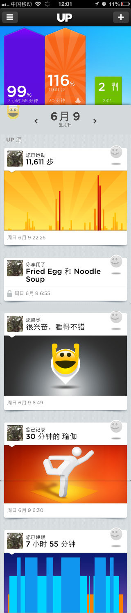
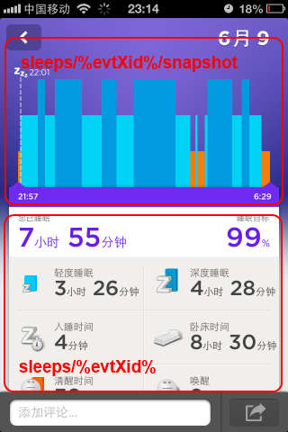
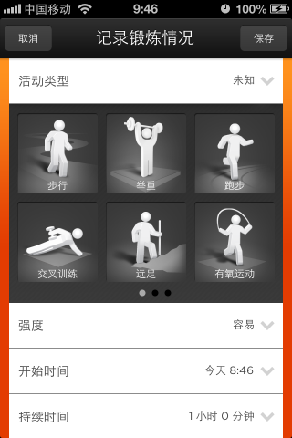
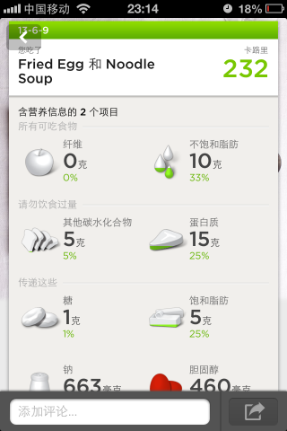
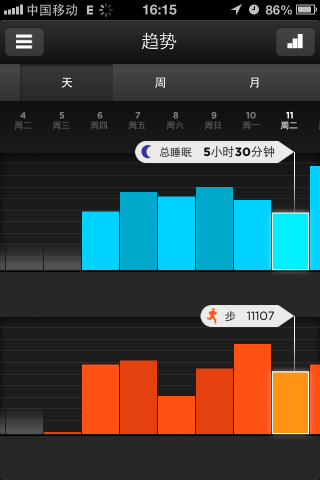
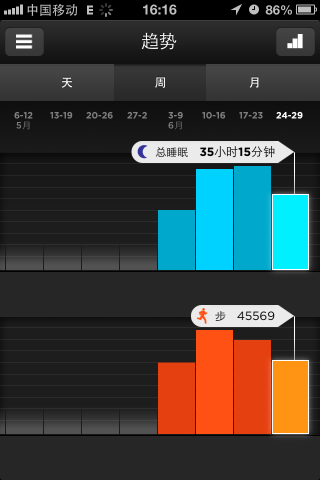
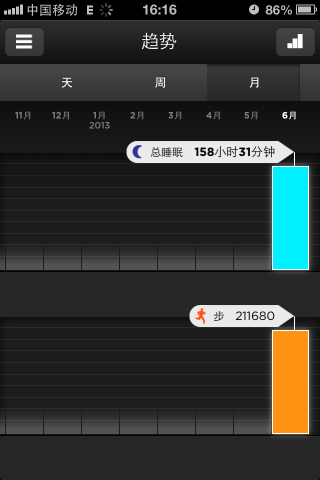
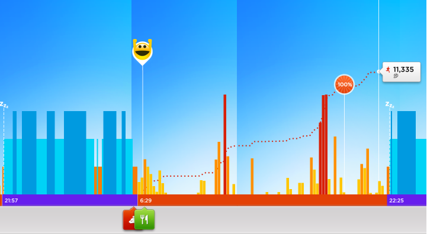

# 获取Jawbone UP中的个人数据（二）非官方API #

---

Author : iascchen(at)gmail(dot)com

Date : 2013-06-20

新浪微博 : [@问天鼓]([@问天鼓](http://www.weibo.com/iascchen)

---

从Jawbone网站上，能够下载UP的个人数据，但是这个数据是以天为单位的汇总数据，如果我们需要更精细的数据，就必须通过程序获取。

Jawbone官方网站宣称已经提供开发API，用于与合作方应用之间进行数据交换。但是这个API在网上见不到。我辈苦逼的码农想玩玩自己的数据，只好另想办法。

Eric Blue曾经于2011年11月发表过一篇博文[jawbone-up-api-discovery](http://eric-blue.com/2011/11/28/jawbone-up-api-discovery/)，介绍了他通过网络侦听Jawbone UP应用与服务器之间的通讯，破解出的一些非官方API，这些API可以用于获得用户自己的运动数据。时过境迁，Jawbone UP硬件已经更新换代至UP 2，手环版本为6\-1.0.20，手机应用软件也已经升级到了2.6.8版本，Server端版本已经更新至1.34。Eric Blue公布的API部分内容已经过时。

下面的API是对Jawbone UP的Android版本进行了反编译所得到的，并借鉴了Eric Blue的方法，通过对Jawbone UP应用发出的请求进行侦听以确认，错误在所难免。

详细内容如下：

1. 概述和登陆

2. 用户行为概况

3. 睡眠情况细节——Sleeps

4. 运动情况细节——Moves

5. 锻炼情况细节——Workouts

6. Meals 和 Mood

7. 其他个人信息

8. 运动趋势统计和生命线
 
各位玩的开心！

# 1. 概述和登陆 #

## 客户端请求基本说明 ##

典型的 Jawbone UP 客户端请求形式如下，其中形如 **v.1.34** 的版本部分用于指明所需的Server端服务版本号，此信息可以省略：

	https://jawbone.com/nudge/api/...
	https://jawbone.com/nudge/api/v.1.34/...

在进行其他访问之前，必须先登录。正确登录之后，只需在每次请求的HTTP中，将认证时的所获得Token值设置到 HTTP Header：**x-nudge-token** 里，即可保持会话。

    x-nudge-token ： 1BkkscbY2RvUUQXF9TewzzDEEuGrKl7nJIuimAfcp8E

## 用户登录 ##

Eric Blue 提到的登录方式 "**user/signin/login**" 方法仍然可用。不过在新的UP客户端版本中，还能够通过 “**users/login**” API进行登陆。

### 利用 user/signin/login 登陆 ###

**Request：**

	POST	
	https://jawbone.com/nudge/api/user/signin/login

**Params：**
	
	'email': email, 
	'pwd':  password, 
	'service': 'nudge'

**Return :**

Token 值为 JSON 内容中最下端的 `"token" : "un_ZHV8Uiq1pyJCPnqCljjDEEuGrKl7nURWQYUScC6E"` 

用户 XID 值取 `"user"."xid” : "RGaCBFg9CsDYVvm2kchbcw"` ：

完整JSON示例如下：
	
	{
	    "newly": false, 
	    "user": {
	        "last_name": "VisHealth", 
	        "uid": 37291881, 
	        "image": "user/image/i/51b4916b03eb185d1c1948a5_RGaCBFg9CsDYVvm2kchbcw_137078820345_2781804_photo.jpeg", 
	        "time_removed": 0, 
	        "basic_info": {
	            "weight": 56.2, 
	            "dob": "1976-06-09", 
	            "gender": "female", 
	            "metric": 1, 
	            "height": 1.58, 
	            "locale": "zh-cn"
	        }, 
	        "share_move": true, 
	        "birth_day": "09", 
	        "text_1": "", 
	        "first_name": "Tester", 
	        "xid": "RGaCBFg9CsDYVvm2kchbcw", 
	        "smart_alarm": {
	            "stopTimeMinsPastMidnight": 390, 
	            "dayMask": 62, 
	            "enable": true, 
	            "startTimeMinsPastMidnight": 370
	        }, 
	        "apps": [
	            {
	                "xid": "bVvQvURXOKc", 
	                "share": true
	            }, 
	            {
	                "xid": "__3Ao7ntG68", 
	                "share": true
	            }
	        ], 
	        "share_eat": false, 
	        "birth_month": "06", 
	        "type": 0, 
	        "email": "iasc@163.com", 
	        "birth_year": "1976", 
	        "band_name": "iasc's jawbone up", 
	        "up_goals": {
	            "move": {
	                "steps": 10000, 
	                "workout_time": null
	            }, 
	            "sleep": {
	                "total": 27000, 
	                "bedtime": null, 
	                "deep": null
	            }, 
	            "meals": {
	                "carbs": null, 
	                "fiber": null, 
	                "sodium": null, 
	                "sugar": null, 
	                "calcium": null, 
	                "unsat_fat": null, 
	                "cholesterol": null, 
	                "protein": null, 
	                "sat_fat": null
	            }
	        }, 
	        "first": "Tester", 
	        "share_mood": true, 
	        "primary_address": {
	            "city": "", 
	            "xid": "P9Q5vjiI-M0", 
	            "country": "CN", 
	            "zipcode": "", 
	            "state": "", 
	            "street_1": "", 
	            "street_2": ""
	        }, 
	        "share_sleep": false, 
	        "power_nap": {
	            "use_optimal_duration": 0, 
	            "custom_duration": 2400, 
	            "maximum_duration": 3600
	        }, 
	        "active_alert": {
	            "stopTimeMinsPastMidnight": 1020, 
	            "threshold": 0, 
	            "durationMins": 60, 
	            "type": 1, 
	            "startTimeMinsPastMidnight": 480
	        }, 
	        "last": "VisHealth", 
	        "name": "Tester VisHealth", 
	        "gender": "female", 
	        "profile_privacy": "friends", 
	        "data_2": 0, 
	        "data_1": 0, 
	        "flags": 1, 
	        "time_created": 1370439133, 
	        "mail_opts": {
	            "mail_opt_in_new_products": null, 
	            "mail_opt_in": null, 
	            "mail_opt_in_products_owned_updates": null, 
	            "mail_opt_in_customer_surveys": null, 
	            "mail_opt_in_deals_n_promotions": null
	        }, 
	        "goals": {
	            "move": 3500, 
	            "sleep": 21600, 
	            "eat": 2
	        }
	    }, 
	    "token": "un_ZHV8Uiq1pyJCPnqCljjDEEuGrKl7nURWQYUScC6E", 
	    "rc": 0
	}	

### 利用 users/login 登陆 ###

**users/login** 是目前Jawbone UP客户端采用的登录方式，由于其将用户密码进行 SHA-1 之后再传递，所以更加安全。

**Request：**

	POST
	https://jawbone.com/nudge/api/users/login

**Params：**
	
    'email' : email,
	'hash_pwd' : hash #将 password 进行 SHA-1 之后，再转换成 HEX 格式

**Return :** 

Token 值为 JSON 内容中的 `"data"."session_uid" : "1BkkscbY2RvUUQXF9TewzzDEEuGrKl7nJIuimAfcp8E"` 

用户 XID 值为 `"data"."user"."xid" : "RGaCBFg9CsDYVvm2kchbcw"`：

完整JSON示例如下：

	{
	    "meta": {
	        "message": "OK", 
	        "code": 200, 
	        "time": 1371960908
	    }, 
	    "data": {
	        "session_uid": "1BkkscbY2RvUUQXF9TewzzDEEuGrKl7nJIuimAfcp8E", 
	        "config": {
	            "i18n": null, 
	            "configuration": {
	                "twitter_character_count": 24, 
	                "system_message": ""
	            }, 
	            "features": {
	                "up_food_gallery": [
	                    "off", 
	                    null
	                ], 
	                "up_twitter_share": [
	                    "on", 
	                    null
	                ], 
	                "up_fooditem_search_typeahead": [
	                    "on", 
	                    null
	                ], 
	                "up_app_gallery": [
	                    "off", 
	                    null
	                ], 
	                "up_addressbook_import": [
	                    "on", 
	                    null
	                ], 
	                "up_daily_dashboards": [
	                    "off", 
	                    null
	                ], 
	                "up_search": [
	                    "on", 
	                    null
	                ], 
	                "up_fb_share": [
	                    "on", 
	                    null
	                ], 
	                "system": [
	                    "on", 
	                    null
	                ], 
	                "up_cheers": [
	                    "off", 
	                    null
	                ], 
	                "barcode_search": [
	                    "on", 
	                    null
	                ], 
	                "up_twitter_import": [
	                    "on", 
	                    null
	                ], 
	                "up_twitter_friend_suggestions": [
	                    "on", 
	                    null
	                ], 
	                "up_fb_import": [
	                    "on", 
	                    null
	                ], 
	                "up_slideshow": [
	                    "on", 
	                    {}
	                ], 
	                "up_fb_friend_suggestions": [
	                    "on", 
	                    null
	                ]
	            }
	        }, 
	        "user": {
	            "xid": "RGaCBFg9CsDYVvm2kchbcw", 
	            "name": "Tester VisHealth", 
	            "short_name": "Tester", 
	            "image": "user/image/i/51b4916b03eb185d1c1948a5_RGaCBFg9CsDYVvm2kchbcw_137078820345_2781804_photo.jpeg", 
	            "has_settings": true, 
	            "last": "VisHealth", 
	            "type": "user", 
	            "first": "Tester"
	        }
	    }
	}

---

# 2. 用户行为概况 #

## 用户概况 ##

打开 UP 的 Home 页，首先会展示用户当天的任务完成情况，以及用户的历史行为。下面我们就来讨论，这个页面使用到两个API **users/%userXid%/score** 和 **users/%userXid%/social** 。

请注意，Eric 提到的 **users/%userXid%/healthCredits** API 似乎已经**不再可用**。

在使用 users/%userXid%/... 类型的 API 时，需要注意的其中 %userXid% 的取值可以有两种形式：

- @me ，用于访问自己的信息
- User XID 值 ，可以使用 login 返回的 "user"."xid" 访问自己的信息。或者可以利用从朋友查找中获取的 User XID值，查询他人的信息（推测，未实验）。

### users/%userXid%/score ###

**users/%userXid%/score** 用于查看用户的运动完成情况，显示当天用户运动、睡眠、饮食等综合信息。

**Request：**

	GET
	https://jawbone.com/nudge/api/users/@me/score	#返回结果与下条完全一致
	https://jawbone.com/nudge/api/users/RGaCBFg9CsDYVvm2kchbcw/score
	https://jawbone.com/nudge/api/users/@me/score?date=20130609		#返回结果与下条完全一致
	https://jawbone.com/nudge/api/users/RGaCBFg9CsDYVvm2kchbcw/score?date=20130609

**Params：**
	
    'date' : datestr #格式为yyyymmdd，如果没有 date 参数，返回今日数据

**Return :** 

返回信息包括 Mood、Move、Sleep、Meals 等按日统计信息，这个数据还包括了当用户点击各种行为的状态条时，打开具体行为统计页面的信息：

完整JSON示例如下：

	{
	    "meta": {
	        "code": 200, 
	        "message": "OK", 
	        "user_xid": "RGaCBFg9CsDYVvm2kchbcw", 
	        "time": 1371960912
	    }, 
	    "data": {
	        "mood": {
	            "time_updated": 1370731786, 
	            "xid": "EJpCkyAtwoMpB8b_a5GOLQ", 
	            "title": "\u5f88\u5174\u594b\uff0c\u7761\u5f97\u4e0d\u9519", 
	            "time_created": 1370731760, 
	            "app_generated": false, 
	            "details": {
	                "tz": "Asia/Shanghai"
	            }, 
	            "date": 20130609, 
	            "shared": true, 
	            "type": "mood", 
	            "sub_type": 2
	        }, 
	        "move": {
	            "distance": 7.965, 
	            "longest_idle": 7260, 
	            "calories": 496.492103646, 
	            "bmr_calories_day": 1198.44050706, 
	            "goals": {
	                "steps": [
	                    11611.0, 
	                    10000
	                ], 
	                "workout_time": [
	                    1800.0, 
	                    null
	                ]
	            }, 
	            "longest_active": 1800, 
	            "hidden": false, 
	            "bg_steps": 11611.0, 
	            "bmr_calories": 1112.31734078, 
	            "active_time": 7917.0
	        }, 
	        "sleep": {
	            "awakenings": 2, 
	            "light": 12406.0, 
	            "time_to_sleep": 262, 
	            "goals": {
	                "total": [
	                    28542.0, 
	                    28800
	                ], 
	                "bedtime": [
	                    1317, 
	                    null
	                ], 
	                "deep": [
	                    16136.0, 
	                    null
	                ]
	            }, 
	            "qualities": [
	                99
	            ], 
	            "awake": 2189.0, 
	            "hidden": false
	        }, 
	        "user_metrics": {
	            "dob": 19760609, 
	            "gender": 1, 
	            "pal": null, 
	            "weight": 57.0, 
	            "height": 1.58
	        }, 
	        "meals": {
	            "num_meals": 1, 
	            "calories": 232.0, 
	            "num_drinks": 0, 
	            "goals": {
	                "carbs": [
	                    4.76000010967, 
	                    null
	                ], 
	                "fiber": [
	                    0.300000011921, 
	                    null
	                ], 
	                "sodium": [
	                    663.0, 
	                    null
	                ], 
	                "sugar": [
	                    0.939999982715, 
	                    null
	                ], 
	                "calcium": [
	                    70.0, 
	                    null
	                ], 
	                "unsat_fat": [
	                    9.69599956274, 
	                    null
	                ], 
	                "cholesterol": [
	                    460.0, 
	                    null
	                ], 
	                "protein": [
	                    15.3100000619, 
	                    null
	                ], 
	                "sat_fat": [
	                    4.5640001595, 
	                    null
	                ]
	            }, 
	            "hidden": false, 
	            "num_foods": 2
	        }, 
	        "insights": {
	            "items": []
	        }
	    }
	}

### users/%userXid%/social ###

**users/%userXid%/social** 用于查看用户各种活动的综合情况，按照当日或设定的截止访问时间，由近至远排列。

**Request：**

	GET
	https://jawbone.com/nudge/api/users/@me/social	#返回结果与下条完全一致
	https://jawbone.com/nudge/api/users/RGaCBFg9CsDYVvm2kchbcw/social
	https://jawbone.com/nudge/api/users/@me/social?date=20130609	#返回结果与下条完全一致
	https://jawbone.com/nudge/api/users/RGaCBFg9CsDYVvm2kchbcw/social?date=20130609
	https://jawbone.com/nudge/api/users/@me/social?date=20130609&limit=20	#返回结果与下条完全一致
	https://jawbone.com/nudge/api/users/RGaCBFg9CsDYVvm2kchbcw/social?date=20130609&limit=20

**Params：**
	
    'date' : datestr #格式为yyyymmdd，如果没有 date 参数，返回今日数据
	'limit' : limit	 #整数，缺省为20。用于限制返回多少条结果

**Return :** 

返回信息包括 Mood、Move、Sleep、Meals、WorkOut 等活动的分项信息，此处数据仅为对应行为的概述性数据，如果需要更详细的分项数据汇总，需要以 "data"."feed"."xid" 为参数（记为 %evtXid% ），根据 "data"."feed"."type" 调用对应的接口。如：

	sleeps/%evtXid%
	workouts/%evtXid%
	moves/%evtXid%
	meals/%evtXid%
	mood/%evtXid%

	sleeps/%evtXid%/snapshot
	workouts/%evtXid%/snapshot
	moves/%evtXid%/snapshot

如果需要换页，可以在"data"."links"."next" 找到换页的URL，如：
`"data"."links"."next": "/nudge/api/v.1.34/users/RGaCBFg9CsDYVvm2kchbcw/social?page_token=1370439133&limit=20"` 

完整JSON示例如下：

	{
	    "meta": {
	        "code": 200, 
	        "message": "OK", 
	        "user_xid": "RGaCBFg9CsDYVvm2kchbcw", 
	        "time": 1371960914
	    }, 
	    "data": {
	        "feed": [
	            {
	                "user": {
	                    "last": "VisHealth", 
	                    "name": "Tester VisHealth", 
	                    "short_name": "Tester", 
	                    "image": "user/image/i/51b4916b03eb185d1c1948a5_RGaCBFg9CsDYVvm2kchbcw_137078820345_2781804_photo.jpeg", 
	                    "xid": "RGaCBFg9CsDYVvm2kchbcw", 
	                    "type": "user", 
	                    "first": "Tester"
	                }, 
	                "time_updated": 1370812786, 
	                "subtitle": null, 
	                "title": "6 \u5c0f\u65f6 40 \u5206\u949f", 
	                "quality": 78, 
	                "image": "/nudge/api/v.1.34/sleeps/EJpCkyAtwoNhHfcKmXhLDQ/image/11370812792", 
	                "reached_goal": false, 
	                "comments": {
	                    "items": [], 
	                    "size": 0
	                }, 
	                "activity_xid": "lX5iJd5Y8-Ypd7aQb52I3A", 
	                "app_generated": false, 
	                "awake": 806, 
	                "emotions": {
	                    "items": [], 
	                    "size": 0
	                }, 
	                "time_created": 1370812786, 
	                "duration": 24852, 
	                "xid": "EJpCkyAtwoNhHfcKmXhLDQ", 
	                "type": "sleep", 
	                "networks": [], 
	                "is_private": true, 
	                "tz": "Asia/Shanghai"
	            }, 
	            {
	                "time_updated": 1370787960, 
	                "xid": "EJpCkyAtwoPJKCOzFyu89A", 
	                "title": "11,611 \u6b65", 
	                "image": "/nudge/api/v.1.34/moves/EJpCkyAtwoPJKCOzFyu89A/image/11370812791", 
	                "reached_goal": true, 
	                "comments": {
	                    "items": [], 
	                    "size": 0
	                }, 
	                "activity_xid": "lX5iJd5Y8-bWv8AvxdlIPg", 
	                "app_generated": false, 
	                "emotions": {
	                    "items": [], 
	                    "size": 0
	                }, 
	                "time_created": 1370730601, 
	                "date": 20130609, 
	                "tz": "Asia/Shanghai", 
	                "type": "move", 
	                "networks": [], 
	                "is_private": false, 
	                "user": {
	                    "xid": "RGaCBFg9CsDYVvm2kchbcw", 
	                    "name": "Tester VisHealth", 
	                    "short_name": "Tester", 
	                    "image": "user/image/i/51b4916b03eb185d1c1948a5_RGaCBFg9CsDYVvm2kchbcw_137078820345_2781804_photo.jpeg", 
	                    "last": "VisHealth", 
	                    "type": "user", 
	                    "first": "Tester"
	                }
	            }, 
	            {
	                "reaction": null, 
	                "time_updated": 1370732127, 
	                "tz": "Asia/Shanghai", 
	                "subtitle": null, 
	                "title": "Fried Egg \u548c Noodle Soup", 
	                "image": null, 
	                "comments": {
	                    "items": [], 
	                    "size": 0
	                }, 
	                "emotions": {
	                    "items": [], 
	                    "size": 0
	                }, 
	                "note": "Fried Egg \u548c Noodle Soup", 
	                "activity_xid": "lX5iJd5Y8-ZDW7VvQnqXGA", 
	                "app_generated": false, 
	                "details": {
	                    "carbohydrate": 4.76000010967, 
	                    "saturated_fat": 4.5640001595, 
	                    "protein": 15.3100000619, 
	                    "tz": "Asia/Shanghai", 
	                    "sodium": 663, 
	                    "vitamin_c": 0, 
	                    "vitamin_a": 0, 
	                    "unsaturated_fat": 9.69599956274, 
	                    "sugar": 0.939999982715, 
	                    "num_drinks": 0, 
	                    "accuracy": 0.0, 
	                    "fiber": 0.300000011921, 
	                    "potassium": 0, 
	                    "fat": 0, 
	                    "num_foods": 2, 
	                    "monounsaturated_fat": 0, 
	                    "calories": 232, 
	                    "place_type": "", 
	                    "polyunsaturated_fat": 0, 
	                    "calcium": 70, 
	                    "iron": 0, 
	                    "cholesterol": 460
	                }, 
	                "time_created": 1370732127, 
	                "xid": "EJpCkyAtwoMKaoaitjJHmg", 
	                "place_name": "", 
	                "type": "meal", 
	                "networks": [], 
	                "is_private": true, 
	                "user": {
	                    "xid": "RGaCBFg9CsDYVvm2kchbcw", 
	                    "name": "Tester VisHealth", 
	                    "short_name": "Tester", 
	                    "image": "user/image/i/51b4916b03eb185d1c1948a5_RGaCBFg9CsDYVvm2kchbcw_137078820345_2781804_photo.jpeg", 
	                    "last": "VisHealth", 
	                    "type": "user", 
	                    "first": "Tester"
	                }
	            }, 
	            {
	                "time_updated": 1370731760, 
	                "tz": "Asia/Shanghai", 
	                "title": "\u5f88\u5174\u594b\uff0c\u7761\u5f97\u4e0d\u9519", 
	                "emotions": {
	                    "items": [], 
	                    "size": 0
	                }, 
	                "activity_xid": "lX5iJd5Y8-ZoG48PRRZa5g", 
	                "app_generated": false, 
	                "comments": {
	                    "items": [], 
	                    "size": 0
	                }, 
	                "time_created": 1370731760, 
	                "xid": "EJpCkyAtwoMpB8b_a5GOLQ", 
	                "type": "mood", 
	                "sub_type": 2, 
	                "is_private": false, 
	                "user": {
	                    "xid": "RGaCBFg9CsDYVvm2kchbcw", 
	                    "name": "Tester VisHealth", 
	                    "short_name": "Tester", 
	                    "image": "user/image/i/51b4916b03eb185d1c1948a5_RGaCBFg9CsDYVvm2kchbcw_137078820345_2781804_photo.jpeg", 
	                    "last": "VisHealth", 
	                    "type": "user", 
	                    "first": "Tester"
	                }
	            }, 
	            {
	                "reaction": null, 
	                "time_updated": 1370730615, 
	                "subtitle": null, 
	                "title": "\u745c\u4f3d", 
	                "type": "workout", 
	                "is_completed": 1, 
	                "networks": [], 
	                "km": 0.0, 
	                "emotions": {
	                    "items": [], 
	                    "size": 0
	                }, 
	                "activity_xid": "lX5iJd5Y8-Yth6ROIP2QPA", 
	                "app_generated": false, 
	                "steps": 0, 
	                "user": {
	                    "xid": "RGaCBFg9CsDYVvm2kchbcw", 
	                    "name": "Tester VisHealth", 
	                    "short_name": "Tester", 
	                    "image": "user/image/i/51b4916b03eb185d1c1948a5_RGaCBFg9CsDYVvm2kchbcw_137078820345_2781804_photo.jpeg", 
	                    "last": "VisHealth", 
	                    "type": "user", 
	                    "first": "Tester"
	                }, 
	                "time_created": 1370730615, 
	                "xid": "EJpCkyAtwoPa1a-leTNHQg", 
	                "duration": 1800, 
	                "tz": "Asia/Shanghai", 
	                "image": "/ver/static/images/up/Workout_Feedv2_yoga.png", 
	                "sub_type": 6, 
	                "is_private": false, 
	                "comments": {
	                    "items": [], 
	                    "size": 0
	                }
	            }, 
	            {
	                "user": {
	                    "xid": "RGaCBFg9CsDYVvm2kchbcw", 
	                    "name": "Tester VisHealth", 
	                    "short_name": "Tester", 
	                    "image": "user/image/i/51b4916b03eb185d1c1948a5_RGaCBFg9CsDYVvm2kchbcw_137078820345_2781804_photo.jpeg", 
	                    "last": "VisHealth", 
	                    "type": "user", 
	                    "first": "Tester"
	                }, 
	                "time_updated": 1370730588, 
	                "subtitle": null, 
	                "title": "7 \u5c0f\u65f6 55 \u5206\u949f", 
	                "quality": 99, 
	                "image": "/nudge/api/v.1.34/sleeps/EJpCkyAtwoPx-NDQaWEnSw/image/11370730602", 
	                "reached_goal": false, 
	                "comments": {
	                    "items": [], 
	                    "size": 0
	                }, 
	                "activity_xid": "lX5iJd5Y8-aWWUdEvsk67g", 
	                "app_generated": false, 
	                "awake": 2189, 
	                "emotions": {
	                    "items": [], 
	                    "size": 0
	                }, 
	                "time_created": 1370730588, 
	                "duration": 30731, 
	                "xid": "EJpCkyAtwoPx-NDQaWEnSw", 
	                "type": "sleep", 
	                "networks": [], 
	                "is_private": true, 
	                "tz": "Asia/Shanghai"
	            }, 
	            {
	                "time_updated": 1370699820, 
	                "xid": "EJpCkyAtwoPW1YD0X277hA", 
	                "title": "6,693 \u6b65", 
	                "image": "/nudge/api/v.1.34/moves/EJpCkyAtwoPW1YD0X277hA/image/11370730599", 
	                "reached_goal": false, 
	                "comments": {
	                    "items": [], 
	                    "size": 0
	                }, 
	                "activity_xid": "lX5iJd5Y8-aUJI6pRVGHRQ", 
	                "app_generated": false, 
	                "emotions": {
	                    "items": [], 
	                    "size": 0
	                }, 
	                "time_created": 1370645647, 
	                "date": 20130608, 
	                "tz": "Asia/Shanghai", 
	                "type": "move", 
	                "networks": [], 
	                "is_private": false, 
	                "user": {
	                    "last": "VisHealth", 
	                    "name": "Tester VisHealth", 
	                    "short_name": "Tester", 
	                    "image": "user/image/i/51b4916b03eb185d1c1948a5_RGaCBFg9CsDYVvm2kchbcw_137078820345_2781804_photo.jpeg", 
	                    "xid": "RGaCBFg9CsDYVvm2kchbcw", 
	                    "type": "user", 
	                    "first": "Tester"
	                }
	            }, 
	            {
	                "user": {
	                    "xid": "RGaCBFg9CsDYVvm2kchbcw", 
	                    "name": "Tester VisHealth", 
	                    "short_name": "Tester", 
	                    "image": "user/image/i/51b4916b03eb185d1c1948a5_RGaCBFg9CsDYVvm2kchbcw_137078820345_2781804_photo.jpeg", 
	                    "last": "VisHealth", 
	                    "type": "user", 
	                    "first": "Tester"
	                }, 
	                "time_updated": 1370644226, 
	                "subtitle": null, 
	                "title": "7 \u5c0f\u65f6 0 \u5206\u949f", 
	                "quality": 0, 
	                "image": "/ver/static/images/up/Sleep_Feed_Manual.png", 
	                "reached_goal": false, 
	                "comments": {
	                    "items": [], 
	                    "size": 0
	                }, 
	                "activity_xid": "lX5iJd5Y8-bV0p1Rp8I6xw", 
	                "app_generated": false, 
	                "awake": 0, 
	                "emotions": {
	                    "items": [], 
	                    "size": 0
	                }, 
	                "time_created": 1370644226, 
	                "duration": 25200, 
	                "xid": "EJpCkyAtwoP5F4HBk72dng", 
	                "type": "sleep", 
	                "networks": [], 
	                "is_private": true, 
	                "tz": "Asia/Shanghai"
	            }, 
	            {
	                "time_updated": 1370620620, 
	                "xid": "BXM3Lg0tIY39TAWZF9J3LA", 
	                "title": "13,030 \u6b65", 
	                "image": "/nudge/api/v.1.34/moves/BXM3Lg0tIY39TAWZF9J3LA/image/11370645645", 
	                "reached_goal": true, 
	                "comments": {
	                    "items": [], 
	                    "size": 0
	                }, 
	                "activity_xid": "lX5iJd5Y8-bAiFLwbwZ9IQ", 
	                "app_generated": false, 
	                "emotions": {
	                    "items": [], 
	                    "size": 0
	                }, 
	                "time_created": 1370575326, 
	                "date": 20130607, 
	                "tz": "Asia/Shanghai", 
	                "type": "move", 
	                "networks": [], 
	                "is_private": false, 
	                "user": {
	                    "xid": "RGaCBFg9CsDYVvm2kchbcw", 
	                    "name": "Tester VisHealth", 
	                    "short_name": "Tester", 
	                    "image": "user/image/i/51b4916b03eb185d1c1948a5_RGaCBFg9CsDYVvm2kchbcw_137078820345_2781804_photo.jpeg", 
	                    "last": "VisHealth", 
	                    "type": "user", 
	                    "first": "Tester"
	                }
	            }, 
	            {
	                "user": {
	                    "xid": "RGaCBFg9CsDYVvm2kchbcw", 
	                    "name": "Tester VisHealth", 
	                    "short_name": "Tester", 
	                    "image": "user/image/i/51b4916b03eb185d1c1948a5_RGaCBFg9CsDYVvm2kchbcw_137078820345_2781804_photo.jpeg", 
	                    "last": "VisHealth", 
	                    "type": "user", 
	                    "first": "Tester"
	                }, 
	                "time_updated": 1370619840, 
	                "subtitle": null, 
	                "title": "1 \u5c0f\u65f6 29 \u5206\u949f", 
	                "quality": 18, 
	                "image": "/nudge/api/v.1.34/sleeps/EJpCkyAtwoOF3sVPoMzjNw/image/11370645648", 
	                "reached_goal": false, 
	                "comments": {
	                    "items": [], 
	                    "size": 0
	                }, 
	                "activity_xid": "lX5iJd5Y8-ap8twiX42Qtw", 
	                "app_generated": false, 
	                "awake": 1052, 
	                "emotions": {
	                    "items": [], 
	                    "size": 0
	                }, 
	                "time_created": 1370619840, 
	                "duration": 6394, 
	                "xid": "EJpCkyAtwoOF3sVPoMzjNw", 
	                "type": "sleep", 
	                "networks": [], 
	                "is_private": true, 
	                "tz": "Asia/Shanghai"
	            }, 
	            {
	                "user": {
	                    "xid": "RGaCBFg9CsDYVvm2kchbcw", 
	                    "name": "Tester VisHealth", 
	                    "short_name": "Tester", 
	                    "image": "user/image/i/51b4916b03eb185d1c1948a5_RGaCBFg9CsDYVvm2kchbcw_137078820345_2781804_photo.jpeg", 
	                    "last": "VisHealth", 
	                    "type": "user", 
	                    "first": "Tester"
	                }, 
	                "time_updated": 1370557817, 
	                "subtitle": null, 
	                "title": "5 \u5c0f\u65f6 56 \u5206\u949f", 
	                "quality": 64, 
	                "image": "/nudge/api/v.1.34/sleeps/BXM3Lg0tIY0DwwLlUXmstA/image/11370557855", 
	                "reached_goal": false, 
	                "comments": {
	                    "items": [], 
	                    "size": 0
	                }, 
	                "activity_xid": "lX5iJd5Y8-Yb3mDOv7V1qA", 
	                "app_generated": false, 
	                "awake": 3297, 
	                "emotions": {
	                    "items": [], 
	                    "size": 0
	                }, 
	                "time_created": 1370557817, 
	                "duration": 24682, 
	                "xid": "BXM3Lg0tIY0DwwLlUXmstA", 
	                "type": "sleep", 
	                "networks": [], 
	                "is_private": true, 
	                "tz": "Asia/Shanghai"
	            }, 
	            {
	                "time_updated": 1370533080, 
	                "xid": "BXM3Lg0tIY2dRqV_zVk94A", 
	                "title": "12,339 \u6b65", 
	                "image": "/nudge/api/v.1.34/moves/BXM3Lg0tIY2dRqV_zVk94A/image/11370557868", 
	                "reached_goal": true, 
	                "comments": {
	                    "items": [], 
	                    "size": 0
	                }, 
	                "activity_xid": "lX5iJd5Y8-bV19tQDrHFBg", 
	                "app_generated": false, 
	                "emotions": {
	                    "items": [], 
	                    "size": 0
	                }, 
	                "time_created": 1370472153, 
	                "date": 20130606, 
	                "tz": "Asia/Shanghai", 
	                "type": "move", 
	                "networks": [], 
	                "is_private": false, 
	                "user": {
	                    "xid": "RGaCBFg9CsDYVvm2kchbcw", 
	                    "name": "Tester VisHealth", 
	                    "short_name": "Tester", 
	                    "image": "user/image/i/51b4916b03eb185d1c1948a5_RGaCBFg9CsDYVvm2kchbcw_137078820345_2781804_photo.jpeg", 
	                    "last": "VisHealth", 
	                    "type": "user", 
	                    "first": "Tester"
	                }
	            }, 
	            {
	                "user": {
	                    "xid": "RGaCBFg9CsDYVvm2kchbcw", 
	                    "name": "Tester VisHealth", 
	                    "short_name": "Tester", 
	                    "image": "user/image/i/51b4916b03eb185d1c1948a5_RGaCBFg9CsDYVvm2kchbcw_137078820345_2781804_photo.jpeg", 
	                    "last": "VisHealth", 
	                    "type": "user", 
	                    "first": "Tester"
	                }, 
	                "time_updated": 1370471100, 
	                "subtitle": null, 
	                "title": "5 \u5c0f\u65f6 35 \u5206\u949f", 
	                "quality": 71, 
	                "image": "/nudge/api/v.1.34/sleeps/BXM3Lg0tIY2H-2uHcDwYSg/image/11370472155", 
	                "reached_goal": false, 
	                "comments": {
	                    "items": [], 
	                    "size": 0
	                }, 
	                "activity_xid": "lX5iJd5Y8-b9nP8F8UDNHA", 
	                "app_generated": false, 
	                "awake": 2082, 
	                "emotions": {
	                    "items": [], 
	                    "size": 0
	                }, 
	                "time_created": 1370471100, 
	                "duration": 22233, 
	                "xid": "BXM3Lg0tIY2H-2uHcDwYSg", 
	                "type": "sleep", 
	                "networks": [], 
	                "is_private": true, 
	                "tz": "Asia/Shanghai"
	            }, 
	            {
	                "time_updated": 1370447940, 
	                "xid": "BXM3Lg0tIY14vuEzUfC9QA", 
	                "title": "367 \u6b65", 
	                "image": "/nudge/api/v.1.34/moves/BXM3Lg0tIY14vuEzUfC9QA/image/11370447939", 
	                "reached_goal": false, 
	                "comments": {
	                    "items": [], 
	                    "size": 0
	                }, 
	                "activity_xid": "lX5iJd5Y8-aHK_ym9GCZIA", 
	                "app_generated": false, 
	                "emotions": {
	                    "items": [], 
	                    "size": 0
	                }, 
	                "time_created": 1370439710, 
	                "date": 20130605, 
	                "tz": "Asia/Shanghai", 
	                "type": "move", 
	                "networks": [], 
	                "is_private": false, 
	                "user": {
	                    "xid": "RGaCBFg9CsDYVvm2kchbcw", 
	                    "name": "Tester VisHealth", 
	                    "short_name": "Tester", 
	                    "image": "user/image/i/51b4916b03eb185d1c1948a5_RGaCBFg9CsDYVvm2kchbcw_137078820345_2781804_photo.jpeg", 
	                    "last": "VisHealth", 
	                    "type": "user", 
	                    "first": "Tester"
	                }
	            }, 
	            {
	                "time_updated": 1370439133, 
	                "tz": "Asia/Shanghai", 
	                "comments": {
	                    "items": [], 
	                    "size": 0
	                }, 
	                "activity_xid": "lX5iJd5Y8-aRU1FwEZIFfQ", 
	                "app_generated": false, 
	                "emotions": {
	                    "items": [], 
	                    "size": 0
	                }, 
	                "time_created": 1370439133, 
	                "type": "user_joined", 
	                "user": {
	                    "xid": "RGaCBFg9CsDYVvm2kchbcw", 
	                    "name": "Tester VisHealth", 
	                    "short_name": "Tester", 
	                    "image": "user/image/i/51b4916b03eb185d1c1948a5_RGaCBFg9CsDYVvm2kchbcw_137078820345_2781804_photo.jpeg", 
	                    "last": "VisHealth", 
	                    "type": "user", 
	                    "first": "Tester"
	                }
	            }
	        ], 
	        "links": {
	            "next": "/nudge/api/v.1.34/users/RGaCBFg9CsDYVvm2kchbcw/social?page_token=1370439133&limit=20"
	        }
	    }
	}

## Users Feeds ##

### users/%userXid%/feed ###

users/%userXid%/feed 这个 API 和 users/%userXid%/social 几乎如出一辙，唯一差别就是 social API多了个参数 date, 两者的返回参数几乎完全相同

**Request：**

	GET
	https://jawbone.com/nudge/api/users/@me/feed	#返回结果与下条完全一致
	https://jawbone.com/nudge/api/users/RGaCBFg9CsDYVvm2kchbcw/feed
	https://jawbone.com/nudge/api/users/@me/feed?limit=5	#返回结果与下条完全一致
	https://jawbone.com/nudge/api/users/RGaCBFg9CsDYVvm2kchbcw/feed?limit=5

**Params：**
	
	'limit' : limit	 #整数，缺省为10。用于限制返回多少条结果

**Return :** 

如果需要换页，可以在"data"."links"."next" 找到换页的URL，如：`"data"."links"."next": "/nudge/api/v.1.34/users/RGaCBFg9CsDYVvm2kchbcw/feed?page_token=1371815940&limit=5"` 

完整JSON示例如下：

	{
	    "meta": {
	        "code": 200, 
	        "message": "OK", 
	        "user_xid": "RGaCBFg9CsDYVvm2kchbcw", 
	        "time": 1371961008
	    }, 
	    "data": {
	        "feed": [
	            {
	                "time_updated": 1371959462, 
	                "xid": "EJpCkyAtwoO25G_p4fNiyw", 
	                "title": "\u4eca\u65e5 940 \u6b65", 
	                "image": "/nudge/api/v.1.34/moves/EJpCkyAtwoO25G_p4fNiyw/image/11371959462", 
	                "reached_goal": false, 
	                "comments": {
	                    "items": [], 
	                    "size": 0
	                }, 
	                "activity_xid": "Qt_j0hDUsXnI65eWs053WA", 
	                "app_generated": false, 
	                "emotions": {
	                    "items": [], 
	                    "size": 0
	                }, 
	                "time_created": 1371959462, 
	                "date": 20130623, 
	                "tz": "Asia/Shanghai", 
	                "type": "move", 
	                "networks": [], 
	                "is_private": false, 
	                "user": {
	                    "xid": "RGaCBFg9CsDYVvm2kchbcw", 
	                    "name": "Tester VisHealth", 
	                    "short_name": "Tester", 
	                    "image": "user/image/i/51b4916b03eb185d1c1948a5_RGaCBFg9CsDYVvm2kchbcw_137078820345_2781804_photo.jpeg", 
	                    "last": "VisHealth", 
	                    "type": "user", 
	                    "first": "Tester"
	                }
	            }, 
	            {
	                "user": {
	                    "last": "VisHealth", 
	                    "name": "Tester VisHealth", 
	                    "short_name": "Tester", 
	                    "image": "user/image/i/51b4916b03eb185d1c1948a5_RGaCBFg9CsDYVvm2kchbcw_137078820345_2781804_photo.jpeg", 
	                    "xid": "RGaCBFg9CsDYVvm2kchbcw", 
	                    "type": "user", 
	                    "first": "Tester"
	                }, 
	                "time_updated": 1371949680, 
	                "subtitle": null, 
	                "title": "6 \u5c0f\u65f6 54 \u5206\u949f", 
	                "quality": 78, 
	                "image": "/nudge/api/v.1.34/sleeps/EJpCkyAtwoPLz1cyhrWHeA/image/11371959463", 
	                "reached_goal": false, 
	                "comments": {
	                    "items": [], 
	                    "size": 0
	                }, 
	                "activity_xid": "Qt_j0hDUsXmXwgN2HMMi9w", 
	                "app_generated": false, 
	                "awake": 2217, 
	                "emotions": {
	                    "items": [], 
	                    "size": 0
	                }, 
	                "time_created": 1371949680, 
	                "duration": 27108, 
	                "xid": "EJpCkyAtwoPLz1cyhrWHeA", 
	                "type": "sleep", 
	                "networks": [], 
	                "is_private": true, 
	                "tz": "Asia/Shanghai"
	            }, 
	            {
	                "time_updated": 1371915360, 
	                "xid": "EJpCkyAtwoPqi0m-9ZxLSQ", 
	                "title": "6,412 \u6b65", 
	                "image": "/nudge/api/v.1.34/moves/EJpCkyAtwoPqi0m-9ZxLSQ/image/11371959461", 
	                "reached_goal": false, 
	                "comments": {
	                    "items": [], 
	                    "size": 0
	                }, 
	                "activity_xid": "Qt_j0hDUsXl4mei5FOz3vw", 
	                "app_generated": false, 
	                "emotions": {
	                    "items": [], 
	                    "size": 0
	                }, 
	                "time_created": 1371860650, 
	                "date": 20130622, 
	                "tz": "Asia/Shanghai", 
	                "type": "move", 
	                "networks": [], 
	                "is_private": false, 
	                "user": {
	                    "last": "VisHealth", 
	                    "name": "Tester VisHealth", 
	                    "short_name": "Tester", 
	                    "image": "user/image/i/51b4916b03eb185d1c1948a5_RGaCBFg9CsDYVvm2kchbcw_137078820345_2781804_photo.jpeg", 
	                    "xid": "RGaCBFg9CsDYVvm2kchbcw", 
	                    "type": "user", 
	                    "first": "Tester"
	                }
	            }, 
	            {
	                "user": {
	                    "xid": "RGaCBFg9CsDYVvm2kchbcw", 
	                    "name": "Tester VisHealth", 
	                    "short_name": "Tester", 
	                    "image": "user/image/i/51b4916b03eb185d1c1948a5_RGaCBFg9CsDYVvm2kchbcw_137078820345_2781804_photo.jpeg", 
	                    "last": "VisHealth", 
	                    "type": "user", 
	                    "first": "Tester"
	                }, 
	                "time_updated": 1371854400, 
	                "subtitle": null, 
	                "title": "8 \u5c0f\u65f6 12 \u5206\u949f", 
	                "quality": 100, 
	                "image": "/nudge/api/v.1.34/sleeps/EJpCkyAtwoMo-EN05aYhog/image/11371860652", 
	                "reached_goal": true, 
	                "comments": {
	                    "items": [], 
	                    "size": 0
	                }, 
	                "activity_xid": "Qt_j0hDUsXlrqp2cjqcfuw", 
	                "app_generated": false, 
	                "awake": 519, 
	                "emotions": {
	                    "items": [], 
	                    "size": 0
	                }, 
	                "time_created": 1371854400, 
	                "duration": 30039, 
	                "xid": "EJpCkyAtwoMo-EN05aYhog", 
	                "type": "sleep", 
	                "networks": [], 
	                "is_private": true, 
	                "tz": "Asia/Shanghai"
	            }, 
	            {
	                "time_updated": 1371815940, 
	                "xid": "EJpCkyAtwoM9d9ABSHCTRw", 
	                "title": "4,616 \u6b65", 
	                "image": "/nudge/api/v.1.34/moves/EJpCkyAtwoM9d9ABSHCTRw/image/11371860647", 
	                "reached_goal": false, 
	                "comments": {
	                    "items": [], 
	                    "size": 0
	                }, 
	                "activity_xid": "Qt_j0hDUsXk8mod8pvWZUA", 
	                "app_generated": false, 
	                "emotions": {
	                    "items": [], 
	                    "size": 0
	                }, 
	                "time_created": 1371767150, 
	                "date": 20130621, 
	                "tz": "Asia/Shanghai", 
	                "type": "move", 
	                "networks": [], 
	                "is_private": false, 
	                "user": {
	                    "last": "VisHealth", 
	                    "name": "Tester VisHealth", 
	                    "short_name": "Tester", 
	                    "image": "user/image/i/51b4916b03eb185d1c1948a5_RGaCBFg9CsDYVvm2kchbcw_137078820345_2781804_photo.jpeg", 
	                    "xid": "RGaCBFg9CsDYVvm2kchbcw", 
	                    "type": "user", 
	                    "first": "Tester"
	                }
	            }
	        ], 
	        "links": {
	            "next": "/nudge/api/v.1.34/users/RGaCBFg9CsDYVvm2kchbcw/feed?page_token=1371815940&limit=5"
	        }
	    }
	}

### feeditems/%activityXid% ###

在 users/%userXid%/social 和 users/%userXid%/feed 两个 API 中的返回值中，我们会发现每个 "data"."feed" 都有一个叫做 "activity_xid" 的值，这个值能够作为 feeditems/%activityXid% 的调用参数，返回单个行为的概述数据。我比对了一下，发现其返回 JSON 数据和上两个 API 的返回值中的数据似乎没什么区别。

**Request：**

	GET
	https://jawbone.com/nudge/api//nudge/api/feeditems/Qt_j0hDUsXmXwgN2HMMi9w

**Params：**
	
	无，URL 为 REST 形式，将 activityXid 放在了 URL 中

**Return :** 

完整JSON示例如下：

	{
	    "meta": {
	        "code": 200, 
	        "message": "OK", 
	        "user_xid": "RGaCBFg9CsDYVvm2kchbcw", 
	        "time": 1371961011
	    }, 
	    "data": {
	        "user": {
	            "last": "VisHealth", 
	            "name": "Tester VisHealth", 
	            "short_name": "Tester", 
	            "image": "user/image/i/51b4916b03eb185d1c1948a5_RGaCBFg9CsDYVvm2kchbcw_137078820345_2781804_photo.jpeg", 
	            "xid": "RGaCBFg9CsDYVvm2kchbcw", 
	            "type": "user", 
	            "first": "Tester"
	        }, 
	        "time_updated": 1371949680, 
	        "subtitle": null, 
	        "title": "6 \u5c0f\u65f6 54 \u5206\u949f", 
	        "quality": 78, 
	        "image": "/nudge/api/v.1.34/sleeps/EJpCkyAtwoPLz1cyhrWHeA/image/11371959463", 
	        "reached_goal": false, 
	        "comments": {
	            "items": [], 
	            "size": 0
	        }, 
	        "activity_xid": "Qt_j0hDUsXmXwgN2HMMi9w", 
	        "app_generated": false, 
	        "awake": 2217, 
	        "emotions": {
	            "items": [], 
	            "size": 0
	        }, 
	        "time_created": 1371949680, 
	        "duration": 27108, 
	        "xid": "EJpCkyAtwoPLz1cyhrWHeA", 
	        "type": "sleep", 
	        "networks": [], 
	        "is_private": true, 
	        "tz": "Asia/Shanghai"
	    }
	}

## Users Events ##

### users/%userXid%/events ###

users/%userXid%/events 是个非常有用的函数。 利用这个函数，能够获取当前用户的所有 Event， 包括已经被删除的用户事件。同时，这个 API 还有 types 参数，能够限制只返回特定类别 Event。

**Request：**

	GET
	https://jawbone.com/nudge/api/users/@me/events?list_deleted=True&limit=10
	https://jawbone.com/nudge/api/users/@me/events?limit=20&start_date=20130609&types=2
	https://jawbone.com/nudge/api/users/@me/events?types=1%2C3 # 此处逗号被转码为%2C了

**Params：**
	
	'start_date' : startDate, # 开始日期，格式为yyyymmdd
	'types' : types,  # 选择哪种类型的事件。取值为 : 1 workout, 2 meal, 3 sleep, 4 move, 5 mood, 7 body。需要显示多个类型，可以将类型取值用逗号连接。不设置则包括所有类型。此处取值为逆向工程得出，不一定全面。
	'limit' : limit ,  # 最多返回多少条记录，缺省为20。
	"list_deleted" : listDeleted # 取值为 True， False。缺省为 False。

**Return :** 

完整JSON示例如下：

	{
	    "meta": {
	        "code": 200, 
	        "message": "OK", 
	        "user_xid": "RGaCBFg9CsDYVvm2kchbcw", 
	        "time": 1372431968
	    }, 
	    "data": {
	        "deleted": [
	            "EJpCkyAtwoOzTldhXELa5Q", 
	            "EJpCkyAtwoOMMWEHyIFF0Q"
	        ], 
	        "items": [
	            {
	                "image": "", 
	                "time_removed": 0, 
	                "emotions": {
	                    "items": [], 
	                    "size": 0
	                }, 
	                "snapshot_image": "/nudge/image/e/1371044854/EJpCkyAtwoPXN30hjKufWg.png", 
	                "networks": [], 
	                "time_completed": 1371016848, 
	                "xid": "EJpCkyAtwoPXN30hjKufWg", 
	                "title": "\u6b65\u884c", 
	                "comments": {
	                    "items": [], 
	                    "size": 0
	                }, 
	                "details": {
	                    "tz": "Asia/Shanghai", 
	                    "goal": 0, 
	                    "calories": 802.075100205, 
	                    "km": 2.249, 
	                    "bmr": 164.075100205, 
	                    "intensity": 1, 
	                    "bg_calories": 127.953000784, 
	                    "meters": 2249, 
	                    "time": 10800, 
	                    "bg_active_time": 1871, 
	                    "steps": 3372, 
	                    "bmr_calories": 164.075100205
	                }, 
	                "shared": true, 
	                "type": "workout", 
	                "band_ids": [], 
	                "time_created": 1371006048, 
	                "date": 20130612, 
	                "sub_type": 1, 
	                "reaction": null, 
	                "time_updated": 1371044854, 
	                "route": "", 
	                "app_generated": false, 
	                "goals": {
	                    "steps": 10000, 
	                    "workout_time": null
	                }, 
	                "is_manual": true, 
	                "is_complete": true, 
	                "user": {
	                    "last": "VisHealth", 
	                    "name": "Tester VisHealth", 
	                    "short_name": "Tester", 
	                    "image": "user/image/i/51b4916b03eb185d1c1948a5_RGaCBFg9CsDYVvm2kchbcw_137078820345_2781804_photo.jpeg", 
	                    "xid": "RGaCBFg9CsDYVvm2kchbcw", 
	                    "type": "user", 
	                    "first": "Tester"
	                }
	            }, 
	            {
	                "time_completed": 1370995140, 
	                "xid": "EJpCkyAtwoOBmMCiBEugow", 
	                "band_ids": [
	                    "23424880A48CD061"
	                ], 
	                "title": "9 \u5c0f\u65f6 55 \u5206\u949f", 
	                "snapshot_image": "/nudge/image/e/1370995674/EJpCkyAtwoOBmMCiBEugow.png", 
	                "user": {
	                    "last": "VisHealth", 
	                    "name": "Tester VisHealth", 
	                    "short_name": "Tester", 
	                    "image": "user/image/i/51b4916b03eb185d1c1948a5_RGaCBFg9CsDYVvm2kchbcw_137078820345_2781804_photo.jpeg", 
	                    "xid": "RGaCBFg9CsDYVvm2kchbcw", 
	                    "type": "user", 
	                    "first": "Tester"
	                }, 
	                "comments": {
	                    "items": [], 
	                    "size": 0
	                }, 
	                "sub_type": 0, 
	                "date": 20130612, 
	                "app_generated": false, 
	                "time_updated": 1370995674, 
	                "emotions": {
	                    "items": [], 
	                    "size": 0
	                }, 
	                "time_created": 1370958101, 
	                "is_manual": false, 
	                "shared": false, 
	                "type": "sleep", 
	                "networks": [], 
	                "goals": {
	                    "total": 27000, 
	                    "bedtime": null, 
	                    "deep": null
	                }, 
	                "details": {
	                    "body": 0, 
	                    "smart_alarm_fire": 1370988000, 
	                    "awakenings": 1, 
	                    "light": 20652, 
	                    "mind": 0, 
	                    "asleep_time": 1370958959, 
	                    "deep": 15093, 
	                    "awake": 1294, 
	                    "duration": 37039, 
	                    "tz": "Asia/Shanghai", 
	                    "quality": 100, 
	                    "awake_time": 1370995001
	                }
	            }, 
	            {
	                "time_updated": 1370957155, 
	                "xid": "EJpCkyAtwoMIuTGkAPvdTw", 
	                "band_ids": [
	                    "23424880A48CD061"
	                ], 
	                "title": "1 \u5c0f\u65f6 7 \u5206\u949f", 
	                "snapshot_image": "/nudge/image/e/1370957155/EJpCkyAtwoMIuTGkAPvdTw.png", 
	                "user": {
	                    "last": "VisHealth", 
	                    "name": "Tester VisHealth", 
	                    "short_name": "Tester", 
	                    "image": "user/image/i/51b4916b03eb185d1c1948a5_RGaCBFg9CsDYVvm2kchbcw_137078820345_2781804_photo.jpeg", 
	                    "xid": "RGaCBFg9CsDYVvm2kchbcw", 
	                    "type": "user", 
	                    "first": "Tester"
	                }, 
	                "comments": {
	                    "items": [], 
	                    "size": 0
	                }, 
	                "networks": [], 
	                "date": 20130611, 
	                "app_generated": false, 
	                "time_completed": 1370908500, 
	                "emotions": {
	                    "items": [], 
	                    "size": 0
	                }, 
	                "time_created": 1370902821, 
	                "is_manual": false, 
	                "shared": false, 
	                "type": "sleep", 
	                "sub_type": 2, 
	                "goals": {
	                    "total": 28800, 
	                    "bedtime": null, 
	                    "deep": null
	                }, 
	                "details": {
	                    "body": 0, 
	                    "smart_alarm_fire": 0, 
	                    "awakenings": 0, 
	                    "light": 1680, 
	                    "mind": 0, 
	                    "asleep_time": 1370903099, 
	                    "deep": 2340, 
	                    "awake": 1659, 
	                    "duration": 5679, 
	                    "tz": "Asia/Shanghai", 
	                    "quality": 12, 
	                    "awake_time": 1370907021
	                }
	            }, 
	            {
	                "time_updated": 1370957154, 
	                "xid": "EJpCkyAtwoPgu7Y5xcoEUw", 
	                "band_ids": [
	                    "23424880A48CD061"
	                ], 
	                "title": "4 \u5c0f\u65f6 23 \u5206\u949f", 
	                "type": "sleep", 
	                "user": {
	                    "last": "VisHealth", 
	                    "name": "Tester VisHealth", 
	                    "short_name": "Tester", 
	                    "image": "user/image/i/51b4916b03eb185d1c1948a5_RGaCBFg9CsDYVvm2kchbcw_137078820345_2781804_photo.jpeg", 
	                    "xid": "RGaCBFg9CsDYVvm2kchbcw", 
	                    "type": "user", 
	                    "first": "Tester"
	                }, 
	                "comments": {
	                    "items": [], 
	                    "size": 0
	                }, 
	                "networks": [], 
	                "is_manual": false, 
	                "app_generated": false, 
	                "time_completed": 1370898180, 
	                "emotions": {
	                    "items": [], 
	                    "size": 0
	                }, 
	                "time_created": 1370880162, 
	                "date": 20130611, 
	                "shared": false, 
	                "snapshot_image": "/nudge/image/e/1370957154/EJpCkyAtwoPgu7Y5xcoEUw.png", 
	                "sub_type": 0, 
	                "goals": {
	                    "total": 28800, 
	                    "bedtime": null, 
	                    "deep": null
	                }, 
	                "details": {
	                    "body": 0, 
	                    "smart_alarm_fire": 0, 
	                    "awakenings": 2, 
	                    "light": 11393, 
	                    "mind": 0, 
	                    "asleep_time": 1370881499, 
	                    "deep": 4408, 
	                    "awake": 2217, 
	                    "duration": 18018, 
	                    "tz": "Asia/Shanghai", 
	                    "quality": 46, 
	                    "awake_time": 1370898162
	                }
	            }, 
	            {
	                "time_updated": 1370812792, 
	                "xid": "EJpCkyAtwoNhHfcKmXhLDQ", 
	                "details": {
	                    "body": 0, 
	                    "smart_alarm_fire": 0, 
	                    "awakenings": 0, 
	                    "light": 13966, 
	                    "mind": 0, 
	                    "asleep_time": 1370788739, 
	                    "deep": 10080, 
	                    "awake": 806, 
	                    "duration": 24852, 
	                    "tz": "Asia/Shanghai", 
	                    "quality": 78, 
	                    "awake_time": 1370812534
	                }, 
	                "band_ids": [
	                    "23424880A48CD061"
	                ], 
	                "title": "6 \u5c0f\u65f6 40 \u5206\u949f", 
	                "snapshot_image": "/nudge/image/e/1370812792/EJpCkyAtwoNhHfcKmXhLDQ.png", 
	                "comments": {
	                    "items": [], 
	                    "size": 0
	                }, 
	                "networks": [], 
	                "is_manual": false, 
	                "app_generated": false, 
	                "time_completed": 1370812786, 
	                "emotions": {
	                    "items": [], 
	                    "size": 0
	                }, 
	                "time_created": 1370787934, 
	                "date": 20130610, 
	                "shared": false, 
	                "type": "sleep", 
	                "sub_type": 0, 
	                "goals": {
	                    "total": 28800, 
	                    "bedtime": null, 
	                    "deep": null
	                }, 
	                "user": {
	                    "last": "VisHealth", 
	                    "name": "Tester VisHealth", 
	                    "short_name": "Tester", 
	                    "image": "user/image/i/51b4916b03eb185d1c1948a5_RGaCBFg9CsDYVvm2kchbcw_137078820345_2781804_photo.jpeg", 
	                    "xid": "RGaCBFg9CsDYVvm2kchbcw", 
	                    "type": "user", 
	                    "first": "Tester"
	                }
	            }, 
	            {
	                "image": "", 
	                "time_removed": 0, 
	                "emotions": {
	                    "items": [], 
	                    "size": 0
	                }, 
	                "snapshot_image": "", 
	                "networks": [], 
	                "time_completed": 1370730615, 
	                "xid": "EJpCkyAtwoPa1a-leTNHQg", 
	                "title": "\u745c\u4f3d", 
	                "comments": {
	                    "items": [], 
	                    "size": 0
	                }, 
	                "details": {
	                    "tz": "Asia/Shanghai", 
	                    "goal": 0, 
	                    "calories": 89.4861169007, 
	                    "km": 0.0, 
	                    "bmr": 27.4861169007, 
	                    "intensity": 1, 
	                    "bg_calories": 0, 
	                    "meters": 0, 
	                    "time": 1800, 
	                    "bg_active_time": 0, 
	                    "steps": 0, 
	                    "bmr_calories": 27.4861169007
	                }, 
	                "shared": true, 
	                "type": "workout", 
	                "band_ids": [], 
	                "time_created": 1370728815, 
	                "date": 20130609, 
	                "sub_type": 6, 
	                "reaction": null, 
	                "time_updated": 1370732478, 
	                "route": "", 
	                "app_generated": false, 
	                "goals": {
	                    "steps": 10000, 
	                    "workout_time": null
	                }, 
	                "is_manual": true, 
	                "is_complete": true, 
	                "user": {
	                    "last": "VisHealth", 
	                    "name": "Tester VisHealth", 
	                    "short_name": "Tester", 
	                    "image": "user/image/i/51b4916b03eb185d1c1948a5_RGaCBFg9CsDYVvm2kchbcw_137078820345_2781804_photo.jpeg", 
	                    "xid": "RGaCBFg9CsDYVvm2kchbcw", 
	                    "type": "user", 
	                    "first": "Tester"
	                }
	            }, 
	            {
	                "time_completed": 1370730588, 
	                "xid": "EJpCkyAtwoPx-NDQaWEnSw", 
	                "band_ids": [
	                    "23424880A48CD061"
	                ], 
	                "title": "7 \u5c0f\u65f6 55 \u5206\u949f", 
	                "type": "sleep", 
	                "user": {
	                    "last": "VisHealth", 
	                    "name": "Tester VisHealth", 
	                    "short_name": "Tester", 
	                    "image": "user/image/i/51b4916b03eb185d1c1948a5_RGaCBFg9CsDYVvm2kchbcw_137078820345_2781804_photo.jpeg", 
	                    "xid": "RGaCBFg9CsDYVvm2kchbcw", 
	                    "type": "user", 
	                    "first": "Tester"
	                }, 
	                "comments": {
	                    "items": [], 
	                    "size": 0
	                }, 
	                "sub_type": 0, 
	                "date": 20130609, 
	                "app_generated": false, 
	                "time_updated": 1370730602, 
	                "emotions": {
	                    "items": [], 
	                    "size": 0
	                }, 
	                "time_created": 1370699857, 
	                "is_manual": false, 
	                "shared": false, 
	                "snapshot_image": "/nudge/image/e/1370730602/EJpCkyAtwoPx-NDQaWEnSw.png", 
	                "networks": [], 
	                "goals": {
	                    "total": 28800, 
	                    "bedtime": null, 
	                    "deep": null
	                }, 
	                "details": {
	                    "body": 0, 
	                    "smart_alarm_fire": 0, 
	                    "awakenings": 2, 
	                    "light": 12406, 
	                    "mind": 0, 
	                    "asleep_time": 1370700119, 
	                    "deep": 16136, 
	                    "awake": 2189, 
	                    "duration": 30731, 
	                    "tz": "Asia/Shanghai", 
	                    "quality": 99, 
	                    "awake_time": 1370729557
	                }
	            }, 
	            {
	                "time_completed": 1370644226, 
	                "xid": "EJpCkyAtwoP5F4HBk72dng", 
	                "details": {
	                    "body": 0, 
	                    "smart_alarm_fire": 0, 
	                    "awakenings": 0, 
	                    "light": 0, 
	                    "mind": 0, 
	                    "asleep_time": 1370619026, 
	                    "deep": 0, 
	                    "awake": 0, 
	                    "duration": 25200, 
	                    "tz": "Asia/Shanghai", 
	                    "quality": 0, 
	                    "awake_time": 1370644226
	                }, 
	                "band_ids": [], 
	                "title": "7 \u5c0f\u65f6 0 \u5206\u949f", 
	                "snapshot_image": "", 
	                "comments": {
	                    "items": [], 
	                    "size": 0
	                }, 
	                "networks": [], 
	                "date": 20130608, 
	                "app_generated": false, 
	                "time_updated": 1370732654, 
	                "emotions": {
	                    "items": [], 
	                    "size": 0
	                }, 
	                "time_created": 1370619026, 
	                "is_manual": true, 
	                "shared": false, 
	                "type": "sleep", 
	                "sub_type": 0, 
	                "goals": {
	                    "total": 28800, 
	                    "bedtime": null, 
	                    "deep": null
	                }, 
	                "user": {
	                    "last": "VisHealth", 
	                    "name": "Tester VisHealth", 
	                    "short_name": "Tester", 
	                    "image": "user/image/i/51b4916b03eb185d1c1948a5_RGaCBFg9CsDYVvm2kchbcw_137078820345_2781804_photo.jpeg", 
	                    "xid": "RGaCBFg9CsDYVvm2kchbcw", 
	                    "type": "user", 
	                    "first": "Tester"
	                }
	            }, 
	            {
	                "time_completed": 1370619840, 
	                "xid": "EJpCkyAtwoOF3sVPoMzjNw", 
	                "band_ids": [
	                    "23424880A48CD061"
	                ], 
	                "title": "1 \u5c0f\u65f6 29 \u5206\u949f", 
	                "type": "sleep", 
	                "user": {
	                    "last": "VisHealth", 
	                    "name": "Tester VisHealth", 
	                    "short_name": "Tester", 
	                    "image": "user/image/i/51b4916b03eb185d1c1948a5_RGaCBFg9CsDYVvm2kchbcw_137078820345_2781804_photo.jpeg", 
	                    "xid": "RGaCBFg9CsDYVvm2kchbcw", 
	                    "type": "user", 
	                    "first": "Tester"
	                }, 
	                "comments": {
	                    "items": [], 
	                    "size": 0
	                }, 
	                "networks": [], 
	                "date": 20130607, 
	                "app_generated": false, 
	                "time_updated": 1370645648, 
	                "emotions": {
	                    "items": [], 
	                    "size": 0
	                }, 
	                "time_created": 1370613446, 
	                "is_manual": false, 
	                "shared": false, 
	                "snapshot_image": "/nudge/image/e/1370645648/EJpCkyAtwoOF3sVPoMzjNw.png", 
	                "sub_type": 2, 
	                "goals": {
	                    "total": 28800, 
	                    "bedtime": null, 
	                    "deep": null
	                }, 
	                "details": {
	                    "body": 0, 
	                    "smart_alarm_fire": 0, 
	                    "awakenings": 0, 
	                    "light": 2762, 
	                    "mind": 0, 
	                    "asleep_time": 1370614439, 
	                    "deep": 2580, 
	                    "awake": 1052, 
	                    "duration": 6394, 
	                    "tz": "Asia/Shanghai", 
	                    "quality": 18, 
	                    "awake_time": 1370619746
	                }
	            }, 
	            {
	                "time_completed": 1370557817, 
	                "xid": "BXM3Lg0tIY0DwwLlUXmstA", 
	                "details": {
	                    "body": 0, 
	                    "smart_alarm_fire": 1370557200, 
	                    "awakenings": 2, 
	                    "light": 14160, 
	                    "mind": 0, 
	                    "asleep_time": 1370533799, 
	                    "deep": 7225, 
	                    "awake": 3297, 
	                    "duration": 24682, 
	                    "tz": "Asia/Shanghai", 
	                    "quality": 64, 
	                    "awake_time": 1370557135
	                }, 
	                "band_ids": [
	                    "23424880A48CD061"
	                ], 
	                "title": "5 \u5c0f\u65f6 56 \u5206\u949f", 
	                "snapshot_image": "/nudge/image/e/1370557855/BXM3Lg0tIY0DwwLlUXmstA.png", 
	                "comments": {
	                    "items": [], 
	                    "size": 0
	                }, 
	                "networks": [], 
	                "date": 20130607, 
	                "app_generated": false, 
	                "time_updated": 1370557855, 
	                "emotions": {
	                    "items": [], 
	                    "size": 0
	                }, 
	                "time_created": 1370533135, 
	                "is_manual": false, 
	                "shared": false, 
	                "type": "sleep", 
	                "sub_type": 0, 
	                "goals": {
	                    "total": 28800, 
	                    "bedtime": null, 
	                    "deep": null
	                }, 
	                "user": {
	                    "last": "VisHealth", 
	                    "name": "Tester VisHealth", 
	                    "short_name": "Tester", 
	                    "image": "user/image/i/51b4916b03eb185d1c1948a5_RGaCBFg9CsDYVvm2kchbcw_137078820345_2781804_photo.jpeg", 
	                    "xid": "RGaCBFg9CsDYVvm2kchbcw", 
	                    "type": "user", 
	                    "first": "Tester"
	                }
	            }
	        ], 
	        "earliest": 20130605, 
	        "size": 10
	    }
	}

---

# 3. 睡眠情况细节——Sleeps #

Jawbone 最吸引我的功能之一，就是能够记录睡眠情况。除了前面介绍的 user/%userXid%/social 等用户行为概述 API 之外，与睡眠相关的 API 还有以下几个：
	
	user/%userXid%/sleeps
	sleeps/%evtXid%
	sleeps/%evtXid%/snapshot

从 user/%userXid%/social 结果中的 "data"."feed"."xid"; 从 user/%userXid%/sleeps 结果中的 "data"."items"."xid" 获得 %evtXid% ， 用于调用 sleeps/%evtXid% 和 sleeps/%evtXid%/snapshot 。

### user/%userXid%/sleeps ###

这个 API 能够返回个人的睡眠概括数据列表。在Jawbone UP 的手机应用界面中并没有对应的界面输出。

Request：
	
	GET
	https://jawbone.com/nudge/api/users/@me/sleeps?start_time=1370707200&end_time=1370966399&limit=100
	https://jawbone.com/nudge/api/users/RGaCBFg9CsDYVvm2kchbcw/sleeps?start_time=1370707200&end_time=1370966399&limit=100

Params：

	'start_time' : startTime, #start_time为 long 型时间，即从1970年以来的秒数，可以不填
	'end_time' : endTime,     #end_time为 long 型时间，即从1970年以来的秒数，可以不填
	'limit' : limit           #最多返回结果条数限制

Return :

	{
	    "meta": {
	        "code": 200, 
	        "message": "OK", 
	        "user_xid": "RGaCBFg9CsDYVvm2kchbcw", 
	        "time": 1371960979
	    }, 
	    "data": {
	        "items": [
	            {
	                "time_updated": 1370730602, 
	                "xid": "EJpCkyAtwoPx-NDQaWEnSw", 
	                "band_ids": [
	                    "23424880A48CD061"
	                ], 
	                "title": "7 \u5c0f\u65f6 55 \u5206\u949f", 
	                "type": "sleep", 
	                "time_created": 1370699857, 
	                "sub_type": 0, 
	                "date": 20130609, 
	                "app_generated": false, 
	                "time_completed": 1370730588, 
	                "details": {
	                    "body": 0, 
	                    "smart_alarm_fire": 0, 
	                    "awakenings": 2, 
	                    "light": 12406, 
	                    "mind": 0, 
	                    "asleep_time": 1370700119, 
	                    "deep": 16136, 
	                    "awake": 2189, 
	                    "duration": 30731, 
	                    "tz": "Asia/Shanghai", 
	                    "quality": 99, 
	                    "awake_time": 1370729557
	                }, 
	                "is_manual": false, 
	                "shared": false, 
	                "snapshot_image": "/nudge/image/e/1370730602/EJpCkyAtwoPx-NDQaWEnSw.png", 
	                "networks": [], 
	                "user": {
	                    "xid": "RGaCBFg9CsDYVvm2kchbcw", 
	                    "name": "Tester VisHealth", 
	                    "short_name": "Tester", 
	                    "image": "user/image/i/51b4916b03eb185d1c1948a5_RGaCBFg9CsDYVvm2kchbcw_137078820345_2781804_photo.jpeg", 
	                    "last": "VisHealth", 
	                    "type": "user", 
	                    "first": "Tester"
	                }
	            }, 
	            {
	                "time_completed": 1370812786, 
	                "xid": "EJpCkyAtwoNhHfcKmXhLDQ", 
	                "band_ids": [
	                    "23424880A48CD061"
	                ], 
	                "title": "6 \u5c0f\u65f6 40 \u5206\u949f", 
	                "type": "sleep", 
	                "time_created": 1370787934, 
	                "networks": [], 
	                "is_manual": false, 
	                "app_generated": false, 
	                "time_updated": 1370812792, 
	                "user": {
	                    "xid": "RGaCBFg9CsDYVvm2kchbcw", 
	                    "name": "Tester VisHealth", 
	                    "short_name": "Tester", 
	                    "image": "user/image/i/51b4916b03eb185d1c1948a5_RGaCBFg9CsDYVvm2kchbcw_137078820345_2781804_photo.jpeg", 
	                    "last": "VisHealth", 
	                    "type": "user", 
	                    "first": "Tester"
	                }, 
	                "date": 20130610, 
	                "shared": false, 
	                "snapshot_image": "/nudge/image/e/1370812792/EJpCkyAtwoNhHfcKmXhLDQ.png", 
	                "sub_type": 0, 
	                "details": {
	                    "body": 0, 
	                    "smart_alarm_fire": 0, 
	                    "awakenings": 0, 
	                    "light": 13966, 
	                    "mind": 0, 
	                    "asleep_time": 1370788739, 
	                    "deep": 10080, 
	                    "awake": 806, 
	                    "duration": 24852, 
	                    "tz": "Asia/Shanghai", 
	                    "quality": 78, 
	                    "awake_time": 1370812534
	                }
	            }, 
	            {
	                "time_updated": 1370957154, 
	                "xid": "EJpCkyAtwoPgu7Y5xcoEUw", 
	                "band_ids": [
	                    "23424880A48CD061"
	                ], 
	                "title": "4 \u5c0f\u65f6 23 \u5206\u949f", 
	                "type": "sleep", 
	                "time_created": 1370880162, 
	                "sub_type": 0, 
	                "is_manual": false, 
	                "app_generated": false, 
	                "time_completed": 1370898180, 
	                "details": {
	                    "body": 0, 
	                    "smart_alarm_fire": 0, 
	                    "awakenings": 2, 
	                    "light": 11393, 
	                    "mind": 0, 
	                    "asleep_time": 1370881499, 
	                    "deep": 4408, 
	                    "awake": 2217, 
	                    "duration": 18018, 
	                    "tz": "Asia/Shanghai", 
	                    "quality": 46, 
	                    "awake_time": 1370898162
	                }, 
	                "date": 20130611, 
	                "shared": false, 
	                "snapshot_image": "/nudge/image/e/1370957154/EJpCkyAtwoPgu7Y5xcoEUw.png", 
	                "networks": [], 
	                "user": {
	                    "xid": "RGaCBFg9CsDYVvm2kchbcw", 
	                    "name": "Tester VisHealth", 
	                    "short_name": "Tester", 
	                    "image": "user/image/i/51b4916b03eb185d1c1948a5_RGaCBFg9CsDYVvm2kchbcw_137078820345_2781804_photo.jpeg", 
	                    "last": "VisHealth", 
	                    "type": "user", 
	                    "first": "Tester"
	                }
	            }, 
	            {
	                "time_completed": 1370908500, 
	                "xid": "EJpCkyAtwoMIuTGkAPvdTw", 
	                "band_ids": [
	                    "23424880A48CD061"
	                ], 
	                "title": "1 \u5c0f\u65f6 7 \u5206\u949f", 
	                "type": "sleep", 
	                "time_created": 1370902821, 
	                "networks": [], 
	                "is_manual": false, 
	                "app_generated": false, 
	                "time_updated": 1370957155, 
	                "details": {
	                    "body": 0, 
	                    "smart_alarm_fire": 0, 
	                    "awakenings": 0, 
	                    "light": 1680, 
	                    "mind": 0, 
	                    "asleep_time": 1370903099, 
	                    "deep": 2340, 
	                    "awake": 1659, 
	                    "duration": 5679, 
	                    "tz": "Asia/Shanghai", 
	                    "quality": 12, 
	                    "awake_time": 1370907021
	                }, 
	                "date": 20130611, 
	                "shared": false, 
	                "snapshot_image": "/nudge/image/e/1370957155/EJpCkyAtwoMIuTGkAPvdTw.png", 
	                "sub_type": 2, 
	                "user": {
	                    "xid": "RGaCBFg9CsDYVvm2kchbcw", 
	                    "name": "Tester VisHealth", 
	                    "short_name": "Tester", 
	                    "image": "user/image/i/51b4916b03eb185d1c1948a5_RGaCBFg9CsDYVvm2kchbcw_137078820345_2781804_photo.jpeg", 
	                    "last": "VisHealth", 
	                    "type": "user", 
	                    "first": "Tester"
	                }
	            }
	        ], 
	        "size": 4
	    }
	}

### sleeps/%evtXid% ###

从 user/%userXid%/social 结果中的 **"data"."feed"."xid"**; 从 user/%userXid%/sleeps 结果中的 **"data"."items"."xid"** 获得 %evtXid% ， 用于调用 sleeps/%evtXid% 。

**Request：**
	
	GET
	https://jawbone.com/nudge/api/sleeps/EJpCkyAtwoOBmMCiBEugow

**Params：**

	无

**Return :**

	{
	    "meta": {
	        "code": 200, 
	        "message": "OK", 
	        "user_xid": "RGaCBFg9CsDYVvm2kchbcw", 
	        "time": 1371960968
	    }, 
	    "data": {
	        "time_updated": 1370995674, 
	        "xid": "EJpCkyAtwoOBmMCiBEugow", 
	        "band_ids": [
	            "23424880A48CD061"
	        ], 
	        "title": "9 \u5c0f\u65f6 55 \u5206\u949f", 
	        "type": "sleep", 
	        "user": {
	            "xid": "RGaCBFg9CsDYVvm2kchbcw", 
	            "name": "Tester VisHealth", 
	            "short_name": "Tester", 
	            "image": "user/image/i/51b4916b03eb185d1c1948a5_RGaCBFg9CsDYVvm2kchbcw_137078820345_2781804_photo.jpeg", 
	            "last": "VisHealth", 
	            "type": "user", 
	            "first": "Tester"
	        }, 
	        "comments": {
	            "items": [], 
	            "size": 0
	        }, 
	        "sub_type": 0, 
	        "is_manual": false, 
	        "app_generated": false, 
	        "time_completed": 1370995140, 
	        "emotions": {
	            "items": [], 
	            "size": 0
	        }, 
	        "time_created": 1370958101, 
	        "date": 20130612, 
	        "shared": false, 
	        "snapshot_image": "/nudge/image/e/1370995674/EJpCkyAtwoOBmMCiBEugow.png", 
	        "networks": [], 
	        "goals": {
	            "total": 27000, 
	            "bedtime": null, 
	            "deep": null
	        }, 
	        "details": {
	            "body": 0, 
	            "smart_alarm_fire": 1370988000, 
	            "awakenings": 1, 
	            "light": 20652, 
	            "mind": 0, 
	            "asleep_time": 1370958959, 
	            "deep": 15093, 
	            "awake": 1294, 
	            "duration": 37039, 
	            "tz": "Asia/Shanghai", 
	            "quality": 100, 
	            "awake_time": 1370995001
	        }
	    }
	}

### sleeps/%evtXid%/snapshot ###

从 user/%userXid%/social 结果中的 **"data"."feed"."xid"**; 从 user/%userXid%/sleeps 结果中的 **"data"."items"."xid"** 获得 %evtXid% ， 用于调用 sleeps/%evtXid%/snapshot 。

**Request：**
	
	GET
	https://jawbone.com/nudge/api/sleeps/EJpCkyAtwoOBmMCiBEugow/snapshot

**Params：**

	无

**Return :**

睡眠详情为记录不同睡眠状态的开始时间。时间序列中的 1 = awake, 2 = light , 3 = deep。

	{
	    "meta": {
	        "code": 200, 
	        "message": "OK", 
	        "user_xid": "RGaCBFg9CsDYVvm2kchbcw", 
	        "time": 1371960969
	    }, 
	    "data": [
	        [
	            1370958101, 
	            1
	        ], 
	        [
	            1370959001, 
	            2
	        ], 
	        [
	            1370959901, 
	            3
	        ], 
	        [
	            1370962001, 
	            2
	        ], 
	        [
	            1370966201, 
	            3
	        ], 
	        [
	            1370967101, 
	            2
	        ], 
	        [
	            1370968301, 
	            3
	        ], 
	        [
	            1370969201, 
	            2
	        ], 
	        [
	            1370971601, 
	            3
	        ], 
	        [
	            1370972501, 
	            2
	        ], 
	        [
	            1370973701, 
	            3
	        ], 
	        [
	            1370974301, 
	            2
	        ], 
	        [
	            1370975501, 
	            3
	        ], 
	        [
	            1370976701, 
	            2
	        ], 
	        [
	            1370979701, 
	            3
	        ], 
	        [
	            1370981501, 
	            2
	        ], 
	        [
	            1370983901, 
	            3
	        ], 
	        [
	            1370985401, 
	            2
	        ], 
	        [
	            1370986601, 
	            3
	        ], 
	        [
	            1370987501, 
	            2
	        ], 
	        [
	            1370987801, 
	            1
	        ], 
	        [
	            1370988401, 
	            2
	        ], 
	        [
	            1370989601, 
	            3
	        ], 
	        [
	            1370992001, 
	            2
	        ], 
	        [
	            1370993201, 
	            3
	        ], 
	        [
	            1370994701, 
	            2
	        ], 
	        [
	            1370995001, 
	            1
	        ]
	    ]
	}

---

# 4. 运动情况细节——Moves #

在 Jawbone UP 的数据中， Move 指的是你的运动情况，Move 的数据是你从醒来之后到睡觉之间的所有运动。这有点废话。之所以这么说，是因为Jawbone UP 中还有一种行为叫做 workout ， 即锻炼，锻炼是对一段时间 Move 情况的一个标注。

除了前面介绍的 user/%userXid%/social 等用户行为概述 API 之外，与运动相关的 API 还有以下几个：
	
	moves/%evtXid%
	moves/%evtXid%/snapshot

从 user/%userXid%/social 结果中的 "data"."feed"."xid" 获得 %evtXid% ， 用于调用 moves/%evtXid% 和 moves/%evtXid%/snapshot 。

### moves/%evtXid% ###

从 user/%userXid%/social 结果中的 **"data"."feed"."xid"** 获得 %evtXid% ， 用于调用 moves/%evtXid% 。

**Request：**
	
	GET
	https://jawbone.com/nudge/api/moves/EJpCkyAtwoMwc2uwpORIFw/

**Params：**

	无

**Return :**

	{
	    "meta": {
	        "code": 200, 
	        "message": "OK", 
	        "user_xid": "RGaCBFg9CsDYVvm2kchbcw", 
	        "time": 1372432000
	    }, 
	    "data": {
	        "time_completed": 1371221340, 
	        "xid": "EJpCkyAtwoMwc2uwpORIFw", 
	        "details": {
	            "distance": 4569, 
	            "tzs": [
	                [
	                    1371141660, 
	                    "Asia/Shanghai"
	                ]
	            ], 
	            "wo_active_time": 0, 
	            "tz": "Asia/Shanghai", 
	            "active_time": 3436, 
	            "longest_idle": 8220, 
	            "calories": 229.194137503, 
	            "wo_count": 0, 
	            "wo_longest": 0, 
	            "bmr": 1194.78760804, 
	            "steps": 6602, 
	            "inactive_time": 27480, 
	            "km": 4.569, 
	            "wo_calories": 0, 
	            "bmr_day": 1259.45770371, 
	            "longest_active": 488, 
	            "wo_time": 0
	        }, 
	        "band_ids": [
	            "23424880A48CD061"
	        ], 
	        "title": "6,602 \u6b65", 
	        "snapshot_image": "/nudge/image/e/1371266206/EJpCkyAtwoMwc2uwpORIFw.png", 
	        "comments": {
	            "items": [], 
	            "size": 0
	        }, 
	        "time_updated": 1371266206, 
	        "emotions": {
	            "items": [], 
	            "size": 0
	        }, 
	        "time_created": 1371141660, 
	        "date": 20130614, 
	        "shared": true, 
	        "type": "move", 
	        "networks": [], 
	        "goals": {
	            "steps": 10000, 
	            "workout_time": null
	        }, 
	        "user": {
	            "xid": "RGaCBFg9CsDYVvm2kchbcw", 
	            "name": "Tester VisHealth", 
	            "short_name": "Tester", 
	            "image": "user/image/i/51b4916b03eb185d1c1948a5_RGaCBFg9CsDYVvm2kchbcw_137078820345_2781804_photo.jpeg", 
	            "last": "VisHealth", 
	            "type": "user", 
	            "first": "Tester"
	        }
	    }
	}

### moves/%evtXid%/snapshot ###

这个API应该是大家最感兴趣的内容了。

从 user/%userXid%/social 结果中的 **"data"."feed"."xid"** 获得 %evtXid% ， 用于调用 moves/%evtXid%/snapshot 。

**Request：**
	
	GET
	https://jawbone.com/nudge/api/moves/EJpCkyAtwoMwc2uwpORIFw/snapshot?bucket=600

**Params：**

	'bucket' : bucket # 运动数据汇总时间颗粒度，以秒为单位，最小取值为 60

**Return :**

运动详情以 bucket 参数设置的秒数为间隔，显示每段间隔内的运动数据。

    {
        "meta": {
            "code": 200, 
            "message": "OK", 
            "user_xid": "RGaCBFg9CsDYVvm2kchbcw", 
            "time": 1372432001
        }, 
        "data": [
            [
                1371142260, 
                21.0
            ], 
            [
                1371142860, 
                0
            ], 
            [
                1371143460, 
                0
            ], 
            [
                1371144060, 
                0
            ], 
            [
                1371144660, 
                0
            ], 
            [
                1371145260, 
                0
            ], 
            [
                1371145860, 
                0
            ], 
            [
                1371146460, 
                0
            ], 
            [
                1371147060, 
                0
            ], 
            [
                1371147660, 
                0
            ], 
            [
                1371148260, 
                0
            ], 
            [
                1371148860, 
                0
            ], 
            [
                1371149460, 
                0
            ], 
            [
                1371150060, 
                0
            ], 
            [
                1371150660, 
                0
            ], 
            [
                1371151260, 
                0
            ], 
            [
                1371151860, 
                0
            ], 
            [
                1371152460, 
                0
            ], 
            [
                1371153060, 
                0
            ], 
            [
                1371153660, 
                0
            ], 
            [
                1371154260, 
                0
            ], 
            [
                1371154860, 
                0
            ], 
            [
                1371155460, 
                0
            ], 
            [
                1371156060, 
                0
            ], 
            [
                1371156660, 
                0
            ], 
            [
                1371157260, 
                0
            ], 
            [
                1371157860, 
                0
            ], 
            [
                1371158460, 
                0
            ], 
            [
                1371159060, 
                0
            ], 
            [
                1371159660, 
                0
            ], 
            [
                1371160260, 
                0
            ], 
            [
                1371160860, 
                0
            ], 
            [
                1371161460, 
                0
            ], 
            [
                1371162060, 
                0
            ], 
            [
                1371162660, 
                0
            ], 
            [
                1371163260, 
                24.0
            ], 
            [
                1371163860, 
                24.0
            ], 
            [
                1371164460, 
                168.0
            ], 
            [
                1371165060, 
                154.0
            ], 
            [
                1371165660, 
                515.0
            ], 
            [
                1371166260, 
                100.0
            ], 
            [
                1371166860, 
                65.0
            ], 
            [
                1371167460, 
                166.0
            ], 
            [
                1371168060, 
                168.0
            ], 
            [
                1371168660, 
                498.0
            ], 
            [
                1371169260, 
                0
            ], 
            [
                1371169860, 
                0
            ], 
            [
                1371170460, 
                242.0
            ], 
            [
                1371171060, 
                0
            ], 
            [
                1371171660, 
                175.0
            ], 
            [
                1371172260, 
                0
            ], 
            [
                1371172860, 
                0
            ], 
            [
                1371173460, 
                0
            ], 
            [
                1371174060, 
                0
            ], 
            [
                1371174660, 
                0
            ], 
            [
                1371175260, 
                0
            ], 
            [
                1371175860, 
                0
            ], 
            [
                1371176460, 
                0
            ], 
            [
                1371177060, 
                0
            ], 
            [
                1371177660, 
                0
            ], 
            [
                1371178260, 
                0
            ], 
            [
                1371178860, 
                0
            ], 
            [
                1371179460, 
                0
            ], 
            [
                1371180060, 
                19.0
            ], 
            [
                1371180660, 
                0
            ], 
            [
                1371181260, 
                241.0
            ], 
            [
                1371181860, 
                360.0
            ], 
            [
                1371182460, 
                0
            ], 
            [
                1371183060, 
                215.0
            ], 
            [
                1371183660, 
                135.0
            ], 
            [
                1371184260, 
                77.0
            ], 
            [
                1371184860, 
                34.0
            ], 
            [
                1371185460, 
                0
            ], 
            [
                1371186060, 
                0
            ], 
            [
                1371186660, 
                108.0
            ], 
            [
                1371187260, 
                50.0
            ], 
            [
                1371187860, 
                168.0
            ], 
            [
                1371188460, 
                147.0
            ], 
            [
                1371189060, 
                0
            ], 
            [
                1371189660, 
                0
            ], 
            [
                1371190260, 
                0
            ], 
            [
                1371190860, 
                0
            ], 
            [
                1371191460, 
                292.0
            ], 
            [
                1371192060, 
                290.0
            ], 
            [
                1371192660, 
                178.0
            ], 
            [
                1371193260, 
                67.0
            ], 
            [
                1371193860, 
                0
            ], 
            [
                1371194460, 
                0
            ], 
            [
                1371195060, 
                0
            ], 
            [
                1371195660, 
                30.0
            ], 
            [
                1371196260, 
                0
            ], 
            [
                1371196860, 
                0
            ], 
            [
                1371197460, 
                0
            ], 
            [
                1371198060, 
                0
            ], 
            [
                1371198660, 
                0
            ], 
            [
                1371199260, 
                0
            ], 
            [
                1371199860, 
                0
            ], 
            [
                1371200460, 
                0
            ], 
            [
                1371201060, 
                0
            ], 
            [
                1371201660, 
                0
            ], 
            [
                1371202260, 
                212.0
            ], 
            [
                1371202860, 
                594.0
            ], 
            [
                1371203460, 
                150.0
            ], 
            [
                1371204060, 
                111.0
            ], 
            [
                1371204660, 
                61.0
            ], 
            [
                1371205260, 
                48.0
            ], 
            [
                1371205860, 
                112.0
            ], 
            [
                1371206460, 
                35.0
            ], 
            [
                1371207060, 
                0
            ], 
            [
                1371207660, 
                65.0
            ], 
            [
                1371208260, 
                19.0
            ], 
            [
                1371208860, 
                0
            ], 
            [
                1371209460, 
                0
            ], 
            [
                1371210060, 
                0
            ], 
            [
                1371210660, 
                0
            ], 
            [
                1371211260, 
                0
            ], 
            [
                1371211860, 
                0
            ], 
            [
                1371212460, 
                74.0
            ], 
            [
                1371213060, 
                0
            ], 
            [
                1371213660, 
                0
            ], 
            [
                1371214260, 
                0
            ], 
            [
                1371214860, 
                0
            ], 
            [
                1371215460, 
                0
            ], 
            [
                1371216060, 
                48.0
            ], 
            [
                1371216660, 
                49.0
            ], 
            [
                1371217260, 
                104.0
            ], 
            [
                1371217860, 
                0
            ], 
            [
                1371218460, 
                0
            ], 
            [
                1371219060, 
                0
            ], 
            [
                1371219660, 
                0
            ], 
            [
                1371220260, 
                0
            ], 
            [
                1371220860, 
                51.0
            ]
        ]
    }

---

# 5. 锻炼情况细节——Workouts #

锻炼使用户标注的某段时间的运动。通过“记录锻炼情况”菜单完成。

除了前面介绍的 user/%userXid%/social 等用户行为概述 API 之外，与锻炼相关的 API 还有以下几个：
	
	user/%userXid%/workouts
	workouts/%evtXid%
	workouts/%evtXid%/snapshot

从 user/%userXid%/social 结果中的 "data"."feed"."xid"; 从 user/%userXid%/workouts 结果中的 "data"."items"."xid" 获得 %evtXid% ， 用于调用 workouts/%evtXid% 和 workouts/%evtXid%/snapshot 。

并非所有的 workouts/%evtXid%/snapshot 都会返回详细的数据，一些锻炼方式，如：步行、跑步等，使用 snapshot 能够返回细节运动数据；而另一些锻炼方式，如：瑜伽，则没有细节运动数据。

### user/%userXid%/workouts ###

这个 API 能够返回个人的锻炼概括数据列表。在Jawbone UP 的手机应用界面中并没有对应的界面输出。

Request：
	
	GET
	https://jawbone.com/nudge/api/users/@me/workouts?start_time=1370707200&limit=100
	https://jawbone.com/nudge/api/users/RGaCBFg9CsDYVvm2kchbcw/workouts?start_time=1370707200&limit=100

Params：

	'start_time' : startTime, #start_time为 long 型时间，即从1970年以来的秒数，可以不填
	'end_time' : endTime,     #end_time为 long 型时间，即从1970年以来的秒数，可以不填
	'limit' : limit           #最多返回结果条数限制

Return :

	{
	    "meta": {
	        "code": 200, 
	        "message": "OK", 
	        "user_xid": "RGaCBFg9CsDYVvm2kchbcw", 
	        "time": 1372472625
	    }, 
	    "data": {
	        "items": [
	            {
	                "user": {
	                    "xid": "RGaCBFg9CsDYVvm2kchbcw", 
	                    "image": "user/image/i/51b4916b03eb185d1c1948a5_RGaCBFg9CsDYVvm2kchbcw_137078820345_2781804_photo.jpeg", 
	                    "type": "user"
	                }, 
	                "reaction": null, 
	                "time_completed": 1370730615, 
	                "xid": "EJpCkyAtwoPa1a-leTNHQg", 
	                "band_ids": [], 
	                "title": "\u745c\u4f3d", 
	                "snapshot_image": "", 
	                "route": "", 
	                "networks": [], 
	                "time_created": 1370728815, 
	                "sub_type": 6, 
	                "date": 20130609, 
	                "app_generated": false, 
	                "time_updated": 1370732478, 
	                "time_removed": 0, 
	                "image": "", 
	                "is_manual": true, 
	                "shared": true, 
	                "type": "workout", 
	                "is_complete": true, 
	                "details": {
	                    "tz": "Asia/Shanghai", 
	                    "goal": 0, 
	                    "calories": 89.4861169007, 
	                    "km": 0.0, 
	                    "bmr": 37.8849980137, 
	                    "intensity": 1, 
	                    "bg_calories": 0, 
	                    "meters": 0, 
	                    "time": 1800, 
	                    "bg_active_time": 0, 
	                    "steps": 0, 
	                    "bmr_calories": 27.4861169007
	                }
	            }, 
	            {
	                "user": {
	                    "xid": "RGaCBFg9CsDYVvm2kchbcw", 
	                    "image": "user/image/i/51b4916b03eb185d1c1948a5_RGaCBFg9CsDYVvm2kchbcw_137078820345_2781804_photo.jpeg", 
	                    "type": "user"
	                }, 
	                "reaction": null, 
	                "time_completed": 1371016848, 
	                "xid": "EJpCkyAtwoPXN30hjKufWg", 
	                "band_ids": [], 
	                "title": "\u6b65\u884c", 
	                "snapshot_image": "/nudge/image/e/1371044854/EJpCkyAtwoPXN30hjKufWg.png", 
	                "route": "", 
	                "networks": [], 
	                "time_created": 1371006048, 
	                "sub_type": 1, 
	                "date": 20130612, 
	                "app_generated": false, 
	                "time_updated": 1371044854, 
	                "time_removed": 0, 
	                "image": "", 
	                "is_manual": true, 
	                "shared": true, 
	                "type": "workout", 
	                "is_complete": true, 
	                "details": {
	                    "tz": "Asia/Shanghai", 
	                    "goal": 0, 
	                    "calories": 802.075100205, 
	                    "km": 2.249, 
	                    "bmr": 164.075100205, 
	                    "intensity": 1, 
	                    "bg_calories": 127.953000784, 
	                    "meters": 2249, 
	                    "time": 10800, 
	                    "bg_active_time": 1871, 
	                    "steps": 3372, 
	                    "bmr_calories": 164.075100205
	                }
	            }
	        ], 
	        "size": 2
	    }
	}

### workouts/%evtXid% ###

从 user/%userXid%/social 结果中的 **"data"."feed"."xid"**; 从 user/%userXid%/workouts 结果中的 **"data"."items"."xid"** 获得 %evtXid% ， 用于调用 workouts/%evtXid% 。

**Request：**
	
	GET
	https://jawbone.com/nudge/api/workouts/EJpCkyAtwoPa1a-leTNHQg

**Params：**

	无

**Return :**

	{
	    "meta": {
	        "code": 200, 
	        "message": "OK", 
	        "user_xid": "RGaCBFg9CsDYVvm2kchbcw", 
	        "time": 1372431987
	    }, 
	    "data": {
	        "image": "", 
	        "time_removed": 0, 
	        "emotions": {
	            "items": [], 
	            "size": 0
	        }, 
	        "snapshot_image": "/nudge/image/e/1371044854/EJpCkyAtwoPXN30hjKufWg.png", 
	        "networks": [], 
	        "time_completed": 1371016848, 
	        "xid": "EJpCkyAtwoPXN30hjKufWg", 
	        "title": "\u6b65\u884c", 
	        "comments": {
	            "items": [], 
	            "size": 0
	        }, 
	        "details": {
	            "tz": "Asia/Shanghai", 
	            "goal": 0, 
	            "calories": 802.075100205, 
	            "km": 2.249, 
	            "bmr": 164.075100205, 
	            "intensity": 1, 
	            "bg_calories": 127.953000784, 
	            "meters": 2249, 
	            "time": 10800, 
	            "bg_active_time": 1871, 
	            "steps": 3372, 
	            "bmr_calories": 164.075100205
	        }, 
	        "shared": true, 
	        "type": "workout", 
	        "band_ids": [], 
	        "user": {
	            "xid": "RGaCBFg9CsDYVvm2kchbcw", 
	            "name": "Tester VisHealth", 
	            "short_name": "Tester", 
	            "image": "user/image/i/51b4916b03eb185d1c1948a5_RGaCBFg9CsDYVvm2kchbcw_137078820345_2781804_photo.jpeg", 
	            "last": "VisHealth", 
	            "type": "user", 
	            "first": "Tester"
	        }, 
	        "date": 20130612, 
	        "sub_type": 1, 
	        "reaction": null, 
	        "time_updated": 1371044854, 
	        "route": "", 
	        "app_generated": false, 
	        "time_created": 1371006048, 
	        "is_manual": true, 
	        "is_complete": true, 
	        "goals": {
	            "steps": 10000, 
	            "workout_time": null
	        }
	    }
	}

### workouts/%evtXid%/snapshot ###

从 user/%userXid%/social 结果中的 **"data"."feed"."xid"**; 从 user/%userXid%/workouts 结果中的 **"data"."items"."xid"** 获得 %evtXid% ， 用于调用 workouts/%evtXid%/snapshot 。

并非所有的 workouts/%evtXid%/snapshot 都会返回详细的数据，一些锻炼方式，如：步行、跑步等，使用 snapshot 能够返回细节运动数据；而另一些锻炼方式，如：瑜伽，则没有细节运动数据。

**Request：**
	
	GET
	https://jawbone.com/nudge/api/workouts/EJpCkyAtwoPa1a-leTNHQg/snapshot  #瑜伽，无详情
	https://jawbone.com/nudge/api/workouts/EJpCkyAtwoPXN30hjKufWg/snapshot?bucket=600  #步行，有详情

**Params：**

	'bucket' : bucket # 运动数据汇总时间颗粒度，以秒为单位，最小取值为 60 

**Return :**

无详情的“瑜伽”结果示例如下：

	{
	    "meta": {
	        "code": 200, 
	        "message": "OK", 
	        "user_xid": "RGaCBFg9CsDYVvm2kchbcw", 
	        "time": 1372473235
	    }, 
	    "data": []
	}

有详情的“步行”结果示例如下：

	{
	    "meta": {
	        "code": 200, 
	        "message": "OK", 
	        "user_xid": "RGaCBFg9CsDYVvm2kchbcw", 
	        "time": 1372473234
	    }, 
	    "data": [
	        [
	            1371006588, 
	            0
	        ], 
	        [
	            1371007188, 
	            262.6
	        ], 
	        [
	            1371007788, 
	            356.4
	        ], 
	        [
	            1371008388, 
	            0
	        ], 
	        [
	            1371008988, 
	            537.0
	        ], 
	        [
	            1371009588, 
	            712.2
	        ], 
	        [
	            1371010188, 
	            320.8
	        ], 
	        [
	            1371010788, 
	            229.0
	        ], 
	        [
	            1371011388, 
	            0
	        ], 
	        [
	            1371011988, 
	            164.0
	        ], 
	        [
	            1371012588, 
	            115.4
	        ], 
	        [
	            1371013188, 
	            102.6
	        ], 
	        [
	            1371013788, 
	            38.2
	        ], 
	        [
	            1371014388, 
	            39.8
	        ], 
	        [
	            1371014988, 
	            292.0
	        ], 
	        [
	            1371015588, 
	            54.0
	        ], 
	        [
	            1371016188, 
	            0
	        ], 
	        [
	            1371016788, 
	            106.0
	        ], 
	        [
	            1371017388, 
	            42.0
	        ]
	    ]
	}

---

# 6. Meals 和 Mood #

从 user/%userXid%/social 结果中的 "data"."feed"."xid" 获得 %evtXid% ， 用于调用 meals/%evtXid%， moods/%evtXid% 。

## Meals ##

### meals/%evtXid% ###

觉得饮食是Jawbone UP中比较鸡肋的功能，实在是懒得输入吃的是什么。与饮食相关的 API 有：

	meals/%evtXid%

**Request：**
	
	GET
	https://jawbone.com/nudge/api/meals/EJpCkyAtwoMKaoaitjJHmg

**Params：**

	无

**Return :**

	{
	    "meta": {
	        "code": 200, 
	        "message": "OK", 
	        "user_xid": "RGaCBFg9CsDYVvm2kchbcw", 
	        "time": 1372431991
	    }, 
	    "data": {
	        "image": null, 
	        "time_created": 1370732127, 
	        "emotions": {
	            "items": [], 
	            "size": 0
	        }, 
	        "networks": [], 
	        "place_name": "", 
	        "time_completed": 1370732127, 
	        "xid": "EJpCkyAtwoMKaoaitjJHmg", 
	        "title": "Fried Egg \u548c Noodle Soup", 
	        "comments": {
	            "items": [], 
	            "size": 0
	        }, 
	        "note": "Fried Egg \u548c Noodle Soup", 
	        "details": {
	            "carbohydrate": 4.76000010967, 
	            "saturated_fat": 4.5640001595, 
	            "protein": 15.3100000619, 
	            "tz": "Asia/Shanghai", 
	            "sodium": 663, 
	            "vitamin_c": 0, 
	            "vitamin_a": 0, 
	            "unsaturated_fat": 9.69599956274, 
	            "sugar": 0.939999982715, 
	            "num_drinks": 0, 
	            "accuracy": 0.0, 
	            "fiber": 0.300000011921, 
	            "potassium": 0, 
	            "fat": 0, 
	            "num_foods": 2, 
	            "monounsaturated_fat": 0, 
	            "calories": 232, 
	            "place_type": "", 
	            "polyunsaturated_fat": 0, 
	            "calcium": 70, 
	            "iron": 0, 
	            "cholesterol": 460
	        }, 
	        "shared": false, 
	        "type": "meal", 
	        "place_lon": 0.0, 
	        "user": {
	            "xid": "RGaCBFg9CsDYVvm2kchbcw", 
	            "name": "Tester VisHealth", 
	            "short_name": "Tester", 
	            "image": "user/image/i/51b4916b03eb185d1c1948a5_RGaCBFg9CsDYVvm2kchbcw_137078820345_2781804_photo.jpeg", 
	            "last": "VisHealth", 
	            "type": "user", 
	            "first": "Tester"
	        }, 
	        "place_lat": 0.0, 
	        "date": 20130609, 
	        "sub_type": 1, 
	        "reaction": null, 
	        "time_updated": 1370732333, 
	        "items": {
	            "items": [
	                {
	                    "category_xid": "", 
	                    "image": null, 
	                    "multiplier_max": 5, 
	                    "multiplier_min": 0.1, 
	                    "carbohydrate": 3.88000011444, 
	                    "trans_fat": 0.0, 
	                    "measurement": "\u514b", 
	                    "saturated_fat": 0.270000010729, 
	                    "protein": 1.67999994755, 
	                    "xid": "vQ_cgl_cir2Bvy58ezYtBQ", 
	                    "sodium": 459.0, 
	                    "vitamin_c": 0, 
	                    "vitamin_a": 0, 
	                    "unsaturated_fat": 0.689999997616, 
	                    "sugar": 0.109999999404, 
	                    "type": "plate", 
	                    "fiber": 0.300000011921, 
	                    "description": "", 
	                    "potassium": 0.0, 
	                    "fat": 0.0, 
	                    "serving_xid": "DKFM_lU5qlg", 
	                    "sub_type": 2, 
	                    "monounsaturated_fat": 0.0, 
	                    "name": "Noodle Soup", 
	                    "calories": 31.0, 
	                    "polyunsaturated_fat": 0.0, 
	                    "calcium": 10.0, 
	                    "amount": 100.0, 
	                    "iron": 0, 
	                    "cholesterol": 3.0, 
	                    "food_xid": "ZAeHWmUphFM"
	                }, 
	                {
	                    "multiplier_min": 0.1, 
	                    "image": null, 
	                    "multiplier_max": 5, 
	                    "category_xid": "", 
	                    "carbohydrate": 0.879999995232, 
	                    "trans_fat": 0.0, 
	                    "measurement": "\u514b", 
	                    "saturated_fat": 4.29400014877, 
	                    "protein": 13.6300001144, 
	                    "xid": "vQ_cgl_cir2HK0LrwH-8iQ", 
	                    "sodium": 204.0, 
	                    "vitamin_c": 0, 
	                    "vitamin_a": 0, 
	                    "unsaturated_fat": 9.00599956512, 
	                    "sugar": 0.829999983311, 
	                    "type": "plate", 
	                    "fiber": 0.0, 
	                    "description": "", 
	                    "potassium": 0.0, 
	                    "fat": 0.0, 
	                    "serving_xid": "ac02AZA36z8", 
	                    "sub_type": 2, 
	                    "monounsaturated_fat": 0.0, 
	                    "name": "Fried Egg", 
	                    "calories": 201.0, 
	                    "polyunsaturated_fat": 0.0, 
	                    "calcium": 60.0, 
	                    "amount": 100.0, 
	                    "iron": 0, 
	                    "cholesterol": 457.0, 
	                    "food_xid": "QH1xyEjt3wc"
	                }
	            ], 
	            "size": 2
	        }, 
	        "place_type": "", 
	        "app_generated": false, 
	        "goals": {
	            "carbs": null, 
	            "fiber": null, 
	            "sodium": null, 
	            "sat_fat": null, 
	            "calcium": null, 
	            "unsat_fat": null, 
	            "cholesterol": null, 
	            "protein": null, 
	            "sugar": null
	        }
	    }
	}

## Mood ##

### user/%userXid%/mood ###

返回用户最近一次发表的 Mood。

**Request：**
	
	GET
	https://jawbone.com/nudge/api/user/@me/mood
	https://jawbone.com/nudge/api/user/RGaCBFg9CsDYVvm2kchbcw/mood

**Params：**

	无

**Return :**

	{
	    "meta": {
	        "code": 200, 
	        "message": "OK", 
	        "user_xid": "RGaCBFg9CsDYVvm2kchbcw", 
	        "time": 1372432018
	    }, 
	    "data": {
	        "time_updated": 1370915387, 
	        "xid": "EJpCkyAtwoOzV4mpWxU5uA", 
	        "title": "\u8868\u73b0\u597d\u5440", 
	        "time_created": 1370915345, 
	        "app_generated": false, 
	        "details": {
	            "tz": "Asia/Shanghai"
	        }, 
	        "date": 20130611, 
	        "shared": true, 
	        "type": "mood", 
	        "sub_type": 3, 
	        "user": {
	            "xid": "RGaCBFg9CsDYVvm2kchbcw", 
	            "name": "Tester VisHealth", 
	            "short_name": "Tester", 
	            "image": "user/image/i/51b4916b03eb185d1c1948a5_RGaCBFg9CsDYVvm2kchbcw_137078820345_2781804_photo.jpeg", 
	            "last": "VisHealth", 
	            "type": "user", 
	            "first": "Tester"
	        }
	    }
	}

### mood/%evtXid% ###

与 Moods 相关的 API 有：

**Request：**
	
	GET
	https://jawbone.com/nudge/api/mood/EJpCkyAtwoOzV4mpWxU5uA

**Params：**

	无

**Return :**

	{
	    "meta": {
	        "code": 200, 
	        "message": "OK", 
	        "user_xid": "RGaCBFg9CsDYVvm2kchbcw", 
	        "time": 1372432005
	    }, 
	    "data": {
	        "time_updated": 1370915387, 
	        "xid": "EJpCkyAtwoOzV4mpWxU5uA", 
	        "title": "\u8868\u73b0\u597d\u5440", 
	        "user": {
	            "xid": "RGaCBFg9CsDYVvm2kchbcw", 
	            "name": "Tester VisHealth", 
	            "short_name": "Tester", 
	            "image": "user/image/i/51b4916b03eb185d1c1948a5_RGaCBFg9CsDYVvm2kchbcw_137078820345_2781804_photo.jpeg", 
	            "last": "VisHealth", 
	            "type": "user", 
	            "first": "Tester"
	        }, 
	        "emotions": {
	            "items": [], 
	            "size": 0
	        }, 
	        "app_generated": false, 
	        "details": {
	            "tz": "Asia/Shanghai"
	        }, 
	        "time_created": 1370915345, 
	        "date": 20130611, 
	        "shared": true, 
	        "type": "mood", 
	        "sub_type": 3, 
	        "comments": {
	            "items": [], 
	            "size": 0
	        }
	    }
	}

---

# 7. 其他个人信息 #

## Acknowledgement ##

### user/%userXid%/acknowledgement ###

返回此用户基本情况。

**Request：**
	
	GET
	https://jawbone.com/nudge/api/user/@me/acknowledgement
	https://jawbone.com/nudge/api/user/RGaCBFg9CsDYVvm2kchbcw/acknowledgement

**Params：**

	无

**Return :**

	{
	    "meta": {
	        "code": 200, 
	        "message": "OK", 
	        "user_xid": "RGaCBFg9CsDYVvm2kchbcw", 
	        "time": 1372432025
	    }, 
	    "data": {
	        "primary_team_xid": "", 
	        "last": "VisHealth", 
	        "name": "Tester VisHealth", 
	        "short_name": "Tester", 
	        "settings": {
	            "share_move": true, 
	            "share_eat": false, 
	            "profile_privacy": "friends", 
	            "share_sleep": false, 
	            "share_mood": true
	        }, 
	        "image": "user/image/i/51b4916b03eb185d1c1948a5_RGaCBFg9CsDYVvm2kchbcw_137078820345_2781804_photo.jpeg", 
	        "user_is_friend": true, 
	        "xid": "RGaCBFg9CsDYVvm2kchbcw", 
	        "user_received_invite": false, 
	        "type": "user", 
	        "user_sent_invite": false, 
	        "first": "Tester"
	    }
	}

## Aliases ##

### user/%userXid%/aliases ###

返回此用户曾经使用的设备的 aliases。

**Request：**
	
	GET
	https://jawbone.com/nudge/api/user/@me/aliases
	https://jawbone.com/nudge/api/user/RGaCBFg9CsDYVvm2kchbcw/aliases

**Params：**

	无

**Return :**

	{
	    "meta": {
	        "code": 200, 
	        "message": "OK", 
	        "user_xid": "RGaCBFg9CsDYVvm2kchbcw", 
	        "time": 1372432033
	    }, 
	    "data": {
	        "items": [
	            {
	                "alias": "iasc@163.com", 
	                "xid": "N0-rp7AnP9M08aMT-OA", 
	                "type": 10
	            }, 
	            {
	                "alias": "222c3254103c38485395bbd4ac128b7178881322cab796992ab5e", 
	                "xid": "N0-rp7AnP9PIh301Ymg", 
	                "type": 15
	            }, 
	            {
	                "alias": "6a7c367a58f9152e2312dc4f238f85515716c6a29b7632a0b298e", 
	                "xid": "N0-rp7AnP9NlJCay_uA", 
	                "type": 15
	            }, 
	            {
	                "alias": "iasc@163.com", 
	                "xid": "N0-rp7AnP9PBkXp3_43", 
	                "type": 1
	            }, 
	            {
	                "alias": "d191b684f6627fd3c15a17976d3a5bdfadd7e0b081d88c36d678e", 
	                "xid": "N0-rp7AnP9MEyTr4M-s", 
	                "type": 15
	            }
	        ], 
	        "size": 5
	    }
	}

## Friends ##

### user/%userXid%/friends ###

返回此用户的好友。

**Request：**
	
	GET
	https://jawbone.com/nudge/api/user/@me/friends
	https://jawbone.com/nudge/api/user/RGaCBFg9CsDYVvm2kchbcw/friends

**Params：**

	无

**Return :**

	{
	    "meta": {
	        "code": 200, 
	        "message": "OK", 
	        "user_xid": "RGaCBFg9CsDYVvm2kchbcw", 
	        "time": 1372432036
	    }, 
	    "data": {
	        "requests": {
	            "items": [], 
	            "size": 0
	        }, 
	        "friends": {
	            "items": [], 
	            "size": 0
	        }, 
	        "unacknowledged_count": 0
	    }
	}

## Goals ##

### user/%userXid%/goals ###

返回此用户的健身目标。具体数值什么逻辑俺也没搞明白。

**Request：**
	
	GET
	https://jawbone.com/nudge/api/user/@me/goals
	https://jawbone.com/nudge/api/user/RGaCBFg9CsDYVvm2kchbcw/goals

**Params：**

	无

**Return :**

	{
	    "meta": {
	        "code": 200, 
	        "message": "OK", 
	        "user_xid": "RGaCBFg9CsDYVvm2kchbcw", 
	        "time": 1372432020
	    }, 
	    "data": {
	        "move": 3500, 
	        "sleep": 21600, 
	        "eat": 2
	    }
	}

## Photo ##

### user/%userXid%/photo ###

返回此用户的照片。

**Request：**
	
	GET
	https://jawbone.com/nudge/api/user/@me/photo
	https://jawbone.com/nudge/api/user/RGaCBFg9CsDYVvm2kchbcw/photo

**Params：**

	无

**Return :**

	{
	    "meta": {
	        "code": 200, 
	        "message": "OK", 
	        "user_xid": "RGaCBFg9CsDYVvm2kchbcw", 
	        "time": 1372432043
	    }, 
	    "data": {
	        "primary_team_xid": "", 
	        "xid": "RGaCBFg9CsDYVvm2kchbcw", 
	        "name": "Tester VisHealth", 
	        "short_name": "Tester", 
	        "settings": {
	            "share_move": true, 
	            "share_eat": false, 
	            "profile_privacy": "friends", 
	            "share_sleep": false, 
	            "share_mood": true
	        }, 
	        "image": "user/image/i/51b4916b03eb185d1c1948a5_RGaCBFg9CsDYVvm2kchbcw_137078820345_2781804_photo.jpeg", 
	        "user_is_friend": true, 
	        "last": "VisHealth", 
	        "user_received_invite": false, 
	        "type": "user", 
	        "user_sent_invite": false, 
	        "first": "Tester"
	    }
	}

## Profile ##

### user/%userXid%/profile ###

返回此用户的健身数据汇总。

**Request：**
	
	GET
	https://jawbone.com/nudge/api/user/@me/profile
	https://jawbone.com/nudge/api/user/RGaCBFg9CsDYVvm2kchbcw/profile

**Params：**

	无

**Return :**

	{
	    "meta": {
	        "code": 200, 
	        "message": "OK", 
	        "user_xid": "RGaCBFg9CsDYVvm2kchbcw", 
	        "time": 1372432041
	    }, 
	    "data": {
	        "xid": "RGaCBFg9CsDYVvm2kchbcw", 
	        "score": {
	            "mood": null, 
	            "move": {
	                "distance": 1.179, 
	                "longest_idle": 1860, 
	                "calories": 58.8214670439, 
	                "bmr_calories_day": 1298.23403661, 
	                "goals": {
	                    "steps": [
	                        1683.0, 
	                        10000
	                    ], 
	                    "workout_time": [
	                        0.0, 
	                        null
	                    ]
	                }, 
	                "longest_active": 305, 
	                "hidden": false, 
	                "bg_steps": 1683.0, 
	                "bmr_calories": 486.780843611, 
	                "active_time": 870.0
	            }, 
	            "sleep": {
	                "awakenings": 2, 
	                "light": 14015.0, 
	                "time_to_sleep": 241, 
	                "goals": {
	                    "total": [
	                        20934.0, 
	                        27000
	                    ], 
	                    "bedtime": [
	                        1439, 
	                        null
	                    ], 
	                    "deep": [
	                        6919.0, 
	                        null
	                    ]
	                }, 
	                "qualities": [
	                    62
	                ], 
	                "awake": 766.0, 
	                "hidden": false
	            }, 
	            "insights": {
	                "items": []
	            }, 
	            "meals": {
	                "num_meals": 0, 
	                "calories": 0.0, 
	                "num_drinks": 0, 
	                "goals": {
	                    "carbs": [
	                        0.0, 
	                        null
	                    ], 
	                    "fiber": [
	                        0.0, 
	                        null
	                    ], 
	                    "sodium": [
	                        0.0, 
	                        null
	                    ], 
	                    "sugar": [
	                        0.0, 
	                        null
	                    ], 
	                    "calcium": [
	                        0.0, 
	                        null
	                    ], 
	                    "unsat_fat": [
	                        0.0, 
	                        null
	                    ], 
	                    "cholesterol": [
	                        0.0, 
	                        null
	                    ], 
	                    "protein": [
	                        0.0, 
	                        null
	                    ], 
	                    "sat_fat": [
	                        0.0, 
	                        null
	                    ]
	                }, 
	                "hidden": false, 
	                "num_foods": 0
	            }, 
	            "user_metrics": {
	                "dob": 19760609, 
	                "gender": 1, 
	                "pal": null, 
	                "weight": 56.2, 
	                "height": 1.58
	            }
	        }, 
	        "friends": {
	            "items": [], 
	            "size": 0
	        }, 
	        "user": {
	            "primary_team_xid": "RGaCBFg9CsDOwAhjtgE4qA", 
	            "up_last_sync": 1372381740, 
	            "name": "Tester VisHealth", 
	            "short_name": "Tester", 
	            "image": "user/image/i/51b4916b03eb185d1c1948a5_RGaCBFg9CsDYVvm2kchbcw_137078820345_2781804_photo.jpeg", 
	            "user_is_friend": true, 
	            "xid": "RGaCBFg9CsDYVvm2kchbcw", 
	            "up_member_since": 1370439133, 
	            "last": "VisHealth", 
	            "user_received_invite": false, 
	            "type": "user", 
	            "user_sent_invite": false, 
	            "first": "Tester"
	        }, 
	        "mutual_friends": {}
	    }
	}

## Settings ##

### user/%userXid%/settings ###

返回此用户的软件设置，包括用户信息和一些设定。

**Request：**
	
	GET
	https://jawbone.com/nudge/api/user/@me/settings
	https://jawbone.com/nudge/api/user/RGaCBFg9CsDYVvm2kchbcw/settings

**Params：**

	无

**Return :**

	{
	    "meta": {
	        "code": 200, 
	        "message": "OK", 
	        "user_xid": "RGaCBFg9CsDYVvm2kchbcw", 
	        "time": 1372432039
	    }, 
	    "data": {
	        "last_name": "VisHealth", 
	        "uid": 37291881, 
	        "image": "user/image/i/51b4916b03eb185d1c1948a5_RGaCBFg9CsDYVvm2kchbcw_137078820345_2781804_photo.jpeg", 
	        "time_removed": 0, 
	        "basic_info": {
	            "weight": 56.2, 
	            "dob": "1976-06-09", 
	            "gender": "female", 
	            "metric": 1, 
	            "height": 1.58, 
	            "locale": "zh-cn"
	        }, 
	        "share_move": true, 
	        "birth_day": "09", 
	        "text_1": "", 
	        "first_name": "Tester", 
	        "xid": "RGaCBFg9CsDYVvm2kchbcw", 
	        "smart_alarm": [
	            {
	                "stopTimeMinsPastMidnight": 390, 
	                "dayMask": 62, 
	                "enable": true, 
	                "startTimeMinsPastMidnight": 370
	            }, 
	            {
	                "stopTimeMinsPastMidnight": 480, 
	                "dayMask": 65, 
	                "enable": true, 
	                "startTimeMinsPastMidnight": 460
	            }
	        ], 
	        "apps": [
	            {
	                "xid": "bVvQvURXOKc", 
	                "share": true
	            }, 
	            {
	                "xid": "__3Ao7ntG68", 
	                "share": true
	            }
	        ], 
	        "share_eat": false, 
	        "birth_month": "06", 
	        "type": 0, 
	        "email": "iasc@163.com", 
	        "birth_year": "1976", 
	        "band_name": "iasc's jawbone up", 
	        "up_goals": {
	            "move": {
	                "steps": 10000, 
	                "workout_time": null
	            }, 
	            "sleep": {
	                "total": 27000, 
	                "bedtime": null, 
	                "deep": null
	            }, 
	            "meals": {
	                "carbs": null, 
	                "fiber": null, 
	                "sodium": null, 
	                "sugar": null, 
	                "calcium": null, 
	                "unsat_fat": null, 
	                "cholesterol": null, 
	                "protein": null, 
	                "sat_fat": null
	            }
	        }, 
	        "first": "Tester", 
	        "share_mood": true, 
	        "primary_address": {
	            "city": "", 
	            "xid": "P9Q5vjiI-M0", 
	            "country": "CN", 
	            "zipcode": "", 
	            "state": "", 
	            "street_1": "", 
	            "street_2": ""
	        }, 
	        "share_sleep": false, 
	        "power_nap": {
	            "use_optimal_duration": 0, 
	            "custom_duration": 2400, 
	            "maximum_duration": 3600
	        }, 
	        "active_alert": {
	            "stopTimeMinsPastMidnight": 1020, 
	            "threshold": 0, 
	            "durationMins": 60, 
	            "type": 1, 
	            "startTimeMinsPastMidnight": 480
	        }, 
	        "last": "VisHealth", 
	        "name": "Tester VisHealth", 
	        "gender": "female", 
	        "profile_privacy": "friends", 
	        "data_2": 0, 
	        "data_1": 0, 
	        "flags": 1, 
	        "time_created": 1370439133, 
	        "mail_opts": {
	            "mail_opt_in_new_products": null, 
	            "mail_opt_in": null, 
	            "mail_opt_in_products_owned_updates": null, 
	            "mail_opt_in_customer_surveys": null, 
	            "mail_opt_in_deals_n_promotions": null
	        }, 
	        "goals": {
	            "move": 3500, 
	            "sleep": 21600, 
	            "eat": 2
	        }
	    }
	}

## Timezone ##

### user/%userXid%/timezone ###

返回此用户的时区。

**Request：**
	
	GET
	https://jawbone.com/nudge/api/user/@me/timezone
	https://jawbone.com/nudge/api/user/RGaCBFg9CsDYVvm2kchbcw/timezone

**Params：**

	无

**Return :**

	{
	    "meta": {
	        "code": 200, 
	        "message": "OK", 
	        "user_xid": "RGaCBFg9CsDYVvm2kchbcw", 
	        "time": 1372432044
	    }, 
	    "data": [
	        {
	            "date": 19700101, 
	            "tz": "Asia/Shanghai", 
	            "time": 0
	        }
	    ]
	}

---

# 8. 运动趋势统计和生命线 #

## 运动趋势统计 ##

### user/%userXid%/trends ###

返回用户运动的历史统计。

**Request：**
	
	GET
	https://jawbone.com/nudge/api/user/@me/trends?range_duration=730&range=d&bucket_size=m
	https://jawbone.com/nudge/api/user/@me/trends?range_duration=730&range=d&bucket_size=d&end_date=20130611

**Params：**

	"end_date" : endDate , # 统计截止日期，格式为 yyyymmdd
	"bucket_size" : bucketSize, # bucketSize 取值为 : d 日 , w 周, m 月
	"range" : inRange ,  # inRange 取值似乎只能为 d 按天
    "range_duration" : rangeDuration，返回的最大的区间，与 range 有关。 

**Return :**

按日返回结果，JSON示例：

	{
	    "meta": {
	        "code": 200, 
	        "message": "OK", 
	        "user_xid": "RGaCBFg9CsDYVvm2kchbcw", 
	        "time": 1372432031
	    }, 
	    "data": {
	        "earliest": 20130605, 
	        "data": [
	            [
	                20130605, 
	                {
	                    "e_protein": null, 
	                    "weight": 57.0, 
	                    "m_distance": 270.0, 
	                    "s_awakenings": null, 
	                    "height": 1.58, 
	                    "m_lcat": 88.0, 
	                    "n_awakenings": null, 
	                    "s_quality": null, 
	                    "n_deep": null, 
	                    "e_calories": null, 
	                    "e_cholesterol": null, 
	                    "s_light": null, 
	                    "s_deep": null, 
	                    "s_bedtime": null, 
	                    "n_bedtime": null, 
	                    "m_workout_time": 0.0, 
	                    "e_calcium": null, 
	                    "e_sat_fat": null, 
	                    "n_duration": null, 
	                    "n_light": null, 
	                    "m_steps": 367.0, 
	                    "pal": null, 
	                    "m_lcit": 0.0, 
	                    "s_awake_time": null, 
	                    "e_unsat_fat": null, 
	                    "m_calories": 12.3110000491, 
	                    "bmr": 1319.38485068, 
	                    "m_total_calories": 1331.69585073, 
	                    "s_asleep_time": null, 
	                    "e_sodium": null, 
	                    "s_awake": null, 
	                    "e_sugar": null, 
	                    "s_duration": null, 
	                    "n_awake": null, 
	                    "age": 37.0136986301, 
	                    "e_carbs": null, 
	                    "e_fiber": null, 
	                    "n_quality": null, 
	                    "n_awake_time": null, 
	                    "gender": 1.0, 
	                    "n_asleep_time": null, 
	                    "m_active_time": 201.0
	                }
	            ], 
	            [
	                20130606, 
	                {
	                    "e_protein": null, 
	                    "weight": 57.0, 
	                    "m_distance": 8561.0, 
	                    "s_awakenings": 0.0, 
	                    "height": 1.58, 
	                    "m_lcat": 1129.0, 
	                    "s_quality": 71.0, 
	                    "n_deep": null, 
	                    "m_steps": 12339.0, 
	                    "e_cholesterol": null, 
	                    "s_light": 8742.0, 
	                    "s_deep": 11409.0, 
	                    "s_bedtime": 14.0, 
	                    "n_bedtime": null, 
	                    "m_workout_time": 0.0, 
	                    "e_calcium": null, 
	                    "e_sat_fat": null, 
	                    "n_awakenings": null, 
	                    "n_light": null, 
	                    "s_awake_time": 374.0, 
	                    "pal": null, 
	                    "n_duration": null, 
	                    "m_lcit": 3480.0, 
	                    "m_active_time": 6412.0, 
	                    "e_unsat_fat": null, 
	                    "m_calories": 336.044000283, 
	                    "e_calories": null, 
	                    "bmr": 1319.37204082, 
	                    "m_total_calories": 1655.4160411, 
	                    "s_asleep_time": 41.0, 
	                    "e_sodium": null, 
	                    "s_awake": 2082.0, 
	                    "e_sugar": null, 
	                    "s_duration": 20151.0, 
	                    "n_awake": null, 
	                    "age": 37.0164383562, 
	                    "e_carbs": null, 
	                    "e_fiber": null, 
	                    "n_quality": null, 
	                    "n_awake_time": null, 
	                    "gender": 1.0, 
	                    "n_asleep_time": null
	                }
	            ], 
	            [
	                20130607, 
	                {
	                    "e_protein": null, 
	                    "weight": 57.0, 
	                    "m_distance": 8818.0, 
	                    "s_awakenings": 2.0, 
	                    "height": 1.58, 
	                    "m_lcat": 1450.0, 
	                    "s_quality": 64.0, 
	                    "n_deep": 2580.0, 
	                    "m_steps": 13030.0, 
	                    "e_cholesterol": null, 
	                    "s_light": 14160.0, 
	                    "s_deep": 7225.0, 
	                    "e_sat_fat": null, 
	                    "n_bedtime": 1317.0, 
	                    "m_workout_time": 0.0, 
	                    "e_calcium": null, 
	                    "s_bedtime": 1418.0, 
	                    "n_awakenings": 0.0, 
	                    "n_light": 2762.0, 
	                    "e_calories": null, 
	                    "pal": null, 
	                    "n_duration": 5342.0, 
	                    "m_lcit": 3660.0, 
	                    "m_active_time": 7040.0, 
	                    "e_unsat_fat": null, 
	                    "m_calories": 346.185998712, 
	                    "bmr": 1319.35923096, 
	                    "m_total_calories": 1665.54522967, 
	                    "s_asleep_time": 1429.0, 
	                    "e_sodium": null, 
	                    "s_awake_time": 378.0, 
	                    "s_awake": 3297.0, 
	                    "e_sugar": null, 
	                    "s_duration": 21385.0, 
	                    "n_awake": 1052.0, 
	                    "age": 37.0191780822, 
	                    "e_carbs": null, 
	                    "e_fiber": null, 
	                    "n_quality": 18.0, 
	                    "n_awake_time": 1422.0, 
	                    "gender": 1.0, 
	                    "n_asleep_time": 1333.0
	                }
	            ], 
	            [
	                20130608, 
	                {
	                    "e_protein": null, 
	                    "weight": 57.0, 
	                    "m_distance": 4644.0, 
	                    "s_awakenings": 0.0, 
	                    "height": 1.58, 
	                    "m_lcat": 645.0, 
	                    "s_quality": 0.0, 
	                    "n_deep": null, 
	                    "e_calories": null, 
	                    "e_cholesterol": null, 
	                    "s_light": 0.0, 
	                    "s_deep": 0.0, 
	                    "e_sat_fat": null, 
	                    "n_bedtime": null, 
	                    "m_workout_time": 0.0, 
	                    "e_calcium": null, 
	                    "s_bedtime": 1410.0, 
	                    "n_awakenings": null, 
	                    "n_light": null, 
	                    "s_awake_time": 390.0, 
	                    "pal": null, 
	                    "n_duration": null, 
	                    "m_lcit": 5640.0, 
	                    "m_active_time": 3472.0, 
	                    "e_unsat_fat": null, 
	                    "m_calories": 183.414000019, 
	                    "bmr": 1319.3464211, 
	                    "m_total_calories": 1502.76042111, 
	                    "s_asleep_time": 1410.0, 
	                    "e_sodium": null, 
	                    "s_awake": 0.0, 
	                    "e_sugar": null, 
	                    "s_duration": 25200.0, 
	                    "gender": 1.0, 
	                    "age": 37.0219178082, 
	                    "e_carbs": null, 
	                    "e_fiber": null, 
	                    "m_steps": 6693.0, 
	                    "n_quality": null, 
	                    "n_awake_time": null, 
	                    "n_awake": null, 
	                    "n_asleep_time": null
	                }
	            ], 
	            [
	                20130609, 
	                {
	                    "e_protein": 15.3100000619, 
	                    "weight": 57.0, 
	                    "m_distance": 7965.0, 
	                    "s_awakenings": 2.0, 
	                    "height": 1.58, 
	                    "m_lcat": 1662.0, 
	                    "n_awakenings": null, 
	                    "s_quality": 99.0, 
	                    "n_deep": null, 
	                    "m_steps": 11611.0, 
	                    "e_cholesterol": 460.0, 
	                    "s_light": 12406.0, 
	                    "s_deep": 16136.0, 
	                    "s_bedtime": 1317.0, 
	                    "n_bedtime": null, 
	                    "m_workout_time": 1800.0, 
	                    "e_calcium": 70.0, 
	                    "e_sat_fat": 4.5640001595, 
	                    "n_duration": null, 
	                    "n_light": null, 
	                    "s_awake_time": 372.0, 
	                    "pal": null, 
	                    "m_lcit": 7260.0, 
	                    "m_active_time": 7917.0, 
	                    "e_unsat_fat": 9.69599956274, 
	                    "m_calories": 375.598999478, 
	                    "e_calories": 232.0, 
	                    "bmr": 1319.33361123, 
	                    "m_total_calories": 1694.93261071, 
	                    "s_asleep_time": 1321.0, 
	                    "e_sodium": 663.0, 
	                    "s_awake": 2189.0, 
	                    "e_sugar": 0.939999982715, 
	                    "s_duration": 28542.0, 
	                    "n_awake": null, 
	                    "age": 37.0246575342, 
	                    "e_carbs": 4.76000010967, 
	                    "e_fiber": 0.300000011921, 
	                    "n_quality": null, 
	                    "n_awake_time": null, 
	                    "gender": 1.0, 
	                    "n_asleep_time": null
	                }
	            ], 
	            [
	                20130610, 
	                {
	                    "e_protein": null, 
	                    "weight": 57.0, 
	                    "m_distance": 11036.0, 
	                    "s_awakenings": 0.0, 
	                    "height": 1.58, 
	                    "m_lcat": 1290.0, 
	                    "s_quality": 78.0, 
	                    "n_deep": null, 
	                    "e_calories": null, 
	                    "e_cholesterol": null, 
	                    "s_light": 13966.0, 
	                    "s_deep": 10080.0, 
	                    "s_bedtime": 1345.0, 
	                    "n_bedtime": null, 
	                    "m_workout_time": 0.0, 
	                    "e_calcium": null, 
	                    "e_sat_fat": null, 
	                    "n_awakenings": null, 
	                    "n_light": null, 
	                    "s_awake_time": 315.0, 
	                    "pal": null, 
	                    "n_duration": null, 
	                    "m_lcit": 6360.0, 
	                    "m_active_time": 8277.0, 
	                    "e_unsat_fat": null, 
	                    "m_calories": 435.56000052, 
	                    "bmr": 1319.32080137, 
	                    "m_total_calories": 1754.88080189, 
	                    "s_asleep_time": 1358.0, 
	                    "e_sodium": null, 
	                    "s_awake": 806.0, 
	                    "e_sugar": null, 
	                    "s_duration": 24046.0, 
	                    "n_awake": null, 
	                    "age": 37.0273972603, 
	                    "e_carbs": null, 
	                    "e_fiber": null, 
	                    "m_steps": 15887.0, 
	                    "n_quality": null, 
	                    "n_awake_time": null, 
	                    "gender": 1.0, 
	                    "n_asleep_time": null
	                }
	            ], 
	            [
	                20130611, 
	                {
	                    "e_protein": null, 
	                    "weight": 57.0, 
	                    "m_distance": 7627.0, 
	                    "s_awakenings": 2.0, 
	                    "height": 1.58, 
	                    "m_lcat": 1513.0, 
	                    "s_quality": 46.0, 
	                    "n_deep": 2340.0, 
	                    "e_calories": null, 
	                    "e_cholesterol": null, 
	                    "s_light": 11393.0, 
	                    "s_deep": 4408.0, 
	                    "s_bedtime": 2.0, 
	                    "n_bedtime": 380.0, 
	                    "m_workout_time": 0.0, 
	                    "e_calcium": null, 
	                    "e_sat_fat": null, 
	                    "n_awakenings": 0.0, 
	                    "n_light": 1680.0, 
	                    "s_awake_time": 302.0, 
	                    "pal": null, 
	                    "n_duration": 4020.0, 
	                    "m_lcit": 6780.0, 
	                    "m_active_time": 5850.0, 
	                    "e_unsat_fat": null, 
	                    "m_calories": 297.263999555, 
	                    "bmr": 1319.30799151, 
	                    "m_total_calories": 1616.57199106, 
	                    "s_asleep_time": 24.0, 
	                    "e_sodium": null, 
	                    "s_awake": 2217.0, 
	                    "e_sugar": null, 
	                    "s_duration": 15801.0, 
	                    "n_awake": 1659.0, 
	                    "age": 37.0301369863, 
	                    "e_carbs": null, 
	                    "e_fiber": null, 
	                    "m_steps": 11107.0, 
	                    "n_quality": 12.0, 
	                    "n_awake_time": 450.0, 
	                    "gender": 1.0, 
	                    "n_asleep_time": 384.0
	                }
	            ]
	        ], 
	        "links": {
	            "next": "/nudge/api/v.1.34/users/RGaCBFg9CsDYVvm2kchbcw/trends/?end_date=20110611&range=d&range_duration=730&bucket_size=d"
	        }
	    }
	}

按周返回结果，JSON示例：

	{
	    "meta": {
	        "code": 200, 
	        "message": "OK", 
	        "user_xid": "RGaCBFg9CsDYVvm2kchbcw", 
	        "time": 1372432028
	    }, 
	    "data": {
	        "earliest": 20130605, 
	        "data": [
	            [
	                20130603, 
	                {
	                    "e_protein": 15.3100000619, 
	                    "weight": 57.0, 
	                    "m_distance": 30258.0, 
	                    "s_awakenings": 4.0, 
	                    "height": 1.58, 
	                    "m_lcat": 4974.0, 
	                    "s_quality": 234.0, 
	                    "n_deep": 2580.0, 
	                    "m_steps": 44040.0, 
	                    "e_cholesterol": 460.0, 
	                    "s_light": 35308.0, 
	                    "s_deep": 34770.0, 
	                    "s_bedtime": 4159.0, 
	                    "n_bedtime": 1317.0, 
	                    "m_workout_time": 1800.0, 
	                    "e_calcium": 70.0, 
	                    "e_sat_fat": 4.5640001595, 
	                    "n_awakenings": 0.0, 
	                    "n_light": 2762.0, 
	                    "s_awake_time": 1514.0, 
	                    "pal": null, 
	                    "n_duration": 5342.0, 
	                    "m_lcit": 20040.0, 
	                    "m_active_time": 25042.0, 
	                    "e_unsat_fat": 9.69599956274, 
	                    "m_calories": 1253.55399854, 
	                    "e_calories": 232.0, 
	                    "bmr": 1319.33361123, 
	                    "m_total_calories": 10488.8892772, 
	                    "e_sugar": 0.939999982715, 
	                    "e_sodium": 663.0, 
	                    "s_awake": 7568.0, 
	                    "s_asleep_time": 4201.0, 
	                    "s_duration": 95278.0, 
	                    "gender": 1.0, 
	                    "age": 37.0246575342, 
	                    "e_carbs": 4.76000010967, 
	                    "e_fiber": 0.300000011921, 
	                    "n_quality": 18.0, 
	                    "n_awake_time": 1422.0, 
	                    "n_awake": 1052.0, 
	                    "n_asleep_time": 1333.0
	                }
	            ], 
	            [
	                20130610, 
	                {
	                    "e_protein": null, 
	                    "weight": 56.2, 
	                    "m_distance": 44004.0, 
	                    "s_awakenings": 7.0, 
	                    "height": 1.58, 
	                    "m_lcat": 6123.0, 
	                    "s_quality": 529.0, 
	                    "n_deep": 2340.0, 
	                    "e_calories": null, 
	                    "e_cholesterol": null, 
	                    "s_light": 89004.0, 
	                    "s_deep": 75832.0, 
	                    "e_sat_fat": null, 
	                    "n_bedtime": 380.0, 
	                    "m_workout_time": 10800.0, 
	                    "e_calcium": null, 
	                    "s_bedtime": 4075.0, 
	                    "n_awakenings": 0.0, 
	                    "n_light": 1680.0, 
	                    "m_steps": 64061.0, 
	                    "pal": null, 
	                    "n_duration": 4020.0, 
	                    "m_lcit": 48780.0, 
	                    "m_active_time": 42746.0, 
	                    "e_unsat_fat": null, 
	                    "m_calories": 2378.53300232, 
	                    "bmr": 1311.59322219, 
	                    "m_total_calories": 11559.6855577, 
	                    "s_asleep_time": 4179.0, 
	                    "e_sodium": null, 
	                    "s_awake_time": 2675.0, 
	                    "s_awake": 11845.0, 
	                    "e_sugar": null, 
	                    "s_duration": 164836.0, 
	                    "n_awake": 1659.0, 
	                    "age": 37.0438356164, 
	                    "e_carbs": null, 
	                    "e_fiber": null, 
	                    "n_quality": 12.0, 
	                    "n_awake_time": 450.0, 
	                    "gender": 1.0, 
	                    "n_asleep_time": 384.0
	                }
	            ], 
	            [
	                20130617, 
	                {
	                    "e_protein": null, 
	                    "weight": 56.2, 
	                    "m_distance": 39946.0, 
	                    "s_awakenings": 6.0, 
	                    "height": 1.58, 
	                    "m_lcat": 5368.0, 
	                    "n_awakenings": null, 
	                    "s_quality": 487.0, 
	                    "n_deep": null, 
	                    "e_calories": null, 
	                    "e_cholesterol": null, 
	                    "s_light": 80639.0, 
	                    "s_deep": 71214.0, 
	                    "e_sat_fat": null, 
	                    "n_bedtime": null, 
	                    "m_workout_time": 0.0, 
	                    "e_calcium": null, 
	                    "s_bedtime": 5611.0, 
	                    "n_duration": null, 
	                    "n_light": null, 
	                    "m_steps": 58010.0, 
	                    "pal": null, 
	                    "m_lcit": 54540.0, 
	                    "s_awake_time": 2855.0, 
	                    "e_unsat_fat": null, 
	                    "m_calories": 1569.0049969, 
	                    "bmr": 1311.50355315, 
	                    "m_total_calories": 10749.529869, 
	                    "e_sugar": null, 
	                    "e_sodium": null, 
	                    "s_awake": 7368.0, 
	                    "s_asleep_time": 5671.0, 
	                    "s_duration": 174293.0, 
	                    "gender": 1.0, 
	                    "age": 37.0630136986, 
	                    "e_carbs": null, 
	                    "e_fiber": null, 
	                    "n_quality": null, 
	                    "n_awake_time": null, 
	                    "n_awake": null, 
	                    "n_asleep_time": null, 
	                    "m_active_time": 30616.0
	                }
	            ], 
	            [
	                20130624, 
	                {
	                    "e_protein": null, 
	                    "weight": 56.2, 
	                    "m_distance": 29735.0, 
	                    "s_awakenings": 3.0, 
	                    "height": 1.58, 
	                    "m_lcat": 3243.0, 
	                    "s_quality": 390.0, 
	                    "n_deep": 2610.0, 
	                    "m_steps": 42414.0, 
	                    "e_cholesterol": null, 
	                    "s_light": 69522.0, 
	                    "s_deep": 53077.0, 
	                    "e_sat_fat": null, 
	                    "n_bedtime": 1556.0, 
	                    "m_workout_time": 0.0, 
	                    "e_calcium": null, 
	                    "s_bedtime": 5509.0, 
	                    "n_awakenings": 1.0, 
	                    "n_light": 1740.0, 
	                    "e_calories": null, 
	                    "pal": null, 
	                    "n_duration": 4350.0, 
	                    "m_lcit": 21180.0, 
	                    "m_active_time": 21684.0, 
	                    "e_unsat_fat": null, 
	                    "m_calories": 1148.69700074, 
	                    "bmr": 1311.43950384, 
	                    "m_total_calories": 6394.45501609, 
	                    "e_sugar": null, 
	                    "e_sodium": null, 
	                    "s_awake_time": 1874.0, 
	                    "s_awake": 7784.0, 
	                    "s_asleep_time": 2682.0, 
	                    "s_duration": 122599.0, 
	                    "n_awake": 2807.0, 
	                    "age": 37.0739726027, 
	                    "e_carbs": null, 
	                    "e_fiber": null, 
	                    "n_quality": 11.0, 
	                    "n_awake_time": 1656.0, 
	                    "gender": 1.0, 
	                    "n_asleep_time": 1573.0
	                }
	            ]
	        ], 
	        "links": {
	            "next": "/nudge/api/v.1.34/users/RGaCBFg9CsDYVvm2kchbcw/trends/?end_date=20110628&range=d&range_duration=730&bucket_size=w"
	        }
	    }
	}

按月返回结果，JSON示例：

	{
	    "meta": {
	        "code": 200, 
	        "message": "OK", 
	        "user_xid": "RGaCBFg9CsDYVvm2kchbcw", 
	        "time": 1372432026
	    }, 
	    "data": {
	        "earliest": 20130605, 
	        "data": [
	            [
	                201306, 
	                {
	                    "e_protein": 15.3100000619, 
	                    "weight": 56.2, 
	                    "m_distance": 143943.0, 
	                    "s_awakenings": 20.0, 
	                    "height": 1.58, 
	                    "m_lcat": 19708.0, 
	                    "s_quality": 1640.0, 
	                    "n_deep": 7530.0, 
	                    "m_steps": 208525.0, 
	                    "e_cholesterol": 460.0, 
	                    "s_light": 274473.0, 
	                    "s_deep": 234893.0, 
	                    "s_bedtime": 19354.0, 
	                    "n_bedtime": 3253.0, 
	                    "m_workout_time": 12600.0, 
	                    "e_calcium": 70.0, 
	                    "e_sat_fat": 4.5640001595, 
	                    "n_awakenings": 1.0, 
	                    "n_light": 6182.0, 
	                    "s_awake_time": 8918.0, 
	                    "pal": null, 
	                    "n_duration": 13712.0, 
	                    "m_lcit": 144540.0, 
	                    "m_active_time": 120088.0, 
	                    "e_unsat_fat": 9.69599956274, 
	                    "m_calories": 6349.7889985, 
	                    "e_calories": 232.0, 
	                    "bmr": 1311.43950384, 
	                    "m_total_calories": 43070.0951059, 
	                    "e_sugar": 0.939999982715, 
	                    "e_sodium": 663.0, 
	                    "s_awake": 34565.0, 
	                    "s_asleep_time": 16733.0, 
	                    "s_duration": 557006.0, 
	                    "gender": 1.0, 
	                    "age": 37.0739726027, 
	                    "e_carbs": 4.76000010967, 
	                    "e_fiber": 0.300000011921, 
	                    "n_quality": 41.0, 
	                    "n_awake_time": 3528.0, 
	                    "n_awake": 5518.0, 
	                    "n_asleep_time": 3290.0
	                }
	            ]
	        ], 
	        "links": {
	            "next": "/nudge/api/v.1.34/users/RGaCBFg9CsDYVvm2kchbcw/trends/?end_date=20110628&range=d&range_duration=730&bucket_size=m"
	        }
	    }
	}

## Band ##

### user/%userXid%/band ###

band的含义似乎与lifeline的显示有关，用于显示lifeline中的运动量，时间颗粒度为分钟。（此函数意义为猜测）

**Request：**
	
	GET
	https://jawbone.com/nudge/api/user/@me/band
	https://jawbone.com/nudge/api/user/RGaCBFg9CsDYVvm2kchbcw/band?start_time=1370707200&limit=100&end_time=1370966399

**Params：**

	'start_time' : startTime, #start_time为 long 型时间，即从1970年以来的秒数，可以不填
	'end_time' : endTime,     #end_time为 long 型时间，即从1970年以来的秒数，可以不填
	'limit' : limit           #最多返回结果条数限制

**Return :**

	{
	    "meta": {
	        "code": 200, 
	        "message": "OK", 
	        "user_xid": "RGaCBFg9CsDYVvm2kchbcw", 
	        "time": 1372432014
	    }, 
	    "data": {
	        "ticks": [
	            {
	                "value": {
	                    "distance": 16, 
	                    "active_time": 14, 
	                    "aerobic": true, 
	                    "calories": 0.660000026226, 
	                    "steps": 25, 
	                    "time": 1370721000, 
	                    "speed": 1.14300000668
	                }
	            }, 
	            {
	                "value": {
	                    "distance": 15, 
	                    "active_time": 10, 
	                    "aerobic": true, 
	                    "calories": 0.580999970436, 
	                    "steps": 21, 
	                    "time": 1370721960, 
	                    "speed": 1.5
	                }
	            }, 
	            {
	                "value": {
	                    "distance": 24, 
	                    "active_time": 16, 
	                    "aerobic": true, 
	                    "calories": 0.929000020027, 
	                    "steps": 34, 
	                    "time": 1370722020, 
	                    "speed": 1.5
	                }
	            }, 
	            {
	                "value": {
	                    "distance": 17, 
	                    "active_time": 11, 
	                    "aerobic": true, 
	                    "calories": 0.653999984264, 
	                    "steps": 23, 
	                    "time": 1370722080, 
	                    "speed": 1.54499995708
	                }
	            }, 
	            {
	                "value": {
	                    "distance": 17, 
	                    "active_time": 12, 
	                    "aerobic": true, 
	                    "calories": 0.666000008583, 
	                    "steps": 24, 
	                    "time": 1370730780, 
	                    "speed": 1.41700005531
	                }
	            }, 
	            {
	                "value": {
	                    "distance": 14, 
	                    "active_time": 10, 
	                    "aerobic": true, 
	                    "calories": 0.550000011921, 
	                    "steps": 20, 
	                    "time": 1370730840, 
	                    "speed": 1.39999997616
	                }
	            }, 
	            {
	                "value": {
	                    "distance": 16, 
	                    "active_time": 12, 
	                    "aerobic": true, 
	                    "calories": 0.635999977589, 
	                    "steps": 23, 
	                    "time": 1370730900, 
	                    "speed": 1.33299994469
	                }
	            }, 
	            {
	                "value": {
	                    "distance": 13, 
	                    "active_time": 12, 
	                    "aerobic": true, 
	                    "calories": 0.544000029564, 
	                    "steps": 20, 
	                    "time": 1370731080, 
	                    "speed": 1.08299994469
	                }
	            }, 
	            {
	                "value": {
	                    "distance": 30, 
	                    "active_time": 24, 
	                    "aerobic": true, 
	                    "calories": 1.21099996567, 
	                    "steps": 44, 
	                    "time": 1370731140, 
	                    "speed": 1.25
	                }
	            }, 
	            {
	                "value": {
	                    "distance": 21, 
	                    "active_time": 15, 
	                    "aerobic": true, 
	                    "calories": 0.824999988079, 
	                    "steps": 30, 
	                    "time": 1370731380, 
	                    "speed": 1.39999997616
	                }
	            }, 
	            {
	                "value": {
	                    "distance": 37, 
	                    "active_time": 34, 
	                    "aerobic": true, 
	                    "calories": 1.54700005054, 
	                    "steps": 57, 
	                    "time": 1370731440, 
	                    "speed": 1.08800005913
	                }
	            }, 
	            {
	                "value": {
	                    "distance": 12, 
	                    "active_time": 8, 
	                    "aerobic": true, 
	                    "calories": 0.465000003576, 
	                    "steps": 18, 
	                    "time": 1370731500, 
	                    "speed": 1.5
	                }
	            }, 
	            {
	                "value": {
	                    "distance": 20, 
	                    "active_time": 13, 
	                    "aerobic": true, 
	                    "calories": 0.769999980927, 
	                    "steps": 27, 
	                    "time": 1370731560, 
	                    "speed": 1.5379999876
	                }
	            }, 
	            {
	                "value": {
	                    "distance": 27, 
	                    "active_time": 20, 
	                    "aerobic": true, 
	                    "calories": 1.07000005245, 
	                    "steps": 39, 
	                    "time": 1370731680, 
	                    "speed": 1.35000002384
	                }
	            }, 
	            {
	                "value": {
	                    "distance": 3, 
	                    "active_time": 3, 
	                    "aerobic": true, 
	                    "calories": 0.12800000608, 
	                    "steps": 5, 
	                    "time": 1370731740, 
	                    "speed": 1.0
	                }
	            }, 
	            {
	                "value": {
	                    "distance": 48, 
	                    "active_time": 35, 
	                    "aerobic": true, 
	                    "calories": 1.89499998093, 
	                    "steps": 69, 
	                    "time": 1370731980, 
	                    "speed": 1.3710000515
	                }
	            }, 
	            {
	                "value": {
	                    "distance": 34, 
	                    "active_time": 26, 
	                    "aerobic": true, 
	                    "calories": 1.35699999332, 
	                    "steps": 50, 
	                    "time": 1370732040, 
	                    "speed": 1.30799996853
	                }
	            }, 
	            {
	                "value": {
	                    "distance": 21, 
	                    "active_time": 17, 
	                    "aerobic": true, 
	                    "calories": 0.850000023842, 
	                    "steps": 31, 
	                    "time": 1370732100, 
	                    "speed": 1.23500001431
	                }
	            }, 
	            {
	                "value": {
	                    "distance": 30, 
	                    "active_time": 21, 
	                    "aerobic": true, 
	                    "calories": 1.1740000248, 
	                    "steps": 43, 
	                    "time": 1370732160, 
	                    "speed": 1.42900002003
	                }
	            }, 
	            {
	                "value": {
	                    "distance": 32, 
	                    "active_time": 24, 
	                    "aerobic": true, 
	                    "calories": 1.27199995518, 
	                    "steps": 47, 
	                    "time": 1370732280, 
	                    "speed": 1.33299994469
	                }
	            }, 
	            {
	                "value": {
	                    "distance": 36, 
	                    "active_time": 26, 
	                    "aerobic": true, 
	                    "calories": 1.41799998283, 
	                    "steps": 52, 
	                    "time": 1370732400, 
	                    "speed": 1.38499999046
	                }
	            }, 
	            {
	                "value": {
	                    "distance": 7, 
	                    "active_time": 5, 
	                    "aerobic": true, 
	                    "calories": 0.27500000596, 
	                    "steps": 10, 
	                    "time": 1370732460, 
	                    "speed": 1.39999997616
	                }
	            }, 
	            {
	                "value": {
	                    "distance": 13, 
	                    "active_time": 12, 
	                    "aerobic": true, 
	                    "calories": 0.544000029564, 
	                    "steps": 21, 
	                    "time": 1370732520, 
	                    "speed": 1.08299994469
	                }
	            }, 
	            {
	                "value": {
	                    "distance": 33, 
	                    "active_time": 25, 
	                    "aerobic": true, 
	                    "calories": 1.31500005722, 
	                    "steps": 48, 
	                    "time": 1370732580, 
	                    "speed": 1.32000005245
	                }
	            }, 
	            {
	                "value": {
	                    "distance": 34, 
	                    "active_time": 23, 
	                    "aerobic": true, 
	                    "calories": 1.32099997997, 
	                    "steps": 47, 
	                    "time": 1370732700, 
	                    "speed": 1.47800004482
	                }
	            }, 
	            {
	                "value": {
	                    "distance": 38, 
	                    "active_time": 26, 
	                    "aerobic": true, 
	                    "calories": 1.48000001907, 
	                    "steps": 55, 
	                    "time": 1370732760, 
	                    "speed": 1.4620000124
	                }
	            }, 
	            {
	                "value": {
	                    "distance": 53, 
	                    "active_time": 39, 
	                    "aerobic": true, 
	                    "calories": 2.09699988365, 
	                    "steps": 76, 
	                    "time": 1370732820, 
	                    "speed": 1.35899996758
	                }
	            }, 
	            {
	                "value": {
	                    "distance": 39, 
	                    "active_time": 27, 
	                    "aerobic": true, 
	                    "calories": 1.52199995518, 
	                    "steps": 54, 
	                    "time": 1370732880, 
	                    "speed": 1.44400000572
	                }
	            }, 
	            {
	                "value": {
	                    "distance": 10, 
	                    "active_time": 8, 
	                    "aerobic": true, 
	                    "calories": 0.404000014067, 
	                    "steps": 15, 
	                    "time": 1370732940, 
	                    "speed": 1.25
	                }
	            }, 
	            {
	                "value": {
	                    "distance": 17, 
	                    "active_time": 14, 
	                    "aerobic": true, 
	                    "calories": 0.690999984741, 
	                    "steps": 26, 
	                    "time": 1370733180, 
	                    "speed": 1.21399998665
	                }
	            }, 
	            {
	                "value": {
	                    "distance": 13, 
	                    "active_time": 10, 
	                    "aerobic": true, 
	                    "calories": 0.519999980927, 
	                    "steps": 19, 
	                    "time": 1370733240, 
	                    "speed": 1.29999995232
	                }
	            }, 
	            {
	                "value": {
	                    "distance": 39, 
	                    "active_time": 28, 
	                    "aerobic": true, 
	                    "calories": 1.53499996662, 
	                    "steps": 55, 
	                    "time": 1370733300, 
	                    "speed": 1.39300000668
	                }
	            }, 
	            {
	                "value": {
	                    "distance": 26, 
	                    "active_time": 20, 
	                    "aerobic": true, 
	                    "calories": 1.03900003433, 
	                    "steps": 38, 
	                    "time": 1370733360, 
	                    "speed": 1.29999995232
	                }
	            }, 
	            {
	                "value": {
	                    "distance": 47, 
	                    "active_time": 35, 
	                    "aerobic": true, 
	                    "calories": 1.86500000954, 
	                    "steps": 68, 
	                    "time": 1370733420, 
	                    "speed": 1.34300005436
	                }
	            }, 
	            {
	                "value": {
	                    "distance": 24, 
	                    "active_time": 19, 
	                    "aerobic": true, 
	                    "calories": 0.966000020504, 
	                    "steps": 35, 
	                    "time": 1370733480, 
	                    "speed": 1.26300001144
	                }
	            }, 
	            {
	                "value": {
	                    "distance": 14, 
	                    "active_time": 9, 
	                    "aerobic": true, 
	                    "calories": 0.537999987602, 
	                    "steps": 19, 
	                    "time": 1370733660, 
	                    "speed": 1.55599999428
	                }
	            }, 
	            {
	                "value": {
	                    "distance": 34, 
	                    "active_time": 22, 
	                    "aerobic": true, 
	                    "calories": 1.30799996853, 
	                    "steps": 47, 
	                    "time": 1370734440, 
	                    "speed": 1.54499995708
	                }
	            }, 
	            {
	                "value": {
	                    "distance": 25, 
	                    "active_time": 20, 
	                    "aerobic": true, 
	                    "calories": 1.00899994373, 
	                    "steps": 37, 
	                    "time": 1370734560, 
	                    "speed": 1.25
	                }
	            }, 
	            {
	                "value": {
	                    "distance": 2, 
	                    "active_time": 2, 
	                    "aerobic": true, 
	                    "calories": 0.0860000029206, 
	                    "steps": 3, 
	                    "time": 1370734620, 
	                    "speed": 1.0
	                }
	            }, 
	            {
	                "value": {
	                    "distance": 20, 
	                    "active_time": 14, 
	                    "aerobic": true, 
	                    "calories": 0.782999992371, 
	                    "steps": 28, 
	                    "time": 1370735100, 
	                    "speed": 1.42900002003
	                }
	            }, 
	            {
	                "value": {
	                    "distance": 77, 
	                    "active_time": 52, 
	                    "aerobic": true, 
	                    "calories": 2.99000000954, 
	                    "steps": 107, 
	                    "time": 1370735340, 
	                    "speed": 1.48099994659
	                }
	            }, 
	            {
	                "value": {
	                    "distance": 69, 
	                    "active_time": 60, 
	                    "aerobic": true, 
	                    "calories": 2.84400010109, 
	                    "steps": 105, 
	                    "time": 1370735400, 
	                    "speed": 1.14999997616
	                }
	            }, 
	            {
	                "value": {
	                    "distance": 11, 
	                    "active_time": 8, 
	                    "aerobic": true, 
	                    "calories": 0.433999985456, 
	                    "steps": 16, 
	                    "time": 1370735460, 
	                    "speed": 1.375
	                }
	            }, 
	            {
	                "value": {
	                    "distance": 17, 
	                    "active_time": 11, 
	                    "aerobic": true, 
	                    "calories": 0.653999984264, 
	                    "steps": 24, 
	                    "time": 1370735580, 
	                    "speed": 1.54499995708
	                }
	            }, 
	            {
	                "value": {
	                    "distance": 34, 
	                    "active_time": 23, 
	                    "aerobic": true, 
	                    "calories": 1.32099997997, 
	                    "steps": 47, 
	                    "time": 1370736060, 
	                    "speed": 1.47800004482
	                }
	            }, 
	            {
	                "value": {
	                    "distance": 47, 
	                    "active_time": 31, 
	                    "aerobic": true, 
	                    "calories": 1.81599998474, 
	                    "steps": 66, 
	                    "time": 1370736120, 
	                    "speed": 1.51600003242
	                }
	            }, 
	            {
	                "value": {
	                    "distance": 4, 
	                    "active_time": 3, 
	                    "aerobic": true, 
	                    "calories": 0.158999994397, 
	                    "steps": 6, 
	                    "time": 1370736180, 
	                    "speed": 1.33299994469
	                }
	            }, 
	            {
	                "value": {
	                    "distance": 13, 
	                    "active_time": 11, 
	                    "aerobic": true, 
	                    "calories": 0.532000005245, 
	                    "steps": 19, 
	                    "time": 1370737020, 
	                    "speed": 1.18200004101
	                }
	            }, 
	            {
	                "value": {
	                    "distance": 12, 
	                    "active_time": 9, 
	                    "aerobic": true, 
	                    "calories": 0.476999998093, 
	                    "steps": 18, 
	                    "time": 1370744340, 
	                    "speed": 1.33299994469
	                }
	            }, 
	            {
	                "value": {
	                    "distance": 14, 
	                    "active_time": 9, 
	                    "aerobic": true, 
	                    "calories": 0.537999987602, 
	                    "steps": 19, 
	                    "time": 1370745420, 
	                    "speed": 1.55599999428
	                }
	            }, 
	            {
	                "value": {
	                    "distance": 45, 
	                    "active_time": 36, 
	                    "aerobic": true, 
	                    "calories": 1.81599998474, 
	                    "steps": 66, 
	                    "time": 1370745480, 
	                    "speed": 1.25
	                }
	            }, 
	            {
	                "value": {
	                    "distance": 43, 
	                    "active_time": 33, 
	                    "aerobic": true, 
	                    "calories": 1.71800005436, 
	                    "steps": 63, 
	                    "time": 1370745540, 
	                    "speed": 1.3029999733
	                }
	            }, 
	            {
	                "value": {
	                    "distance": 65, 
	                    "active_time": 50, 
	                    "aerobic": true, 
	                    "calories": 2.59899997711, 
	                    "steps": 94, 
	                    "time": 1370746080, 
	                    "speed": 1.29999995232
	                }
	            }, 
	            {
	                "value": {
	                    "distance": 33, 
	                    "active_time": 26, 
	                    "aerobic": true, 
	                    "calories": 1.32700002193, 
	                    "steps": 48, 
	                    "time": 1370746140, 
	                    "speed": 1.26900005341
	                }
	            }, 
	            {
	                "value": {
	                    "distance": 16, 
	                    "active_time": 11, 
	                    "aerobic": true, 
	                    "calories": 0.624000012875, 
	                    "steps": 22, 
	                    "time": 1370748780, 
	                    "speed": 1.45500004292
	                }
	            }, 
	            {
	                "value": {
	                    "distance": 77, 
	                    "active_time": 52, 
	                    "aerobic": false, 
	                    "calories": 2.99000000954, 
	                    "steps": 108, 
	                    "time": 1370748840, 
	                    "speed": 1.48099994659
	                }
	            }, 
	            {
	                "value": {
	                    "distance": 84, 
	                    "active_time": 60, 
	                    "aerobic": false, 
	                    "calories": 3.30200004578, 
	                    "steps": 119, 
	                    "time": 1370748900, 
	                    "speed": 1.39999997616
	                }
	            }, 
	            {
	                "value": {
	                    "distance": 85, 
	                    "active_time": 60, 
	                    "aerobic": false, 
	                    "calories": 3.33200001717, 
	                    "steps": 119, 
	                    "time": 1370748960, 
	                    "speed": 1.41700005531
	                }
	            }, 
	            {
	                "value": {
	                    "distance": 85, 
	                    "active_time": 60, 
	                    "aerobic": false, 
	                    "calories": 3.33200001717, 
	                    "steps": 119, 
	                    "time": 1370749020, 
	                    "speed": 1.41700005531
	                }
	            }, 
	            {
	                "value": {
	                    "distance": 83, 
	                    "active_time": 60, 
	                    "aerobic": false, 
	                    "calories": 3.27099990845, 
	                    "steps": 118, 
	                    "time": 1370749080, 
	                    "speed": 1.38300001621
	                }
	            }, 
	            {
	                "value": {
	                    "distance": 83, 
	                    "active_time": 60, 
	                    "aerobic": false, 
	                    "calories": 3.27099990845, 
	                    "steps": 117, 
	                    "time": 1370749140, 
	                    "speed": 1.38300001621
	                }
	            }, 
	            {
	                "value": {
	                    "distance": 76, 
	                    "active_time": 56, 
	                    "aerobic": false, 
	                    "calories": 3.007999897, 
	                    "steps": 108, 
	                    "time": 1370749200, 
	                    "speed": 1.35699999332
	                }
	            }, 
	            {
	                "value": {
	                    "distance": 34, 
	                    "active_time": 28, 
	                    "aerobic": false, 
	                    "calories": 1.38199996948, 
	                    "steps": 51, 
	                    "time": 1370749260, 
	                    "speed": 1.21399998665
	                }
	            }, 
	            {
	                "value": {
	                    "distance": 28, 
	                    "active_time": 23, 
	                    "aerobic": true, 
	                    "calories": 1.13699996471, 
	                    "steps": 42, 
	                    "time": 1370749440, 
	                    "speed": 1.21700000763
	                }
	            }, 
	            {
	                "value": {
	                    "distance": 59, 
	                    "active_time": 44, 
	                    "aerobic": true, 
	                    "calories": 2.34200000763, 
	                    "steps": 85, 
	                    "time": 1370750400, 
	                    "speed": 1.3409999609
	                }
	            }, 
	            {
	                "value": {
	                    "distance": 64, 
	                    "active_time": 52, 
	                    "aerobic": true, 
	                    "calories": 2.59299993515, 
	                    "steps": 95, 
	                    "time": 1370750460, 
	                    "speed": 1.23099994659
	                }
	            }, 
	            {
	                "value": {
	                    "distance": 68, 
	                    "active_time": 59, 
	                    "aerobic": true, 
	                    "calories": 2.80100011826, 
	                    "steps": 104, 
	                    "time": 1370750520, 
	                    "speed": 1.15299999714
	                }
	            }, 
	            {
	                "value": {
	                    "distance": 19, 
	                    "active_time": 16, 
	                    "aerobic": true, 
	                    "calories": 0.777000010014, 
	                    "steps": 28, 
	                    "time": 1370750580, 
	                    "speed": 1.18799996376
	                }
	            }, 
	            {
	                "value": {
	                    "distance": 63, 
	                    "active_time": 51, 
	                    "aerobic": false, 
	                    "calories": 2.54999995232, 
	                    "steps": 94, 
	                    "time": 1370750640, 
	                    "speed": 1.23500001431
	                }
	            }, 
	            {
	                "value": {
	                    "distance": 67, 
	                    "active_time": 55, 
	                    "aerobic": false, 
	                    "calories": 2.72099995613, 
	                    "steps": 100, 
	                    "time": 1370750700, 
	                    "speed": 1.21800005436
	                }
	            }, 
	            {
	                "value": {
	                    "distance": 72, 
	                    "active_time": 58, 
	                    "aerobic": false, 
	                    "calories": 2.91100001335, 
	                    "steps": 107, 
	                    "time": 1370750760, 
	                    "speed": 1.24100005627
	                }
	            }, 
	            {
	                "value": {
	                    "distance": 76, 
	                    "active_time": 60, 
	                    "aerobic": false, 
	                    "calories": 3.0569999218, 
	                    "steps": 112, 
	                    "time": 1370750820, 
	                    "speed": 1.26699995995
	                }
	            }, 
	            {
	                "value": {
	                    "distance": 70, 
	                    "active_time": 56, 
	                    "aerobic": false, 
	                    "calories": 2.82500004768, 
	                    "steps": 104, 
	                    "time": 1370750880, 
	                    "speed": 1.25
	                }
	            }, 
	            {
	                "value": {
	                    "distance": 76, 
	                    "active_time": 60, 
	                    "aerobic": false, 
	                    "calories": 3.0569999218, 
	                    "steps": 112, 
	                    "time": 1370750940, 
	                    "speed": 1.26699995995
	                }
	            }, 
	            {
	                "value": {
	                    "distance": 76, 
	                    "active_time": 60, 
	                    "aerobic": false, 
	                    "calories": 3.0569999218, 
	                    "steps": 112, 
	                    "time": 1370751000, 
	                    "speed": 1.26699995995
	                }
	            }, 
	            {
	                "value": {
	                    "distance": 71, 
	                    "active_time": 60, 
	                    "aerobic": false, 
	                    "calories": 2.90499997139, 
	                    "steps": 108, 
	                    "time": 1370751060, 
	                    "speed": 1.18299996853
	                }
	            }, 
	            {
	                "value": {
	                    "distance": 65, 
	                    "active_time": 55, 
	                    "aerobic": false, 
	                    "calories": 2.66000008583, 
	                    "steps": 98, 
	                    "time": 1370751120, 
	                    "speed": 1.18200004101
	                }
	            }, 
	            {
	                "value": {
	                    "distance": 57, 
	                    "active_time": 59, 
	                    "aerobic": false, 
	                    "calories": 2.46499991417, 
	                    "steps": 92, 
	                    "time": 1370751180, 
	                    "speed": 0.966000020504
	                }
	            }, 
	            {
	                "value": {
	                    "distance": 55, 
	                    "active_time": 47, 
	                    "aerobic": false, 
	                    "calories": 2.25699996948, 
	                    "steps": 83, 
	                    "time": 1370751240, 
	                    "speed": 1.16999995708
	                }
	            }, 
	            {
	                "value": {
	                    "distance": 15, 
	                    "active_time": 9, 
	                    "aerobic": true, 
	                    "calories": 0.630999982357, 
	                    "steps": 20, 
	                    "time": 1370751720, 
	                    "speed": 1.66700005531
	                }
	            }, 
	            {
	                "value": {
	                    "distance": 34, 
	                    "active_time": 23, 
	                    "aerobic": true, 
	                    "calories": 1.32099997997, 
	                    "steps": 47, 
	                    "time": 1370752800, 
	                    "speed": 1.47800004482
	                }
	            }, 
	            {
	                "value": {
	                    "distance": 43, 
	                    "active_time": 31, 
	                    "aerobic": true, 
	                    "calories": 1.69400000572, 
	                    "steps": 62, 
	                    "time": 1370752860, 
	                    "speed": 1.38699996471
	                }
	            }, 
	            {
	                "value": {
	                    "distance": 64, 
	                    "active_time": 44, 
	                    "aerobic": true, 
	                    "calories": 2.49399995804, 
	                    "steps": 89, 
	                    "time": 1370757420, 
	                    "speed": 1.45500004292
	                }
	            }, 
	            {
	                "value": {
	                    "distance": 34, 
	                    "active_time": 22, 
	                    "aerobic": true, 
	                    "calories": 1.30799996853, 
	                    "steps": 47, 
	                    "time": 1370757480, 
	                    "speed": 1.54499995708
	                }
	            }, 
	            {
	                "value": {
	                    "distance": 67, 
	                    "active_time": 52, 
	                    "aerobic": true, 
	                    "calories": 0.0, 
	                    "steps": 98, 
	                    "time": 1370757540, 
	                    "speed": 1.2879999876
	                }
	            }, 
	            {
	                "value": {
	                    "distance": 47, 
	                    "active_time": 35, 
	                    "aerobic": true, 
	                    "calories": 1.86500000954, 
	                    "steps": 69, 
	                    "time": 1370757600, 
	                    "speed": 1.34300005436
	                }
	            }, 
	            {
	                "value": {
	                    "distance": 31, 
	                    "active_time": 21, 
	                    "aerobic": true, 
	                    "calories": 1.20399999619, 
	                    "steps": 43, 
	                    "time": 1370757660, 
	                    "speed": 1.47599995136
	                }
	            }, 
	            {
	                "value": {
	                    "distance": 25, 
	                    "active_time": 17, 
	                    "aerobic": true, 
	                    "calories": 0.972000002861, 
	                    "steps": 35, 
	                    "time": 1370757720, 
	                    "speed": 1.47099995613
	                }
	            }, 
	            {
	                "value": {
	                    "distance": 17, 
	                    "active_time": 12, 
	                    "aerobic": true, 
	                    "calories": 0.666000008583, 
	                    "steps": 24, 
	                    "time": 1370760660, 
	                    "speed": 1.41700005531
	                }
	            }, 
	            {
	                "value": {
	                    "distance": 17, 
	                    "active_time": 12, 
	                    "aerobic": true, 
	                    "calories": 0.666000008583, 
	                    "steps": 24, 
	                    "time": 1370763900, 
	                    "speed": 1.41700005531
	                }
	            }, 
	            {
	                "value": {
	                    "distance": 55, 
	                    "active_time": 40, 
	                    "aerobic": true, 
	                    "calories": 2.17100000381, 
	                    "steps": 79, 
	                    "time": 1370765940, 
	                    "speed": 1.375
	                }
	            }, 
	            {
	                "value": {
	                    "distance": 31, 
	                    "active_time": 22, 
	                    "aerobic": true, 
	                    "calories": 1.21700000763, 
	                    "steps": 45, 
	                    "time": 1370766000, 
	                    "speed": 1.4090000391
	                }
	            }, 
	            {
	                "value": {
	                    "distance": 35, 
	                    "active_time": 26, 
	                    "aerobic": true, 
	                    "calories": 1.38800001144, 
	                    "steps": 50, 
	                    "time": 1370766060, 
	                    "speed": 1.34599995613
	                }
	            }, 
	            {
	                "value": {
	                    "distance": 40, 
	                    "active_time": 28, 
	                    "aerobic": true, 
	                    "calories": 1.56500005722, 
	                    "steps": 56, 
	                    "time": 1370766120, 
	                    "speed": 1.42900002003
	                }
	            }, 
	            {
	                "value": {
	                    "distance": 22, 
	                    "active_time": 16, 
	                    "aerobic": true, 
	                    "calories": 0.867999970913, 
	                    "steps": 31, 
	                    "time": 1370768580, 
	                    "speed": 1.375
	                }
	            }, 
	            {
	                "value": {
	                    "distance": 51, 
	                    "active_time": 36, 
	                    "aerobic": true, 
	                    "calories": 1.99899995327, 
	                    "steps": 73, 
	                    "time": 1370768700, 
	                    "speed": 1.41700005531
	                }
	            }, 
	            {
	                "value": {
	                    "distance": 13, 
	                    "active_time": 9, 
	                    "aerobic": true, 
	                    "calories": 0.507000029087, 
	                    "steps": 18, 
	                    "time": 1370768760, 
	                    "speed": 1.44400000572
	                }
	            }, 
	            {
	                "value": {
	                    "distance": 43, 
	                    "active_time": 32, 
	                    "aerobic": true, 
	                    "calories": 1.70599997044, 
	                    "steps": 62, 
	                    "time": 1370768880, 
	                    "speed": 1.34399998188
	                }
	            }, 
	            {
	                "value": {
	                    "distance": 24, 
	                    "active_time": 18, 
	                    "aerobic": true, 
	                    "calories": 0.953999996185, 
	                    "steps": 34, 
	                    "time": 1370768940, 
	                    "speed": 1.33299994469
	                }
	            }, 
	            {
	                "value": {
	                    "distance": 17, 
	                    "active_time": 11, 
	                    "aerobic": true, 
	                    "calories": 0.653999984264, 
	                    "steps": 24, 
	                    "time": 1370769000, 
	                    "speed": 1.54499995708
	                }
	            }, 
	            {
	                "value": {
	                    "distance": 26, 
	                    "active_time": 18, 
	                    "aerobic": true, 
	                    "calories": 1.01499998569, 
	                    "steps": 37, 
	                    "time": 1370771220, 
	                    "speed": 1.44400000572
	                }
	            }, 
	            {
	                "value": {
	                    "distance": 57, 
	                    "active_time": 40, 
	                    "aerobic": true, 
	                    "calories": 2.23200011253, 
	                    "steps": 80, 
	                    "time": 1370771280, 
	                    "speed": 1.42499995232
	                }
	            }, 
	            {
	                "value": {
	                    "distance": 73, 
	                    "active_time": 47, 
	                    "aerobic": true, 
	                    "calories": 2.80599999428, 
	                    "steps": 98, 
	                    "time": 1370771340, 
	                    "speed": 1.5529999733
	                }
	            }, 
	            {
	                "value": {
	                    "distance": 48, 
	                    "active_time": 33, 
	                    "aerobic": false, 
	                    "calories": 1.8710000515, 
	                    "steps": 67, 
	                    "time": 1370771460, 
	                    "speed": 1.45500004292
	                }
	            }, 
	            {
	                "value": {
	                    "distance": 76, 
	                    "active_time": 51, 
	                    "aerobic": false, 
	                    "calories": 2.9470000267, 
	                    "steps": 108, 
	                    "time": 1370771520, 
	                    "speed": 1.49000000954
	                }
	            }, 
	            {
	                "value": {
	                    "distance": 63, 
	                    "active_time": 44, 
	                    "aerobic": false, 
	                    "calories": 2.46399998665, 
	                    "steps": 88, 
	                    "time": 1370771580, 
	                    "speed": 1.43200004101
	                }
	            }, 
	            {
	                "value": {
	                    "distance": 65, 
	                    "active_time": 44, 
	                    "aerobic": false, 
	                    "calories": 2.52500009537, 
	                    "steps": 90, 
	                    "time": 1370771640, 
	                    "speed": 1.47699999809
	                }
	            }, 
	            {
	                "value": {
	                    "distance": 18, 
	                    "active_time": 14, 
	                    "aerobic": false, 
	                    "calories": 0.722000002861, 
	                    "steps": 27, 
	                    "time": 1370771700, 
	                    "speed": 1.28600001335
	                }
	            }, 
	            {
	                "value": {
	                    "distance": 16, 
	                    "active_time": 10, 
	                    "aerobic": true, 
	                    "calories": 0.0, 
	                    "steps": 22, 
	                    "time": 1370771940, 
	                    "speed": 1.60000002384
	                }
	            }, 
	            {
	                "value": {
	                    "distance": 23, 
	                    "active_time": 17, 
	                    "aerobic": true, 
	                    "calories": 0.911000013351, 
	                    "steps": 33, 
	                    "time": 1370772000, 
	                    "speed": 1.35300004482
	                }
	            }, 
	            {
	                "value": {
	                    "distance": 14, 
	                    "active_time": 9, 
	                    "aerobic": true, 
	                    "calories": 0.537999987602, 
	                    "steps": 19, 
	                    "time": 1370772420, 
	                    "speed": 1.55599999428
	                }
	            }, 
	            {
	                "value": {
	                    "distance": 13, 
	                    "active_time": 12, 
	                    "aerobic": true, 
	                    "calories": 0.544000029564, 
	                    "steps": 20, 
	                    "time": 1370772480, 
	                    "speed": 1.08299994469
	                }
	            }, 
	            {
	                "value": {
	                    "distance": 13, 
	                    "active_time": 10, 
	                    "aerobic": true, 
	                    "calories": 0.519999980927, 
	                    "steps": 19, 
	                    "time": 1370772660, 
	                    "speed": 1.29999995232
	                }
	            }, 
	            {
	                "value": {
	                    "distance": 15, 
	                    "active_time": 10, 
	                    "aerobic": true, 
	                    "calories": 0.580999970436, 
	                    "steps": 21, 
	                    "time": 1370772720, 
	                    "speed": 1.5
	                }
	            }, 
	            {
	                "value": {
	                    "distance": 24, 
	                    "active_time": 20, 
	                    "aerobic": true, 
	                    "calories": 0.977999985218, 
	                    "steps": 36, 
	                    "time": 1370772840, 
	                    "speed": 1.20000004768
	                }
	            }, 
	            {
	                "value": {
	                    "distance": 25, 
	                    "active_time": 16, 
	                    "aerobic": true, 
	                    "calories": 0.959999978542, 
	                    "steps": 34, 
	                    "time": 1370773080, 
	                    "speed": 1.56200003624
	                }
	            }, 
	            {
	                "value": {
	                    "distance": 69, 
	                    "active_time": 46, 
	                    "aerobic": false, 
	                    "calories": 2.67199993134, 
	                    "steps": 95, 
	                    "time": 1370773260, 
	                    "speed": 1.5
	                }
	            }, 
	            {
	                "value": {
	                    "distance": 92, 
	                    "active_time": 60, 
	                    "aerobic": false, 
	                    "calories": 3.54600000381, 
	                    "steps": 127, 
	                    "time": 1370773320, 
	                    "speed": 1.53299999237
	                }
	            }, 
	            {
	                "value": {
	                    "distance": 93, 
	                    "active_time": 60, 
	                    "aerobic": false, 
	                    "calories": 3.5759999752, 
	                    "steps": 127, 
	                    "time": 1370773380, 
	                    "speed": 1.54999995232
	                }
	            }, 
	            {
	                "value": {
	                    "distance": 92, 
	                    "active_time": 60, 
	                    "aerobic": false, 
	                    "calories": 3.54600000381, 
	                    "steps": 126, 
	                    "time": 1370773440, 
	                    "speed": 1.53299999237
	                }
	            }, 
	            {
	                "value": {
	                    "distance": 87, 
	                    "active_time": 60, 
	                    "aerobic": false, 
	                    "calories": 3.39299988747, 
	                    "steps": 121, 
	                    "time": 1370773500, 
	                    "speed": 1.45000004768
	                }
	            }, 
	            {
	                "value": {
	                    "distance": 90, 
	                    "active_time": 60, 
	                    "aerobic": false, 
	                    "calories": 3.4849998951, 
	                    "steps": 126, 
	                    "time": 1370773560, 
	                    "speed": 1.5
	                }
	            }, 
	            {
	                "value": {
	                    "distance": 92, 
	                    "active_time": 59, 
	                    "aerobic": false, 
	                    "calories": 3.53299999237, 
	                    "steps": 126, 
	                    "time": 1370773620, 
	                    "speed": 1.55900001526
	                }
	            }, 
	            {
	                "value": {
	                    "distance": 93, 
	                    "active_time": 60, 
	                    "aerobic": false, 
	                    "calories": 3.5759999752, 
	                    "steps": 127, 
	                    "time": 1370773680, 
	                    "speed": 1.54999995232
	                }
	            }, 
	            {
	                "value": {
	                    "distance": 89, 
	                    "active_time": 60, 
	                    "aerobic": false, 
	                    "calories": 3.45399999619, 
	                    "steps": 124, 
	                    "time": 1370773740, 
	                    "speed": 1.48300004005
	                }
	            }, 
	            {
	                "value": {
	                    "distance": 91, 
	                    "active_time": 60, 
	                    "aerobic": false, 
	                    "calories": 3.5150001049, 
	                    "steps": 125, 
	                    "time": 1370773800, 
	                    "speed": 1.51699995995
	                }
	            }, 
	            {
	                "value": {
	                    "distance": 92, 
	                    "active_time": 60, 
	                    "aerobic": false, 
	                    "calories": 3.54600000381, 
	                    "steps": 126, 
	                    "time": 1370773860, 
	                    "speed": 1.53299999237
	                }
	            }, 
	            {
	                "value": {
	                    "distance": 62, 
	                    "active_time": 47, 
	                    "aerobic": false, 
	                    "calories": 2.47000002861, 
	                    "steps": 90, 
	                    "time": 1370773920, 
	                    "speed": 1.31900000572
	                }
	            }, 
	            {
	                "value": {
	                    "distance": 35, 
	                    "active_time": 27, 
	                    "aerobic": true, 
	                    "calories": 1.39999997616, 
	                    "steps": 51, 
	                    "time": 1370774040, 
	                    "speed": 1.29600000381
	                }
	            }, 
	            {
	                "value": {
	                    "distance": 41, 
	                    "active_time": 34, 
	                    "aerobic": true, 
	                    "calories": 1.66900002956, 
	                    "steps": 62, 
	                    "time": 1370774100, 
	                    "speed": 1.20599997044
	                }
	            }, 
	            {
	                "value": {
	                    "distance": 62, 
	                    "active_time": 58, 
	                    "aerobic": true, 
	                    "calories": 2.60500001907, 
	                    "steps": 97, 
	                    "time": 1370774160, 
	                    "speed": 1.06900000572
	                }
	            }, 
	            {
	                "value": {
	                    "distance": 55, 
	                    "active_time": 50, 
	                    "aerobic": true, 
	                    "calories": 2.29299998283, 
	                    "steps": 86, 
	                    "time": 1370774220, 
	                    "speed": 1.10000002384
	                }
	            }, 
	            {
	                "value": {
	                    "distance": 21, 
	                    "active_time": 18, 
	                    "aerobic": true, 
	                    "calories": 0.861999988556, 
	                    "steps": 32, 
	                    "time": 1370774280, 
	                    "speed": 1.16700005531
	                }
	            }, 
	            {
	                "value": {
	                    "distance": 73, 
	                    "active_time": 60, 
	                    "aerobic": false, 
	                    "calories": 2.96600008011, 
	                    "steps": 109, 
	                    "time": 1370774340, 
	                    "speed": 1.21700000763
	                }
	            }, 
	            {
	                "value": {
	                    "distance": 70, 
	                    "active_time": 60, 
	                    "aerobic": false, 
	                    "calories": 2.87400007248, 
	                    "steps": 107, 
	                    "time": 1370774400, 
	                    "speed": 1.16700005531
	                }
	            }, 
	            {
	                "value": {
	                    "distance": 46, 
	                    "active_time": 41, 
	                    "aerobic": false, 
	                    "calories": 1.90799999237, 
	                    "steps": 71, 
	                    "time": 1370774460, 
	                    "speed": 1.12199997902
	                }
	            }, 
	            {
	                "value": {
	                    "distance": 75, 
	                    "active_time": 60, 
	                    "aerobic": false, 
	                    "calories": 3.02699995041, 
	                    "steps": 113, 
	                    "time": 1370774520, 
	                    "speed": 1.25
	                }
	            }, 
	            {
	                "value": {
	                    "distance": 54, 
	                    "active_time": 58, 
	                    "aerobic": false, 
	                    "calories": 2.36100006104, 
	                    "steps": 89, 
	                    "time": 1370774580, 
	                    "speed": 0.930999994278
	                }
	            }, 
	            {
	                "value": {
	                    "distance": 60, 
	                    "active_time": 58, 
	                    "aerobic": false, 
	                    "calories": 2.54399991035, 
	                    "steps": 95, 
	                    "time": 1370774640, 
	                    "speed": 1.0340000391
	                }
	            }, 
	            {
	                "value": {
	                    "distance": 57, 
	                    "active_time": 53, 
	                    "aerobic": false, 
	                    "calories": 2.39100003242, 
	                    "steps": 89, 
	                    "time": 1370774700, 
	                    "speed": 1.07500004768
	                }
	            }, 
	            {
	                "value": {
	                    "distance": 52, 
	                    "active_time": 49, 
	                    "aerobic": false, 
	                    "calories": 2.19000005722, 
	                    "steps": 82, 
	                    "time": 1370774760, 
	                    "speed": 1.06099998951
	                }
	            }, 
	            {
	                "value": {
	                    "distance": 67, 
	                    "active_time": 60, 
	                    "aerobic": false, 
	                    "calories": 2.78299999237, 
	                    "steps": 104, 
	                    "time": 1370774820, 
	                    "speed": 1.11699998379
	                }
	            }, 
	            {
	                "value": {
	                    "distance": 64, 
	                    "active_time": 59, 
	                    "aerobic": false, 
	                    "calories": 2.67899990082, 
	                    "steps": 100, 
	                    "time": 1370774880, 
	                    "speed": 1.08500003815
	                }
	            }, 
	            {
	                "value": {
	                    "distance": 60, 
	                    "active_time": 56, 
	                    "aerobic": false, 
	                    "calories": 2.51999998093, 
	                    "steps": 94, 
	                    "time": 1370774940, 
	                    "speed": 1.07099997997
	                }
	            }, 
	            {
	                "value": {
	                    "distance": 35, 
	                    "active_time": 32, 
	                    "aerobic": false, 
	                    "calories": 1.4620000124, 
	                    "steps": 55, 
	                    "time": 1370775000, 
	                    "speed": 1.09399998188
	                }
	            }, 
	            {
	                "value": {
	                    "distance": 29, 
	                    "active_time": 29, 
	                    "aerobic": false, 
	                    "calories": 1.24199998379, 
	                    "steps": 46, 
	                    "time": 1370775060, 
	                    "speed": 1.0
	                }
	            }, 
	            {
	                "value": {
	                    "distance": 26, 
	                    "active_time": 21, 
	                    "aerobic": true, 
	                    "calories": 1.05200004578, 
	                    "steps": 39, 
	                    "time": 1370775180, 
	                    "speed": 1.23800003529
	                }
	            }, 
	            {
	                "value": {
	                    "distance": 16, 
	                    "active_time": 10, 
	                    "aerobic": true, 
	                    "calories": 0.634999990463, 
	                    "steps": 22, 
	                    "time": 1370775360, 
	                    "speed": 1.60000002384
	                }
	            }, 
	            {
	                "value": {
	                    "distance": 13, 
	                    "active_time": 12, 
	                    "aerobic": true, 
	                    "calories": 0.544000029564, 
	                    "steps": 20, 
	                    "time": 1370776500, 
	                    "speed": 1.08299994469
	                }
	            }, 
	            {
	                "value": {
	                    "distance": 70, 
	                    "active_time": 59, 
	                    "aerobic": false, 
	                    "calories": 2.86199998856, 
	                    "steps": 106, 
	                    "time": 1370776560, 
	                    "speed": 1.18599998951
	                }
	            }, 
	            {
	                "value": {
	                    "distance": 76, 
	                    "active_time": 60, 
	                    "aerobic": false, 
	                    "calories": 3.0569999218, 
	                    "steps": 112, 
	                    "time": 1370776620, 
	                    "speed": 1.26699995995
	                }
	            }, 
	            {
	                "value": {
	                    "distance": 73, 
	                    "active_time": 60, 
	                    "aerobic": false, 
	                    "calories": 2.96600008011, 
	                    "steps": 109, 
	                    "time": 1370776680, 
	                    "speed": 1.21700000763
	                }
	            }, 
	            {
	                "value": {
	                    "distance": 64, 
	                    "active_time": 51, 
	                    "aerobic": false, 
	                    "calories": 2.57999992371, 
	                    "steps": 95, 
	                    "time": 1370776740, 
	                    "speed": 1.25499999523
	                }
	            }, 
	            {
	                "value": {
	                    "distance": 86, 
	                    "active_time": 60, 
	                    "aerobic": false, 
	                    "calories": 3.36299991608, 
	                    "steps": 124, 
	                    "time": 1370776800, 
	                    "speed": 1.43299996853
	                }
	            }, 
	            {
	                "value": {
	                    "distance": 32, 
	                    "active_time": 23, 
	                    "aerobic": false, 
	                    "calories": 1.25999999046, 
	                    "steps": 45, 
	                    "time": 1370776860, 
	                    "speed": 1.39100003242
	                }
	            }, 
	            {
	                "value": {
	                    "distance": 56, 
	                    "active_time": 42, 
	                    "aerobic": true, 
	                    "calories": 2.22600007057, 
	                    "steps": 81, 
	                    "time": 1370778000, 
	                    "speed": 1.33299994469
	                }
	            }, 
	            {
	                "value": {
	                    "distance": 29, 
	                    "active_time": 22, 
	                    "aerobic": true, 
	                    "calories": 1.15600001812, 
	                    "steps": 42, 
	                    "time": 1370778060, 
	                    "speed": 1.31799995899
	                }
	            }, 
	            {
	                "value": {
	                    "distance": 36, 
	                    "active_time": 29, 
	                    "aerobic": true, 
	                    "calories": 1.45500004292, 
	                    "steps": 54, 
	                    "time": 1370778180, 
	                    "speed": 1.24100005627
	                }
	            }, 
	            {
	                "value": {
	                    "distance": 15, 
	                    "active_time": 11, 
	                    "aerobic": true, 
	                    "calories": 0.592999994755, 
	                    "steps": 21, 
	                    "time": 1370779020, 
	                    "speed": 1.36399996281
	                }
	            }, 
	            {
	                "value": {
	                    "distance": 30, 
	                    "active_time": 25, 
	                    "aerobic": true, 
	                    "calories": 1.22300004959, 
	                    "steps": 45, 
	                    "time": 1370781840, 
	                    "speed": 1.20000004768
	                }
	            }, 
	            {
	                "value": {
	                    "distance": 24, 
	                    "active_time": 22, 
	                    "aerobic": true, 
	                    "calories": 1.00300002098, 
	                    "steps": 37, 
	                    "time": 1370781900, 
	                    "speed": 1.0909999609
	                }
	            }, 
	            {
	                "value": {
	                    "distance": 16, 
	                    "active_time": 13, 
	                    "aerobic": true, 
	                    "calories": 0.648000001907, 
	                    "steps": 24, 
	                    "time": 1370782320, 
	                    "speed": 1.23099994659
	                }
	            }, 
	            {
	                "value": {
	                    "distance": 37, 
	                    "active_time": 27, 
	                    "aerobic": true, 
	                    "calories": 1.46099996567, 
	                    "steps": 53, 
	                    "time": 1370782380, 
	                    "speed": 1.37000000477
	                }
	            }, 
	            {
	                "value": {
	                    "distance": 33, 
	                    "active_time": 24, 
	                    "aerobic": true, 
	                    "calories": 1.30200004578, 
	                    "steps": 48, 
	                    "time": 1370782500, 
	                    "speed": 1.375
	                }
	            }, 
	            {
	                "value": {
	                    "distance": 22, 
	                    "active_time": 16, 
	                    "aerobic": true, 
	                    "calories": 0.867999970913, 
	                    "steps": 31, 
	                    "time": 1370782560, 
	                    "speed": 1.375
	                }
	            }, 
	            {
	                "value": {
	                    "distance": 46, 
	                    "active_time": 35, 
	                    "aerobic": true, 
	                    "calories": 1.83399999142, 
	                    "steps": 68, 
	                    "time": 1370782620, 
	                    "speed": 1.31400001049
	                }
	            }, 
	            {
	                "value": {
	                    "distance": 63, 
	                    "active_time": 50, 
	                    "aerobic": true, 
	                    "calories": 2.53800010681, 
	                    "steps": 93, 
	                    "time": 1370782680, 
	                    "speed": 1.25999999046
	                }
	            }, 
	            {
	                "value": {
	                    "distance": 39, 
	                    "active_time": 29, 
	                    "aerobic": true, 
	                    "calories": 0.0, 
	                    "steps": 56, 
	                    "time": 1370782740, 
	                    "speed": 1.34500002861
	                }
	            }, 
	            {
	                "value": {
	                    "distance": 16, 
	                    "active_time": 11, 
	                    "aerobic": true, 
	                    "calories": 0.624000012875, 
	                    "steps": 23, 
	                    "time": 1370782800, 
	                    "speed": 1.45500004292
	                }
	            }, 
	            {
	                "value": {
	                    "distance": 53, 
	                    "active_time": 49, 
	                    "aerobic": false, 
	                    "calories": 2.22000002861, 
	                    "steps": 83, 
	                    "time": 1370783700, 
	                    "speed": 1.08200001717
	                }
	            }, 
	            {
	                "value": {
	                    "distance": 61, 
	                    "active_time": 59, 
	                    "aerobic": false, 
	                    "calories": 2.58699989319, 
	                    "steps": 97, 
	                    "time": 1370783760, 
	                    "speed": 1.0340000391
	                }
	            }, 
	            {
	                "value": {
	                    "distance": 62, 
	                    "active_time": 59, 
	                    "aerobic": false, 
	                    "calories": 2.61800003052, 
	                    "steps": 98, 
	                    "time": 1370783820, 
	                    "speed": 1.05099999905
	                }
	            }, 
	            {
	                "value": {
	                    "distance": 64, 
	                    "active_time": 60, 
	                    "aerobic": false, 
	                    "calories": 2.69099998474, 
	                    "steps": 101, 
	                    "time": 1370783880, 
	                    "speed": 1.06700003147
	                }
	            }, 
	            {
	                "value": {
	                    "distance": 64, 
	                    "active_time": 60, 
	                    "aerobic": false, 
	                    "calories": 2.69099998474, 
	                    "steps": 101, 
	                    "time": 1370783940, 
	                    "speed": 1.06700003147
	                }
	            }, 
	            {
	                "value": {
	                    "distance": 44, 
	                    "active_time": 40, 
	                    "aerobic": false, 
	                    "calories": 1.83500003815, 
	                    "steps": 68, 
	                    "time": 1370784000, 
	                    "speed": 1.10000002384
	                }
	            }, 
	            {
	                "value": {
	                    "distance": 27, 
	                    "active_time": 21, 
	                    "aerobic": false, 
	                    "calories": 1.08200001717, 
	                    "steps": 39, 
	                    "time": 1370784060, 
	                    "speed": 1.28600001335
	                }
	            }, 
	            {
	                "value": {
	                    "distance": 16, 
	                    "active_time": 14, 
	                    "aerobic": false, 
	                    "calories": 0.660000026226, 
	                    "steps": 25, 
	                    "time": 1370784120, 
	                    "speed": 1.14300000668
	                }
	            }, 
	            {
	                "value": {
	                    "distance": 53, 
	                    "active_time": 43, 
	                    "aerobic": true, 
	                    "calories": 2.14599990845, 
	                    "steps": 79, 
	                    "time": 1370784180, 
	                    "speed": 1.23300004005
	                }
	            }, 
	            {
	                "value": {
	                    "distance": 13, 
	                    "active_time": 10, 
	                    "aerobic": true, 
	                    "calories": 0.519999980927, 
	                    "steps": 19, 
	                    "time": 1370784360, 
	                    "speed": 1.29999995232
	                }
	            }, 
	            {
	                "value": {
	                    "distance": 22, 
	                    "active_time": 18, 
	                    "aerobic": true, 
	                    "calories": 0.893000006676, 
	                    "steps": 33, 
	                    "time": 1370784420, 
	                    "speed": 1.22200000286
	                }
	            }, 
	            {
	                "value": {
	                    "distance": 12, 
	                    "active_time": 9, 
	                    "aerobic": true, 
	                    "calories": 0.476999998093, 
	                    "steps": 18, 
	                    "time": 1370784480, 
	                    "speed": 1.33299994469
	                }
	            }, 
	            {
	                "value": {
	                    "distance": 11, 
	                    "active_time": 10, 
	                    "aerobic": true, 
	                    "calories": 0.458999991417, 
	                    "steps": 17, 
	                    "time": 1370784660, 
	                    "speed": 1.10000002384
	                }
	            }, 
	            {
	                "value": {
	                    "distance": 13, 
	                    "active_time": 8, 
	                    "aerobic": true, 
	                    "calories": 0.527999997139, 
	                    "steps": 18, 
	                    "time": 1370786280, 
	                    "speed": 1.625
	                }
	            }, 
	            {
	                "value": {
	                    "distance": 15, 
	                    "active_time": 12, 
	                    "aerobic": true, 
	                    "calories": 0.605000019073, 
	                    "steps": 23, 
	                    "time": 1370786820, 
	                    "speed": 1.25
	                }
	            }, 
	            {
	                "value": {
	                    "distance": 43, 
	                    "active_time": 31, 
	                    "aerobic": true, 
	                    "calories": 1.69400000572, 
	                    "steps": 63, 
	                    "time": 1370787000, 
	                    "speed": 1.38699996471
	                }
	            }, 
	            {
	                "value": {
	                    "distance": 19, 
	                    "active_time": 18, 
	                    "aerobic": true, 
	                    "calories": 0.800999999046, 
	                    "steps": 30, 
	                    "time": 1370787060, 
	                    "speed": 1.05599999428
	                }
	            }, 
	            {
	                "value": {
	                    "distance": 16, 
	                    "active_time": 12, 
	                    "aerobic": true, 
	                    "calories": 0.635999977589, 
	                    "steps": 23, 
	                    "time": 1370787240, 
	                    "speed": 1.33299994469
	                }
	            }, 
	            {
	                "value": {
	                    "distance": 14, 
	                    "active_time": 11, 
	                    "aerobic": true, 
	                    "calories": 0.563000023365, 
	                    "steps": 21, 
	                    "time": 1370787780, 
	                    "speed": 1.27300000191
	                }
	            }, 
	            {
	                "value": {
	                    "distance": 34, 
	                    "active_time": 26, 
	                    "aerobic": true, 
	                    "calories": 1.35699999332, 
	                    "steps": 49, 
	                    "time": 1370787840, 
	                    "speed": 1.30799996853
	                }
	            }, 
	            {
	                "value": {
	                    "distance": 13, 
	                    "active_time": 11, 
	                    "aerobic": true, 
	                    "calories": 0.532000005245, 
	                    "steps": 19, 
	                    "time": 1370787900, 
	                    "speed": 1.18200004101
	                }
	            }, 
	            {
	                "value": {
	                    "distance": 22, 
	                    "active_time": 14, 
	                    "aerobic": true, 
	                    "calories": 0.850000023842, 
	                    "steps": 30, 
	                    "time": 1370787960, 
	                    "speed": 1.57099997997
	                }
	            }, 
	            {
	                "value": {
	                    "distance": 10, 
	                    "active_time": 6, 
	                    "aerobic": true, 
	                    "calories": 0.421000003815, 
	                    "steps": 14, 
	                    "time": 1370812980, 
	                    "speed": 1.66700005531
	                }
	            }, 
	            {
	                "value": {
	                    "distance": 19, 
	                    "active_time": 15, 
	                    "aerobic": true, 
	                    "calories": 0.763999998569, 
	                    "steps": 28, 
	                    "time": 1370813220, 
	                    "speed": 1.26699995995
	                }
	            }, 
	            {
	                "value": {
	                    "distance": 15, 
	                    "active_time": 12, 
	                    "aerobic": true, 
	                    "calories": 0.605000019073, 
	                    "steps": 22, 
	                    "time": 1370813700, 
	                    "speed": 1.25
	                }
	            }, 
	            {
	                "value": {
	                    "distance": 53, 
	                    "active_time": 39, 
	                    "aerobic": true, 
	                    "calories": 2.09699988365, 
	                    "steps": 76, 
	                    "time": 1370816340, 
	                    "speed": 1.35899996758
	                }
	            }, 
	            {
	                "value": {
	                    "distance": 22, 
	                    "active_time": 15, 
	                    "aerobic": true, 
	                    "calories": 0.856000006199, 
	                    "steps": 31, 
	                    "time": 1370816460, 
	                    "speed": 1.46700000763
	                }
	            }, 
	            {
	                "value": {
	                    "distance": 53, 
	                    "active_time": 41, 
	                    "aerobic": true, 
	                    "calories": 2.12199997902, 
	                    "steps": 78, 
	                    "time": 1370816700, 
	                    "speed": 1.29299998283
	                }
	            }, 
	            {
	                "value": {
	                    "distance": 18, 
	                    "active_time": 15, 
	                    "aerobic": true, 
	                    "calories": 0.73400002718, 
	                    "steps": 27, 
	                    "time": 1370816760, 
	                    "speed": 1.20000004768
	                }
	            }, 
	            {
	                "value": {
	                    "distance": 21, 
	                    "active_time": 14, 
	                    "aerobic": true, 
	                    "calories": 0.813000023365, 
	                    "steps": 29, 
	                    "time": 1370816940, 
	                    "speed": 1.5
	                }
	            }, 
	            {
	                "value": {
	                    "distance": 34, 
	                    "active_time": 26, 
	                    "aerobic": true, 
	                    "calories": 1.35699999332, 
	                    "steps": 51, 
	                    "time": 1370817180, 
	                    "speed": 1.30799996853
	                }
	            }, 
	            {
	                "value": {
	                    "distance": 31, 
	                    "active_time": 24, 
	                    "aerobic": true, 
	                    "calories": 1.24100005627, 
	                    "steps": 45, 
	                    "time": 1370817360, 
	                    "speed": 1.29200005531
	                }
	            }, 
	            {
	                "value": {
	                    "distance": 14, 
	                    "active_time": 11, 
	                    "aerobic": true, 
	                    "calories": 0.563000023365, 
	                    "steps": 21, 
	                    "time": 1370817720, 
	                    "speed": 1.27300000191
	                }
	            }, 
	            {
	                "value": {
	                    "distance": 18, 
	                    "active_time": 15, 
	                    "aerobic": true, 
	                    "calories": 0.73400002718, 
	                    "steps": 27, 
	                    "time": 1370817840, 
	                    "speed": 1.20000004768
	                }
	            }, 
	            {
	                "value": {
	                    "distance": 12, 
	                    "active_time": 10, 
	                    "aerobic": true, 
	                    "calories": 0.488999992609, 
	                    "steps": 18, 
	                    "time": 1370818020, 
	                    "speed": 1.20000004768
	                }
	            }, 
	            {
	                "value": {
	                    "distance": 1, 
	                    "active_time": 1, 
	                    "aerobic": true, 
	                    "calories": 0.0430000014603, 
	                    "steps": 1, 
	                    "time": 1370818080, 
	                    "speed": 1.0
	                }
	            }, 
	            {
	                "value": {
	                    "distance": 30, 
	                    "active_time": 20, 
	                    "aerobic": true, 
	                    "calories": 1.16199994087, 
	                    "steps": 42, 
	                    "time": 1370818380, 
	                    "speed": 1.5
	                }
	            }, 
	            {
	                "value": {
	                    "distance": 22, 
	                    "active_time": 15, 
	                    "aerobic": true, 
	                    "calories": 0.856000006199, 
	                    "steps": 31, 
	                    "time": 1370818440, 
	                    "speed": 1.46700000763
	                }
	            }, 
	            {
	                "value": {
	                    "distance": 46, 
	                    "active_time": 32, 
	                    "aerobic": true, 
	                    "calories": 1.79700005054, 
	                    "steps": 65, 
	                    "time": 1370818500, 
	                    "speed": 1.43799996376
	                }
	            }, 
	            {
	                "value": {
	                    "distance": 31, 
	                    "active_time": 23, 
	                    "aerobic": true, 
	                    "calories": 1.22899997234, 
	                    "steps": 46, 
	                    "time": 1370818560, 
	                    "speed": 1.34800004959
	                }
	            }, 
	            {
	                "value": {
	                    "distance": 57, 
	                    "active_time": 43, 
	                    "aerobic": true, 
	                    "calories": 2.26799988747, 
	                    "steps": 82, 
	                    "time": 1370818680, 
	                    "speed": 1.3259999752
	                }
	            }, 
	            {
	                "value": {
	                    "distance": 29, 
	                    "active_time": 22, 
	                    "aerobic": true, 
	                    "calories": 0.0, 
	                    "steps": 42, 
	                    "time": 1370818740, 
	                    "speed": 1.31799995899
	                }
	            }, 
	            {
	                "value": {
	                    "distance": 28, 
	                    "active_time": 19, 
	                    "aerobic": true, 
	                    "calories": 1.08800005913, 
	                    "steps": 40, 
	                    "time": 1370818920, 
	                    "speed": 1.47399997711
	                }
	            }, 
	            {
	                "value": {
	                    "distance": 14, 
	                    "active_time": 11, 
	                    "aerobic": true, 
	                    "calories": 0.563000023365, 
	                    "steps": 21, 
	                    "time": 1370818980, 
	                    "speed": 1.27300000191
	                }
	            }, 
	            {
	                "value": {
	                    "distance": 56, 
	                    "active_time": 46, 
	                    "aerobic": true, 
	                    "calories": 2.27500009537, 
	                    "steps": 84, 
	                    "time": 1370819040, 
	                    "speed": 1.21700000763
	                }
	            }, 
	            {
	                "value": {
	                    "distance": 36, 
	                    "active_time": 25, 
	                    "aerobic": true, 
	                    "calories": 1.40600001812, 
	                    "steps": 51, 
	                    "time": 1370819100, 
	                    "speed": 1.44000005722
	                }
	            }, 
	            {
	                "value": {
	                    "distance": 46, 
	                    "active_time": 37, 
	                    "aerobic": true, 
	                    "calories": 1.85899996758, 
	                    "steps": 68, 
	                    "time": 1370819220, 
	                    "speed": 1.24300003052
	                }
	            }, 
	            {
	                "value": {
	                    "distance": 21, 
	                    "active_time": 14, 
	                    "aerobic": true, 
	                    "calories": 0.813000023365, 
	                    "steps": 29, 
	                    "time": 1370819580, 
	                    "speed": 1.5
	                }
	            }, 
	            {
	                "value": {
	                    "distance": 60, 
	                    "active_time": 41, 
	                    "aerobic": true, 
	                    "calories": 2.33500003815, 
	                    "steps": 85, 
	                    "time": 1370819640, 
	                    "speed": 1.46300005913
	                }
	            }, 
	            {
	                "value": {
	                    "distance": 31, 
	                    "active_time": 18, 
	                    "aerobic": true, 
	                    "calories": 1.36000001431, 
	                    "steps": 40, 
	                    "time": 1370819700, 
	                    "speed": 1.72200000286
	                }
	            }, 
	            {
	                "value": {
	                    "distance": 19, 
	                    "active_time": 14, 
	                    "aerobic": true, 
	                    "calories": 0.751999974251, 
	                    "steps": 27, 
	                    "time": 1370819760, 
	                    "speed": 1.35699999332
	                }
	            }, 
	            {
	                "value": {
	                    "distance": 18, 
	                    "active_time": 13, 
	                    "aerobic": true, 
	                    "calories": 0.708999991417, 
	                    "steps": 26, 
	                    "time": 1370819880, 
	                    "speed": 1.38499999046
	                }
	            }, 
	            {
	                "value": {
	                    "distance": 19, 
	                    "active_time": 13, 
	                    "aerobic": true, 
	                    "calories": 0.740000009537, 
	                    "steps": 26, 
	                    "time": 1370820000, 
	                    "speed": 1.4620000124
	                }
	            }, 
	            {
	                "value": {
	                    "distance": 20, 
	                    "active_time": 13, 
	                    "aerobic": true, 
	                    "calories": 0.769999980927, 
	                    "steps": 28, 
	                    "time": 1370820060, 
	                    "speed": 1.5379999876
	                }
	            }, 
	            {
	                "value": {
	                    "distance": 11, 
	                    "active_time": 9, 
	                    "aerobic": true, 
	                    "calories": 0.446000009775, 
	                    "steps": 16, 
	                    "time": 1370820300, 
	                    "speed": 1.22200000286
	                }
	            }, 
	            {
	                "value": {
	                    "distance": 32, 
	                    "active_time": 23, 
	                    "aerobic": true, 
	                    "calories": 1.25999999046, 
	                    "steps": 45, 
	                    "time": 1370820420, 
	                    "speed": 1.39100003242
	                }
	            }, 
	            {
	                "value": {
	                    "distance": 83, 
	                    "active_time": 58, 
	                    "aerobic": false, 
	                    "calories": 3.2460000515, 
	                    "steps": 116, 
	                    "time": 1370820480, 
	                    "speed": 1.43099999428
	                }
	            }, 
	            {
	                "value": {
	                    "distance": 85, 
	                    "active_time": 58, 
	                    "aerobic": false, 
	                    "calories": 3.30800008774, 
	                    "steps": 118, 
	                    "time": 1370820540, 
	                    "speed": 1.4659999609
	                }
	            }, 
	            {
	                "value": {
	                    "distance": 95, 
	                    "active_time": 60, 
	                    "aerobic": false, 
	                    "calories": 3.71399998665, 
	                    "steps": 131, 
	                    "time": 1370820600, 
	                    "speed": 1.58299994469
	                }
	            }, 
	            {
	                "value": {
	                    "distance": 89, 
	                    "active_time": 59, 
	                    "aerobic": false, 
	                    "calories": 3.44199991226, 
	                    "steps": 123, 
	                    "time": 1370820660, 
	                    "speed": 1.50800001621
	                }
	            }, 
	            {
	                "value": {
	                    "distance": 2, 
	                    "active_time": 2, 
	                    "aerobic": false, 
	                    "calories": 0.0860000029206, 
	                    "steps": 3, 
	                    "time": 1370820720, 
	                    "speed": 1.0
	                }
	            }, 
	            {
	                "value": {
	                    "distance": 16, 
	                    "active_time": 12, 
	                    "aerobic": true, 
	                    "calories": 0.635999977589, 
	                    "steps": 23, 
	                    "time": 1370821860, 
	                    "speed": 1.33299994469
	                }
	            }, 
	            {
	                "value": {
	                    "distance": 13, 
	                    "active_time": 9, 
	                    "aerobic": true, 
	                    "calories": 0.507000029087, 
	                    "steps": 18, 
	                    "time": 1370822760, 
	                    "speed": 1.44400000572
	                }
	            }, 
	            {
	                "value": {
	                    "distance": 78, 
	                    "active_time": 54, 
	                    "aerobic": true, 
	                    "calories": 3.04500007629, 
	                    "steps": 109, 
	                    "time": 1370822820, 
	                    "speed": 1.44400000572
	                }
	            }, 
	            {
	                "value": {
	                    "distance": 43, 
	                    "active_time": 35, 
	                    "aerobic": true, 
	                    "calories": 1.74300003052, 
	                    "steps": 64, 
	                    "time": 1370826240, 
	                    "speed": 1.22899997234
	                }
	            }, 
	            {
	                "value": {
	                    "distance": 32, 
	                    "active_time": 27, 
	                    "aerobic": true, 
	                    "calories": 1.30900001526, 
	                    "steps": 47, 
	                    "time": 1370826300, 
	                    "speed": 1.18499994278
	                }
	            }, 
	            {
	                "value": {
	                    "distance": 54, 
	                    "active_time": 35, 
	                    "aerobic": true, 
	                    "calories": 2.07899999619, 
	                    "steps": 74, 
	                    "time": 1370826360, 
	                    "speed": 1.54299998283
	                }
	            }, 
	            {
	                "value": {
	                    "distance": 28, 
	                    "active_time": 19, 
	                    "aerobic": true, 
	                    "calories": 1.08800005913, 
	                    "steps": 39, 
	                    "time": 1370826420, 
	                    "speed": 1.47399997711
	                }
	            }, 
	            {
	                "value": {
	                    "distance": 51, 
	                    "active_time": 33, 
	                    "aerobic": true, 
	                    "calories": 1.9620000124, 
	                    "steps": 71, 
	                    "time": 1370826540, 
	                    "speed": 1.54499995708
	                }
	            }, 
	            {
	                "value": {
	                    "distance": 13, 
	                    "active_time": 8, 
	                    "aerobic": true, 
	                    "calories": 0.527999997139, 
	                    "steps": 18, 
	                    "time": 1370826600, 
	                    "speed": 1.625
	                }
	            }, 
	            {
	                "value": {
	                    "distance": 70, 
	                    "active_time": 46, 
	                    "aerobic": false, 
	                    "calories": 2.70199990273, 
	                    "steps": 98, 
	                    "time": 1370827500, 
	                    "speed": 1.52199995518
	                }
	            }, 
	            {
	                "value": {
	                    "distance": 94, 
	                    "active_time": 60, 
	                    "aerobic": false, 
	                    "calories": 3.61500000954, 
	                    "steps": 129, 
	                    "time": 1370827560, 
	                    "speed": 1.56700003147
	                }
	            }, 
	            {
	                "value": {
	                    "distance": 92, 
	                    "active_time": 60, 
	                    "aerobic": false, 
	                    "calories": 3.54600000381, 
	                    "steps": 126, 
	                    "time": 1370827620, 
	                    "speed": 1.53299999237
	                }
	            }, 
	            {
	                "value": {
	                    "distance": 86, 
	                    "active_time": 56, 
	                    "aerobic": false, 
	                    "calories": 3.31299996376, 
	                    "steps": 118, 
	                    "time": 1370827680, 
	                    "speed": 1.53600001335
	                }
	            }, 
	            {
	                "value": {
	                    "distance": 93, 
	                    "active_time": 60, 
	                    "aerobic": false, 
	                    "calories": 3.5759999752, 
	                    "steps": 128, 
	                    "time": 1370827740, 
	                    "speed": 1.54999995232
	                }
	            }, 
	            {
	                "value": {
	                    "distance": 45, 
	                    "active_time": 30, 
	                    "aerobic": false, 
	                    "calories": 1.74199998379, 
	                    "steps": 64, 
	                    "time": 1370827800, 
	                    "speed": 1.5
	                }
	            }, 
	            {
	                "value": {
	                    "distance": 9, 
	                    "active_time": 9, 
	                    "aerobic": true, 
	                    "calories": 0.384999990463, 
	                    "steps": 14, 
	                    "time": 1370827920, 
	                    "speed": 1.0
	                }
	            }, 
	            {
	                "value": {
	                    "distance": 69, 
	                    "active_time": 47, 
	                    "aerobic": true, 
	                    "calories": 2.68400001526, 
	                    "steps": 96, 
	                    "time": 1370828160, 
	                    "speed": 1.46800005436
	                }
	            }, 
	            {
	                "value": {
	                    "distance": 90, 
	                    "active_time": 60, 
	                    "aerobic": true, 
	                    "calories": 3.4849998951, 
	                    "steps": 124, 
	                    "time": 1370828220, 
	                    "speed": 1.5
	                }
	            }, 
	            {
	                "value": {
	                    "distance": 75, 
	                    "active_time": 51, 
	                    "aerobic": true, 
	                    "calories": 2.91599988937, 
	                    "steps": 104, 
	                    "time": 1370828280, 
	                    "speed": 1.47099995613
	                }
	            }, 
	            {
	                "value": {
	                    "distance": 24, 
	                    "active_time": 16, 
	                    "aerobic": true, 
	                    "calories": 0.929000020027, 
	                    "steps": 34, 
	                    "time": 1370828520, 
	                    "speed": 1.5
	                }
	            }, 
	            {
	                "value": {
	                    "distance": 76, 
	                    "active_time": 51, 
	                    "aerobic": true, 
	                    "calories": 2.9470000267, 
	                    "steps": 106, 
	                    "time": 1370828580, 
	                    "speed": 1.49000000954
	                }
	            }, 
	            {
	                "value": {
	                    "distance": 87, 
	                    "active_time": 60, 
	                    "aerobic": true, 
	                    "calories": 3.39299988747, 
	                    "steps": 122, 
	                    "time": 1370828640, 
	                    "speed": 1.45000004768
	                }
	            }, 
	            {
	                "value": {
	                    "distance": 71, 
	                    "active_time": 45, 
	                    "aerobic": true, 
	                    "calories": 2.76099991798, 
	                    "steps": 96, 
	                    "time": 1370828700, 
	                    "speed": 1.57799994946
	                }
	            }, 
	            {
	                "value": {
	                    "distance": 42, 
	                    "active_time": 28, 
	                    "aerobic": true, 
	                    "calories": 1.62600004673, 
	                    "steps": 58, 
	                    "time": 1370828880, 
	                    "speed": 1.5
	                }
	            }, 
	            {
	                "value": {
	                    "distance": 85, 
	                    "active_time": 60, 
	                    "aerobic": true, 
	                    "calories": 3.33200001717, 
	                    "steps": 120, 
	                    "time": 1370828940, 
	                    "speed": 1.41700005531
	                }
	            }, 
	            {
	                "value": {
	                    "distance": 88, 
	                    "active_time": 60, 
	                    "aerobic": true, 
	                    "calories": 3.4240000248, 
	                    "steps": 122, 
	                    "time": 1370829000, 
	                    "speed": 1.46700000763
	                }
	            }, 
	            {
	                "value": {
	                    "distance": 90, 
	                    "active_time": 60, 
	                    "aerobic": true, 
	                    "calories": 3.4849998951, 
	                    "steps": 124, 
	                    "time": 1370829060, 
	                    "speed": 1.5
	                }
	            }, 
	            {
	                "value": {
	                    "distance": 10, 
	                    "active_time": 7, 
	                    "aerobic": true, 
	                    "calories": 0.391000002623, 
	                    "steps": 14, 
	                    "time": 1370829120, 
	                    "speed": 1.42900002003
	                }
	            }, 
	            {
	                "value": {
	                    "distance": 18, 
	                    "active_time": 12, 
	                    "aerobic": true, 
	                    "calories": 0.697000026703, 
	                    "steps": 25, 
	                    "time": 1370829480, 
	                    "speed": 1.5
	                }
	            }, 
	            {
	                "value": {
	                    "distance": 58, 
	                    "active_time": 38, 
	                    "aerobic": true, 
	                    "calories": 2.23799991608, 
	                    "steps": 80, 
	                    "time": 1370829600, 
	                    "speed": 1.52600002289
	                }
	            }, 
	            {
	                "value": {
	                    "distance": 17, 
	                    "active_time": 12, 
	                    "aerobic": true, 
	                    "calories": 0.666000008583, 
	                    "steps": 24, 
	                    "time": 1370829660, 
	                    "speed": 1.41700005531
	                }
	            }, 
	            {
	                "value": {
	                    "distance": 17, 
	                    "active_time": 15, 
	                    "aerobic": true, 
	                    "calories": 0.70300000906, 
	                    "steps": 26, 
	                    "time": 1370829720, 
	                    "speed": 1.13300001621
	                }
	            }, 
	            {
	                "value": {
	                    "distance": 75, 
	                    "active_time": 47, 
	                    "aerobic": true, 
	                    "calories": 2.96600008011, 
	                    "steps": 100, 
	                    "time": 1370830260, 
	                    "speed": 1.59599995613
	                }
	            }, 
	            {
	                "value": {
	                    "distance": 118, 
	                    "active_time": 51, 
	                    "aerobic": true, 
	                    "calories": 6.68800020218, 
	                    "steps": 131, 
	                    "time": 1370830320, 
	                    "speed": 2.31399989128
	                }
	            }, 
	            {
	                "value": {
	                    "distance": 21, 
	                    "active_time": 11, 
	                    "aerobic": true, 
	                    "calories": 1.03299999237, 
	                    "steps": 26, 
	                    "time": 1370830440, 
	                    "speed": 1.9090000391
	                }
	            }, 
	            {
	                "value": {
	                    "distance": 13, 
	                    "active_time": 11, 
	                    "aerobic": true, 
	                    "calories": 0.532000005245, 
	                    "steps": 20, 
	                    "time": 1370830500, 
	                    "speed": 1.18200004101
	                }
	            }, 
	            {
	                "value": {
	                    "distance": 30, 
	                    "active_time": 23, 
	                    "aerobic": true, 
	                    "calories": 1.19799995422, 
	                    "steps": 44, 
	                    "time": 1370830620, 
	                    "speed": 1.30400002003
	                }
	            }, 
	            {
	                "value": {
	                    "distance": 15, 
	                    "active_time": 9, 
	                    "aerobic": true, 
	                    "calories": 0.630999982357, 
	                    "steps": 20, 
	                    "time": 1370830680, 
	                    "speed": 1.66700005531
	                }
	            }, 
	            {
	                "value": {
	                    "distance": 58, 
	                    "active_time": 37, 
	                    "aerobic": true, 
	                    "calories": 2.23300004005, 
	                    "steps": 83, 
	                    "time": 1370830800, 
	                    "speed": 1.56799995899
	                }
	            }, 
	            {
	                "value": {
	                    "distance": 19, 
	                    "active_time": 14, 
	                    "aerobic": true, 
	                    "calories": 0.751999974251, 
	                    "steps": 27, 
	                    "time": 1370830860, 
	                    "speed": 1.35699999332
	                }
	            }, 
	            {
	                "value": {
	                    "distance": 28, 
	                    "active_time": 19, 
	                    "aerobic": true, 
	                    "calories": 1.08800005913, 
	                    "steps": 39, 
	                    "time": 1370834100, 
	                    "speed": 1.47399997711
	                }
	            }, 
	            {
	                "value": {
	                    "distance": 9, 
	                    "active_time": 6, 
	                    "aerobic": true, 
	                    "calories": 0.347999989986, 
	                    "steps": 13, 
	                    "time": 1370834160, 
	                    "speed": 1.5
	                }
	            }, 
	            {
	                "value": {
	                    "distance": 39, 
	                    "active_time": 27, 
	                    "aerobic": true, 
	                    "calories": 1.52199995518, 
	                    "steps": 55, 
	                    "time": 1370834460, 
	                    "speed": 1.44400000572
	                }
	            }, 
	            {
	                "value": {
	                    "distance": 36, 
	                    "active_time": 26, 
	                    "aerobic": true, 
	                    "calories": 1.41799998283, 
	                    "steps": 51, 
	                    "time": 1370835420, 
	                    "speed": 1.38499999046
	                }
	            }, 
	            {
	                "value": {
	                    "distance": 16, 
	                    "active_time": 11, 
	                    "aerobic": true, 
	                    "calories": 0.624000012875, 
	                    "steps": 22, 
	                    "time": 1370835480, 
	                    "speed": 1.45500004292
	                }
	            }, 
	            {
	                "value": {
	                    "distance": 17, 
	                    "active_time": 14, 
	                    "aerobic": true, 
	                    "calories": 0.690999984741, 
	                    "steps": 25, 
	                    "time": 1370835540, 
	                    "speed": 1.21399998665
	                }
	            }, 
	            {
	                "value": {
	                    "distance": 38, 
	                    "active_time": 33, 
	                    "aerobic": true, 
	                    "calories": 1.56599998474, 
	                    "steps": 58, 
	                    "time": 1370835780, 
	                    "speed": 1.15199995041
	                }
	            }, 
	            {
	                "value": {
	                    "distance": 59, 
	                    "active_time": 55, 
	                    "aerobic": false, 
	                    "calories": 2.47699999809, 
	                    "steps": 92, 
	                    "time": 1370835840, 
	                    "speed": 1.07299995422
	                }
	            }, 
	            {
	                "value": {
	                    "distance": 71, 
	                    "active_time": 54, 
	                    "aerobic": false, 
	                    "calories": 2.83100008965, 
	                    "steps": 102, 
	                    "time": 1370835900, 
	                    "speed": 1.31500005722
	                }
	            }, 
	            {
	                "value": {
	                    "distance": 77, 
	                    "active_time": 59, 
	                    "aerobic": false, 
	                    "calories": 3.0759999752, 
	                    "steps": 112, 
	                    "time": 1370835960, 
	                    "speed": 1.30499994755
	                }
	            }, 
	            {
	                "value": {
	                    "distance": 74, 
	                    "active_time": 60, 
	                    "aerobic": false, 
	                    "calories": 2.9960000515, 
	                    "steps": 110, 
	                    "time": 1370836020, 
	                    "speed": 1.23300004005
	                }
	            }, 
	            {
	                "value": {
	                    "distance": 49, 
	                    "active_time": 39, 
	                    "aerobic": false, 
	                    "calories": 1.97500002384, 
	                    "steps": 72, 
	                    "time": 1370836080, 
	                    "speed": 1.25600004196
	                }
	            }, 
	            {
	                "value": {
	                    "distance": 23, 
	                    "active_time": 15, 
	                    "aerobic": false, 
	                    "calories": 0.885999977589, 
	                    "steps": 32, 
	                    "time": 1370836140, 
	                    "speed": 1.53299999237
	                }
	            }, 
	            {
	                "value": {
	                    "distance": 20, 
	                    "active_time": 14, 
	                    "aerobic": false, 
	                    "calories": 0.782999992371, 
	                    "steps": 28, 
	                    "time": 1370836200, 
	                    "speed": 1.42900002003
	                }
	            }, 
	            {
	                "value": {
	                    "distance": 79, 
	                    "active_time": 59, 
	                    "aerobic": true, 
	                    "calories": 3.13700008392, 
	                    "steps": 114, 
	                    "time": 1370836260, 
	                    "speed": 1.33899998665
	                }
	            }, 
	            {
	                "value": {
	                    "distance": 69, 
	                    "active_time": 57, 
	                    "aerobic": true, 
	                    "calories": 2.8069999218, 
	                    "steps": 103, 
	                    "time": 1370836320, 
	                    "speed": 1.21099996567
	                }
	            }, 
	            {
	                "value": {
	                    "distance": 42, 
	                    "active_time": 29, 
	                    "aerobic": true, 
	                    "calories": 1.63900005817, 
	                    "steps": 59, 
	                    "time": 1370836380, 
	                    "speed": 1.44799995422
	                }
	            }, 
	            {
	                "value": {
	                    "distance": 14, 
	                    "active_time": 9, 
	                    "aerobic": true, 
	                    "calories": 0.537999987602, 
	                    "steps": 19, 
	                    "time": 1370836440, 
	                    "speed": 1.55599999428
	                }
	            }, 
	            {
	                "value": {
	                    "distance": 21, 
	                    "active_time": 15, 
	                    "aerobic": true, 
	                    "calories": 0.824999988079, 
	                    "steps": 30, 
	                    "time": 1370836500, 
	                    "speed": 1.39999997616
	                }
	            }, 
	            {
	                "value": {
	                    "distance": 88, 
	                    "active_time": 59, 
	                    "aerobic": false, 
	                    "calories": 3.41100001335, 
	                    "steps": 122, 
	                    "time": 1370836560, 
	                    "speed": 1.49199998379
	                }
	            }, 
	            {
	                "value": {
	                    "distance": 88, 
	                    "active_time": 60, 
	                    "aerobic": false, 
	                    "calories": 3.4240000248, 
	                    "steps": 122, 
	                    "time": 1370836620, 
	                    "speed": 1.46700000763
	                }
	            }, 
	            {
	                "value": {
	                    "distance": 87, 
	                    "active_time": 60, 
	                    "aerobic": false, 
	                    "calories": 3.39299988747, 
	                    "steps": 121, 
	                    "time": 1370836680, 
	                    "speed": 1.45000004768
	                }
	            }, 
	            {
	                "value": {
	                    "distance": 76, 
	                    "active_time": 60, 
	                    "aerobic": false, 
	                    "calories": 0.0, 
	                    "steps": 111, 
	                    "time": 1370836740, 
	                    "speed": 1.26699995995
	                }
	            }, 
	            {
	                "value": {
	                    "distance": 89, 
	                    "active_time": 58, 
	                    "aerobic": false, 
	                    "calories": 3.43000006676, 
	                    "steps": 122, 
	                    "time": 1370836800, 
	                    "speed": 1.5340000391
	                }
	            }, 
	            {
	                "value": {
	                    "distance": 77, 
	                    "active_time": 51, 
	                    "aerobic": false, 
	                    "calories": 2.97699999809, 
	                    "steps": 107, 
	                    "time": 1370836860, 
	                    "speed": 1.50999999046
	                }
	            }, 
	            {
	                "value": {
	                    "distance": 34, 
	                    "active_time": 24, 
	                    "aerobic": false, 
	                    "calories": 1.33299994469, 
	                    "steps": 48, 
	                    "time": 1370836920, 
	                    "speed": 1.41700005531
	                }
	            }, 
	            {
	                "value": {
	                    "distance": 91, 
	                    "active_time": 60, 
	                    "aerobic": false, 
	                    "calories": 3.5150001049, 
	                    "steps": 125, 
	                    "time": 1370836980, 
	                    "speed": 1.51699995995
	                }
	            }, 
	            {
	                "value": {
	                    "distance": 82, 
	                    "active_time": 60, 
	                    "aerobic": false, 
	                    "calories": 3.24099993706, 
	                    "steps": 117, 
	                    "time": 1370837040, 
	                    "speed": 1.36699998379
	                }
	            }, 
	            {
	                "value": {
	                    "distance": 80, 
	                    "active_time": 60, 
	                    "aerobic": false, 
	                    "calories": 3.17899990082, 
	                    "steps": 115, 
	                    "time": 1370837100, 
	                    "speed": 1.33299994469
	                }
	            }, 
	            {
	                "value": {
	                    "distance": 85, 
	                    "active_time": 60, 
	                    "aerobic": false, 
	                    "calories": 3.33200001717, 
	                    "steps": 119, 
	                    "time": 1370837160, 
	                    "speed": 1.41700005531
	                }
	            }, 
	            {
	                "value": {
	                    "distance": 64, 
	                    "active_time": 44, 
	                    "aerobic": false, 
	                    "calories": 2.49399995804, 
	                    "steps": 89, 
	                    "time": 1370837220, 
	                    "speed": 1.45500004292
	                }
	            }, 
	            {
	                "value": {
	                    "distance": 90, 
	                    "active_time": 59, 
	                    "aerobic": false, 
	                    "calories": 3.47199988365, 
	                    "steps": 124, 
	                    "time": 1370837280, 
	                    "speed": 1.52499997616
	                }
	            }, 
	            {
	                "value": {
	                    "distance": 37, 
	                    "active_time": 26, 
	                    "aerobic": true, 
	                    "calories": 1.44900000095, 
	                    "steps": 52, 
	                    "time": 1370837400, 
	                    "speed": 1.42299997807
	                }
	            }, 
	            {
	                "value": {
	                    "distance": 30, 
	                    "active_time": 22, 
	                    "aerobic": true, 
	                    "calories": 1.18599998951, 
	                    "steps": 43, 
	                    "time": 1370840520, 
	                    "speed": 1.36399996281
	                }
	            }, 
	            {
	                "value": {
	                    "distance": 21, 
	                    "active_time": 17, 
	                    "aerobic": true, 
	                    "calories": 0.850000023842, 
	                    "steps": 31, 
	                    "time": 1370840880, 
	                    "speed": 1.23500001431
	                }
	            }, 
	            {
	                "value": {
	                    "distance": 21, 
	                    "active_time": 15, 
	                    "aerobic": true, 
	                    "calories": 0.824999988079, 
	                    "steps": 30, 
	                    "time": 1370841120, 
	                    "speed": 1.39999997616
	                }
	            }, 
	            {
	                "value": {
	                    "distance": 26, 
	                    "active_time": 18, 
	                    "aerobic": true, 
	                    "calories": 1.01499998569, 
	                    "steps": 37, 
	                    "time": 1370841780, 
	                    "speed": 1.44400000572
	                }
	            }, 
	            {
	                "value": {
	                    "distance": 1, 
	                    "active_time": 0, 
	                    "aerobic": true, 
	                    "calories": 0.0, 
	                    "steps": 1, 
	                    "time": 1370841840, 
	                    "speed": 0.0
	                }
	            }, 
	            {
	                "value": {
	                    "distance": 17, 
	                    "active_time": 12, 
	                    "aerobic": true, 
	                    "calories": 0.666000008583, 
	                    "steps": 24, 
	                    "time": 1370841960, 
	                    "speed": 1.41700005531
	                }
	            }, 
	            {
	                "value": {
	                    "distance": 20, 
	                    "active_time": 15, 
	                    "aerobic": true, 
	                    "calories": 0.795000016689, 
	                    "steps": 29, 
	                    "time": 1370842380, 
	                    "speed": 1.33299994469
	                }
	            }, 
	            {
	                "value": {
	                    "distance": 42, 
	                    "active_time": 31, 
	                    "aerobic": true, 
	                    "calories": 1.6629999876, 
	                    "steps": 60, 
	                    "time": 1370842440, 
	                    "speed": 1.35500001907
	                }
	            }, 
	            {
	                "value": {
	                    "distance": 16, 
	                    "active_time": 12, 
	                    "aerobic": true, 
	                    "calories": 0.635999977589, 
	                    "steps": 23, 
	                    "time": 1370842500, 
	                    "speed": 1.33299994469
	                }
	            }, 
	            {
	                "value": {
	                    "distance": 12, 
	                    "active_time": 10, 
	                    "aerobic": true, 
	                    "calories": 0.488999992609, 
	                    "steps": 18, 
	                    "time": 1370842560, 
	                    "speed": 1.20000004768
	                }
	            }, 
	            {
	                "value": {
	                    "distance": 42, 
	                    "active_time": 31, 
	                    "aerobic": true, 
	                    "calories": 1.6629999876, 
	                    "steps": 61, 
	                    "time": 1370843040, 
	                    "speed": 1.35500001907
	                }
	            }, 
	            {
	                "value": {
	                    "distance": 13, 
	                    "active_time": 11, 
	                    "aerobic": true, 
	                    "calories": 0.532000005245, 
	                    "steps": 19, 
	                    "time": 1370843100, 
	                    "speed": 1.18200004101
	                }
	            }, 
	            {
	                "value": {
	                    "distance": 20, 
	                    "active_time": 15, 
	                    "aerobic": true, 
	                    "calories": 0.795000016689, 
	                    "steps": 29, 
	                    "time": 1370843160, 
	                    "speed": 1.33299994469
	                }
	            }, 
	            {
	                "value": {
	                    "distance": 54, 
	                    "active_time": 56, 
	                    "aerobic": true, 
	                    "calories": 2.33699989319, 
	                    "steps": 88, 
	                    "time": 1370843220, 
	                    "speed": 0.963999986649
	                }
	            }, 
	            {
	                "value": {
	                    "distance": 39, 
	                    "active_time": 34, 
	                    "aerobic": true, 
	                    "calories": 1.60800004005, 
	                    "steps": 59, 
	                    "time": 1370843280, 
	                    "speed": 1.14699995518
	                }
	            }, 
	            {
	                "value": {
	                    "distance": 56, 
	                    "active_time": 54, 
	                    "aerobic": false, 
	                    "calories": 2.37299990654, 
	                    "steps": 89, 
	                    "time": 1370843340, 
	                    "speed": 1.03699994087
	                }
	            }, 
	            {
	                "value": {
	                    "distance": 70, 
	                    "active_time": 59, 
	                    "aerobic": false, 
	                    "calories": 2.86199998856, 
	                    "steps": 106, 
	                    "time": 1370843400, 
	                    "speed": 1.18599998951
	                }
	            }, 
	            {
	                "value": {
	                    "distance": 74, 
	                    "active_time": 60, 
	                    "aerobic": false, 
	                    "calories": 2.9960000515, 
	                    "steps": 111, 
	                    "time": 1370843460, 
	                    "speed": 1.23300004005
	                }
	            }, 
	            {
	                "value": {
	                    "distance": 61, 
	                    "active_time": 52, 
	                    "aerobic": false, 
	                    "calories": 2.50099992752, 
	                    "steps": 91, 
	                    "time": 1370843520, 
	                    "speed": 1.17299997807
	                }
	            }, 
	            {
	                "value": {
	                    "distance": 79, 
	                    "active_time": 60, 
	                    "aerobic": false, 
	                    "calories": 3.14899992943, 
	                    "steps": 116, 
	                    "time": 1370843580, 
	                    "speed": 1.31700003147
	                }
	            }, 
	            {
	                "value": {
	                    "distance": 73, 
	                    "active_time": 60, 
	                    "aerobic": false, 
	                    "calories": 2.96600008011, 
	                    "steps": 110, 
	                    "time": 1370843640, 
	                    "speed": 1.21700000763
	                }
	            }, 
	            {
	                "value": {
	                    "distance": 38, 
	                    "active_time": 30, 
	                    "aerobic": false, 
	                    "calories": 1.52900004387, 
	                    "steps": 56, 
	                    "time": 1370843700, 
	                    "speed": 1.26699995995
	                }
	            }, 
	            {
	                "value": {
	                    "distance": 43, 
	                    "active_time": 35, 
	                    "aerobic": false, 
	                    "calories": 1.74300003052, 
	                    "steps": 64, 
	                    "time": 1370843760, 
	                    "speed": 1.22899997234
	                }
	            }, 
	            {
	                "value": {
	                    "distance": 16, 
	                    "active_time": 12, 
	                    "aerobic": false, 
	                    "calories": 0.635999977589, 
	                    "steps": 23, 
	                    "time": 1370843820, 
	                    "speed": 1.33299994469
	                }
	            }, 
	            {
	                "value": {
	                    "distance": 14, 
	                    "active_time": 10, 
	                    "aerobic": true, 
	                    "calories": 0.550000011921, 
	                    "steps": 20, 
	                    "time": 1370844180, 
	                    "speed": 1.39999997616
	                }
	            }, 
	            {
	                "value": {
	                    "distance": 60, 
	                    "active_time": 50, 
	                    "aerobic": true, 
	                    "calories": 2.44600009918, 
	                    "steps": 91, 
	                    "time": 1370844240, 
	                    "speed": 1.20000004768
	                }
	            }, 
	            {
	                "value": {
	                    "distance": 64, 
	                    "active_time": 46, 
	                    "aerobic": true, 
	                    "calories": 2.51900005341, 
	                    "steps": 91, 
	                    "time": 1370844300, 
	                    "speed": 1.39100003242
	                }
	            }, 
	            {
	                "value": {
	                    "distance": 76, 
	                    "active_time": 52, 
	                    "aerobic": true, 
	                    "calories": 2.95900011063, 
	                    "steps": 104, 
	                    "time": 1370844360, 
	                    "speed": 1.4620000124
	                }
	            }, 
	            {
	                "value": {
	                    "distance": 36, 
	                    "active_time": 24, 
	                    "aerobic": true, 
	                    "calories": 1.39400005341, 
	                    "steps": 49, 
	                    "time": 1370844420, 
	                    "speed": 1.5
	                }
	            }, 
	            {
	                "value": {
	                    "distance": 44, 
	                    "active_time": 26, 
	                    "aerobic": true, 
	                    "calories": 1.88800001144, 
	                    "steps": 57, 
	                    "time": 1370844480, 
	                    "speed": 1.69200003147
	                }
	            }, 
	            {
	                "value": {
	                    "distance": 38, 
	                    "active_time": 29, 
	                    "aerobic": true, 
	                    "calories": 1.51600003242, 
	                    "steps": 56, 
	                    "time": 1370844540, 
	                    "speed": 1.30999994278
	                }
	            }, 
	            {
	                "value": {
	                    "distance": 32, 
	                    "active_time": 22, 
	                    "aerobic": true, 
	                    "calories": 1.24699997902, 
	                    "steps": 45, 
	                    "time": 1370844600, 
	                    "speed": 1.45500004292
	                }
	            }, 
	            {
	                "value": {
	                    "distance": 8, 
	                    "active_time": 6, 
	                    "aerobic": true, 
	                    "calories": 0.317999988794, 
	                    "steps": 12, 
	                    "time": 1370844660, 
	                    "speed": 1.33299994469
	                }
	            }, 
	            {
	                "value": {
	                    "distance": 48, 
	                    "active_time": 40, 
	                    "aerobic": true, 
	                    "calories": 1.95700001717, 
	                    "steps": 72, 
	                    "time": 1370844720, 
	                    "speed": 1.20000004768
	                }
	            }, 
	            {
	                "value": {
	                    "distance": 52, 
	                    "active_time": 37, 
	                    "aerobic": true, 
	                    "calories": 2.04200005531, 
	                    "steps": 74, 
	                    "time": 1370844780, 
	                    "speed": 1.40499997139
	                }
	            }, 
	            {
	                "value": {
	                    "distance": 13, 
	                    "active_time": 10, 
	                    "aerobic": true, 
	                    "calories": 0.519999980927, 
	                    "steps": 19, 
	                    "time": 1370844840, 
	                    "speed": 1.29999995232
	                }
	            }, 
	            {
	                "value": {
	                    "distance": 46, 
	                    "active_time": 32, 
	                    "aerobic": true, 
	                    "calories": 1.79700005054, 
	                    "steps": 66, 
	                    "time": 1370851260, 
	                    "speed": 1.43799996376
	                }
	            }, 
	            {
	                "value": {
	                    "distance": 46, 
	                    "active_time": 37, 
	                    "aerobic": true, 
	                    "calories": 1.85899996758, 
	                    "steps": 68, 
	                    "time": 1370851380, 
	                    "speed": 1.24300003052
	                }
	            }, 
	            {
	                "value": {
	                    "distance": 64, 
	                    "active_time": 53, 
	                    "aerobic": true, 
	                    "calories": 2.60500001907, 
	                    "steps": 96, 
	                    "time": 1370851440, 
	                    "speed": 1.20799994469
	                }
	            }, 
	            {
	                "value": {
	                    "distance": 21, 
	                    "active_time": 18, 
	                    "aerobic": true, 
	                    "calories": 0.861999988556, 
	                    "steps": 32, 
	                    "time": 1370851500, 
	                    "speed": 1.16700005531
	                }
	            }, 
	            {
	                "value": {
	                    "distance": 23, 
	                    "active_time": 18, 
	                    "aerobic": true, 
	                    "calories": 0.922999978065, 
	                    "steps": 34, 
	                    "time": 1370851980, 
	                    "speed": 1.27799999714
	                }
	            }, 
	            {
	                "value": {
	                    "distance": 12, 
	                    "active_time": 9, 
	                    "aerobic": true, 
	                    "calories": 0.476999998093, 
	                    "steps": 17, 
	                    "time": 1370852040, 
	                    "speed": 1.33299994469
	                }
	            }, 
	            {
	                "value": {
	                    "distance": 27, 
	                    "active_time": 20, 
	                    "aerobic": true, 
	                    "calories": 1.07000005245, 
	                    "steps": 39, 
	                    "time": 1370852160, 
	                    "speed": 1.35000002384
	                }
	            }, 
	            {
	                "value": {
	                    "distance": 17, 
	                    "active_time": 14, 
	                    "aerobic": true, 
	                    "calories": 0.690999984741, 
	                    "steps": 25, 
	                    "time": 1370852220, 
	                    "speed": 1.21399998665
	                }
	            }, 
	            {
	                "value": {
	                    "distance": 39, 
	                    "active_time": 30, 
	                    "aerobic": true, 
	                    "calories": 1.55900001526, 
	                    "steps": 57, 
	                    "time": 1370852400, 
	                    "speed": 1.29999995232
	                }
	            }, 
	            {
	                "value": {
	                    "distance": 26, 
	                    "active_time": 21, 
	                    "aerobic": true, 
	                    "calories": 1.05200004578, 
	                    "steps": 39, 
	                    "time": 1370852520, 
	                    "speed": 1.23800003529
	                }
	            }, 
	            {
	                "value": {
	                    "distance": 19, 
	                    "active_time": 15, 
	                    "aerobic": true, 
	                    "calories": 0.763999998569, 
	                    "steps": 28, 
	                    "time": 1370852580, 
	                    "speed": 1.26699995995
	                }
	            }, 
	            {
	                "value": {
	                    "distance": 45, 
	                    "active_time": 34, 
	                    "aerobic": true, 
	                    "calories": 1.79200005531, 
	                    "steps": 66, 
	                    "time": 1370852640, 
	                    "speed": 1.32400000095
	                }
	            }, 
	            {
	                "value": {
	                    "distance": 16, 
	                    "active_time": 12, 
	                    "aerobic": true, 
	                    "calories": 0.635999977589, 
	                    "steps": 23, 
	                    "time": 1370852760, 
	                    "speed": 1.33299994469
	                }
	            }, 
	            {
	                "value": {
	                    "distance": 15, 
	                    "active_time": 12, 
	                    "aerobic": true, 
	                    "calories": 0.605000019073, 
	                    "steps": 22, 
	                    "time": 1370852820, 
	                    "speed": 1.25
	                }
	            }, 
	            {
	                "value": {
	                    "distance": 25, 
	                    "active_time": 16, 
	                    "aerobic": true, 
	                    "calories": 0.959999978542, 
	                    "steps": 34, 
	                    "time": 1370852940, 
	                    "speed": 1.56200003624
	                }
	            }, 
	            {
	                "value": {
	                    "distance": 15, 
	                    "active_time": 14, 
	                    "aerobic": true, 
	                    "calories": 0.629999995232, 
	                    "steps": 23, 
	                    "time": 1370853000, 
	                    "speed": 1.07099997997
	                }
	            }, 
	            {
	                "value": {
	                    "distance": 18, 
	                    "active_time": 13, 
	                    "aerobic": true, 
	                    "calories": 0.708999991417, 
	                    "steps": 25, 
	                    "time": 1370853060, 
	                    "speed": 1.38499999046
	                }
	            }, 
	            {
	                "value": {
	                    "distance": 18, 
	                    "active_time": 14, 
	                    "aerobic": true, 
	                    "calories": 0.722000002861, 
	                    "steps": 27, 
	                    "time": 1370853120, 
	                    "speed": 1.28600001335
	                }
	            }, 
	            {
	                "value": {
	                    "distance": 12, 
	                    "active_time": 10, 
	                    "aerobic": true, 
	                    "calories": 0.488999992609, 
	                    "steps": 18, 
	                    "time": 1370853180, 
	                    "speed": 1.20000004768
	                }
	            }, 
	            {
	                "value": {
	                    "distance": 3, 
	                    "active_time": 3, 
	                    "aerobic": true, 
	                    "calories": 0.12800000608, 
	                    "steps": 5, 
	                    "time": 1370853240, 
	                    "speed": 1.0
	                }
	            }, 
	            {
	                "value": {
	                    "distance": 70, 
	                    "active_time": 50, 
	                    "aerobic": true, 
	                    "calories": 2.75099992752, 
	                    "steps": 99, 
	                    "time": 1370853300, 
	                    "speed": 1.39999997616
	                }
	            }, 
	            {
	                "value": {
	                    "distance": 36, 
	                    "active_time": 20, 
	                    "aerobic": true, 
	                    "calories": 1.66400003433, 
	                    "steps": 46, 
	                    "time": 1370853360, 
	                    "speed": 1.79999995232
	                }
	            }, 
	            {
	                "value": {
	                    "distance": 35, 
	                    "active_time": 29, 
	                    "aerobic": true, 
	                    "calories": 1.42499995232, 
	                    "steps": 52, 
	                    "time": 1370853420, 
	                    "speed": 1.20700001717
	                }
	            }, 
	            {
	                "value": {
	                    "distance": 28, 
	                    "active_time": 24, 
	                    "aerobic": true, 
	                    "calories": 1.14999997616, 
	                    "steps": 42, 
	                    "time": 1370853480, 
	                    "speed": 1.16700005531
	                }
	            }, 
	            {
	                "value": {
	                    "distance": 46, 
	                    "active_time": 34, 
	                    "aerobic": true, 
	                    "calories": 1.8220000267, 
	                    "steps": 65, 
	                    "time": 1370853540, 
	                    "speed": 1.35300004482
	                }
	            }, 
	            {
	                "value": {
	                    "distance": 22, 
	                    "active_time": 16, 
	                    "aerobic": true, 
	                    "calories": 0.867999970913, 
	                    "steps": 32, 
	                    "time": 1370853600, 
	                    "speed": 1.375
	                }
	            }, 
	            {
	                "value": {
	                    "distance": 54, 
	                    "active_time": 57, 
	                    "aerobic": false, 
	                    "calories": 2.34899997711, 
	                    "steps": 88, 
	                    "time": 1370853660, 
	                    "speed": 0.947000026703
	                }
	            }, 
	            {
	                "value": {
	                    "distance": 52, 
	                    "active_time": 59, 
	                    "aerobic": false, 
	                    "calories": 2.31299996376, 
	                    "steps": 87, 
	                    "time": 1370853720, 
	                    "speed": 0.880999982357
	                }
	            }, 
	            {
	                "value": {
	                    "distance": 48, 
	                    "active_time": 52, 
	                    "aerobic": false, 
	                    "calories": 2.10400009155, 
	                    "steps": 79, 
	                    "time": 1370853780, 
	                    "speed": 0.922999978065
	                }
	            }, 
	            {
	                "value": {
	                    "distance": 40, 
	                    "active_time": 41, 
	                    "aerobic": false, 
	                    "calories": 1.72500002384, 
	                    "steps": 65, 
	                    "time": 1370853840, 
	                    "speed": 0.976000010967
	                }
	            }, 
	            {
	                "value": {
	                    "distance": 34, 
	                    "active_time": 29, 
	                    "aerobic": false, 
	                    "calories": 1.39400005341, 
	                    "steps": 52, 
	                    "time": 1370853900, 
	                    "speed": 1.17200005054
	                }
	            }, 
	            {
	                "value": {
	                    "distance": 10, 
	                    "active_time": 13, 
	                    "aerobic": false, 
	                    "calories": 0.465000003576, 
	                    "steps": 17, 
	                    "time": 1370853960, 
	                    "speed": 0.768999993801
	                }
	            }, 
	            {
	                "value": {
	                    "distance": 17, 
	                    "active_time": 12, 
	                    "aerobic": true, 
	                    "calories": 0.666000008583, 
	                    "steps": 24, 
	                    "time": 1370854920, 
	                    "speed": 1.41700005531
	                }
	            }, 
	            {
	                "value": {
	                    "distance": 27, 
	                    "active_time": 20, 
	                    "aerobic": true, 
	                    "calories": 1.07000005245, 
	                    "steps": 39, 
	                    "time": 1370855640, 
	                    "speed": 1.35000002384
	                }
	            }, 
	            {
	                "value": {
	                    "distance": 34, 
	                    "active_time": 23, 
	                    "aerobic": true, 
	                    "calories": 1.32099997997, 
	                    "steps": 46, 
	                    "time": 1370855700, 
	                    "speed": 1.47800004482
	                }
	            }, 
	            {
	                "value": {
	                    "distance": 25, 
	                    "active_time": 22, 
	                    "aerobic": true, 
	                    "calories": 1.0340000391, 
	                    "steps": 39, 
	                    "time": 1370855760, 
	                    "speed": 1.13600003719
	                }
	            }, 
	            {
	                "value": {
	                    "distance": 19, 
	                    "active_time": 14, 
	                    "aerobic": true, 
	                    "calories": 0.751999974251, 
	                    "steps": 27, 
	                    "time": 1370857320, 
	                    "speed": 1.35699999332
	                }
	            }, 
	            {
	                "value": {
	                    "distance": 15, 
	                    "active_time": 11, 
	                    "aerobic": true, 
	                    "calories": 0.592999994755, 
	                    "steps": 21, 
	                    "time": 1370857500, 
	                    "speed": 1.36399996281
	                }
	            }, 
	            {
	                "value": {
	                    "distance": 18, 
	                    "active_time": 14, 
	                    "aerobic": true, 
	                    "calories": 0.722000002861, 
	                    "steps": 26, 
	                    "time": 1370857560, 
	                    "speed": 1.28600001335
	                }
	            }, 
	            {
	                "value": {
	                    "distance": 47, 
	                    "active_time": 29, 
	                    "aerobic": true, 
	                    "calories": 1.90100002289, 
	                    "steps": 60, 
	                    "time": 1370857620, 
	                    "speed": 1.6210000515
	                }
	            }, 
	            {
	                "value": {
	                    "distance": 61, 
	                    "active_time": 55, 
	                    "aerobic": false, 
	                    "calories": 2.53800010681, 
	                    "steps": 94, 
	                    "time": 1370857680, 
	                    "speed": 1.10899996758
	                }
	            }, 
	            {
	                "value": {
	                    "distance": 66, 
	                    "active_time": 60, 
	                    "aerobic": false, 
	                    "calories": 2.75200009346, 
	                    "steps": 103, 
	                    "time": 1370857740, 
	                    "speed": 1.10000002384
	                }
	            }, 
	            {
	                "value": {
	                    "distance": 108, 
	                    "active_time": 60, 
	                    "aerobic": false, 
	                    "calories": 4.99300003052, 
	                    "steps": 127, 
	                    "time": 1370857800, 
	                    "speed": 1.79999995232
	                }
	            }, 
	            {
	                "value": {
	                    "distance": 59, 
	                    "active_time": 48, 
	                    "aerobic": false, 
	                    "calories": 2.39100003242, 
	                    "steps": 87, 
	                    "time": 1370857860, 
	                    "speed": 1.22899997234
	                }
	            }, 
	            {
	                "value": {
	                    "distance": 54, 
	                    "active_time": 55, 
	                    "aerobic": false, 
	                    "calories": 2.32399988174, 
	                    "steps": 87, 
	                    "time": 1370857920, 
	                    "speed": 0.981999993324
	                }
	            }, 
	            {
	                "value": {
	                    "distance": 59, 
	                    "active_time": 60, 
	                    "aerobic": false, 
	                    "calories": 2.53800010681, 
	                    "steps": 95, 
	                    "time": 1370857980, 
	                    "speed": 0.98299998045
	                }
	            }, 
	            {
	                "value": {
	                    "distance": 67, 
	                    "active_time": 60, 
	                    "aerobic": false, 
	                    "calories": 2.78299999237, 
	                    "steps": 104, 
	                    "time": 1370858040, 
	                    "speed": 1.11699998379
	                }
	            }, 
	            {
	                "value": {
	                    "distance": 70, 
	                    "active_time": 59, 
	                    "aerobic": false, 
	                    "calories": 2.86199998856, 
	                    "steps": 105, 
	                    "time": 1370858100, 
	                    "speed": 1.18599998951
	                }
	            }, 
	            {
	                "value": {
	                    "distance": 53, 
	                    "active_time": 45, 
	                    "aerobic": false, 
	                    "calories": 2.17100000381, 
	                    "steps": 79, 
	                    "time": 1370858160, 
	                    "speed": 1.1779999733
	                }
	            }, 
	            {
	                "value": {
	                    "distance": 49, 
	                    "active_time": 40, 
	                    "aerobic": false, 
	                    "calories": 1.98699998856, 
	                    "steps": 72, 
	                    "time": 1370858220, 
	                    "speed": 1.22500002384
	                }
	            }, 
	            {
	                "value": {
	                    "distance": 82, 
	                    "active_time": 60, 
	                    "aerobic": false, 
	                    "calories": 3.24099993706, 
	                    "steps": 119, 
	                    "time": 1370858280, 
	                    "speed": 1.36699998379
	                }
	            }, 
	            {
	                "value": {
	                    "distance": 33, 
	                    "active_time": 26, 
	                    "aerobic": false, 
	                    "calories": 0.0, 
	                    "steps": 49, 
	                    "time": 1370858340, 
	                    "speed": 1.26900005341
	                }
	            }, 
	            {
	                "value": {
	                    "distance": 21, 
	                    "active_time": 20, 
	                    "aerobic": false, 
	                    "calories": 0.887000024319, 
	                    "steps": 33, 
	                    "time": 1370858400, 
	                    "speed": 1.04999995232
	                }
	            }, 
	            {
	                "value": {
	                    "distance": 19, 
	                    "active_time": 18, 
	                    "aerobic": true, 
	                    "calories": 0.800999999046, 
	                    "steps": 30, 
	                    "time": 1370858580, 
	                    "speed": 1.05599999428
	                }
	            }, 
	            {
	                "value": {
	                    "distance": 20, 
	                    "active_time": 16, 
	                    "aerobic": true, 
	                    "calories": 0.806999981403, 
	                    "steps": 30, 
	                    "time": 1370858640, 
	                    "speed": 1.25
	                }
	            }, 
	            {
	                "value": {
	                    "distance": 21, 
	                    "active_time": 22, 
	                    "aerobic": true, 
	                    "calories": 0.911000013351, 
	                    "steps": 34, 
	                    "time": 1370859180, 
	                    "speed": 0.954999983311
	                }
	            }, 
	            {
	                "value": {
	                    "distance": 14, 
	                    "active_time": 14, 
	                    "aerobic": true, 
	                    "calories": 0.598999977112, 
	                    "steps": 22, 
	                    "time": 1370859660, 
	                    "speed": 1.0
	                }
	            }, 
	            {
	                "value": {
	                    "distance": 8, 
	                    "active_time": 10, 
	                    "aerobic": true, 
	                    "calories": 0.36700001359, 
	                    "steps": 14, 
	                    "time": 1370859720, 
	                    "speed": 0.800000011921
	                }
	            }, 
	            {
	                "value": {
	                    "distance": 9, 
	                    "active_time": 9, 
	                    "aerobic": true, 
	                    "calories": 0.384999990463, 
	                    "steps": 14, 
	                    "time": 1370859900, 
	                    "speed": 1.0
	                }
	            }, 
	            {
	                "value": {
	                    "distance": 28, 
	                    "active_time": 25, 
	                    "aerobic": true, 
	                    "calories": 1.16199994087, 
	                    "steps": 43, 
	                    "time": 1370860560, 
	                    "speed": 1.12000000477
	                }
	            }, 
	            {
	                "value": {
	                    "distance": 47, 
	                    "active_time": 41, 
	                    "aerobic": true, 
	                    "calories": 1.93900001049, 
	                    "steps": 72, 
	                    "time": 1370861040, 
	                    "speed": 1.14600002766
	                }
	            }, 
	            {
	                "value": {
	                    "distance": 25, 
	                    "active_time": 21, 
	                    "aerobic": true, 
	                    "calories": 1.02100002766, 
	                    "steps": 38, 
	                    "time": 1370861100, 
	                    "speed": 1.19000005722
	                }
	            }, 
	            {
	                "value": {
	                    "distance": 19, 
	                    "active_time": 15, 
	                    "aerobic": true, 
	                    "calories": 0.763999998569, 
	                    "steps": 28, 
	                    "time": 1370861160, 
	                    "speed": 1.26699995995
	                }
	            }, 
	            {
	                "value": {
	                    "distance": 13, 
	                    "active_time": 11, 
	                    "aerobic": true, 
	                    "calories": 0.532000005245, 
	                    "steps": 19, 
	                    "time": 1370861280, 
	                    "speed": 1.18200004101
	                }
	            }, 
	            {
	                "value": {
	                    "distance": 28, 
	                    "active_time": 26, 
	                    "aerobic": true, 
	                    "calories": 1.1740000248, 
	                    "steps": 44, 
	                    "time": 1370861820, 
	                    "speed": 1.07700002193
	                }
	            }, 
	            {
	                "value": {
	                    "distance": 13, 
	                    "active_time": 9, 
	                    "aerobic": true, 
	                    "calories": 0.507000029087, 
	                    "steps": 18, 
	                    "time": 1370862600, 
	                    "speed": 1.44400000572
	                }
	            }, 
	            {
	                "value": {
	                    "distance": 15, 
	                    "active_time": 10, 
	                    "aerobic": true, 
	                    "calories": 0.580999970436, 
	                    "steps": 21, 
	                    "time": 1370862780, 
	                    "speed": 1.5
	                }
	            }, 
	            {
	                "value": {
	                    "distance": 17, 
	                    "active_time": 12, 
	                    "aerobic": true, 
	                    "calories": 0.666000008583, 
	                    "steps": 23, 
	                    "time": 1370863500, 
	                    "speed": 1.41700005531
	                }
	            }, 
	            {
	                "value": {
	                    "distance": 18, 
	                    "active_time": 12, 
	                    "aerobic": true, 
	                    "calories": 0.697000026703, 
	                    "steps": 25, 
	                    "time": 1370865660, 
	                    "speed": 1.5
	                }
	            }, 
	            {
	                "value": {
	                    "distance": 12, 
	                    "active_time": 10, 
	                    "aerobic": true, 
	                    "calories": 0.488999992609, 
	                    "steps": 18, 
	                    "time": 1370866740, 
	                    "speed": 1.20000004768
	                }
	            }, 
	            {
	                "value": {
	                    "distance": 14, 
	                    "active_time": 10, 
	                    "aerobic": true, 
	                    "calories": 0.550000011921, 
	                    "steps": 20, 
	                    "time": 1370867580, 
	                    "speed": 1.39999997616
	                }
	            }, 
	            {
	                "value": {
	                    "distance": 34, 
	                    "active_time": 28, 
	                    "aerobic": true, 
	                    "calories": 1.38199996948, 
	                    "steps": 50, 
	                    "time": 1370867640, 
	                    "speed": 1.21399998665
	                }
	            }, 
	            {
	                "value": {
	                    "distance": 68, 
	                    "active_time": 51, 
	                    "aerobic": true, 
	                    "calories": 2.70300006866, 
	                    "steps": 97, 
	                    "time": 1370867700, 
	                    "speed": 1.33299994469
	                }
	            }, 
	            {
	                "value": {
	                    "distance": 41, 
	                    "active_time": 33, 
	                    "aerobic": false, 
	                    "calories": 1.65699994564, 
	                    "steps": 61, 
	                    "time": 1370867820, 
	                    "speed": 1.24199998379
	                }
	            }, 
	            {
	                "value": {
	                    "distance": 57, 
	                    "active_time": 44, 
	                    "aerobic": false, 
	                    "calories": 2.28099989891, 
	                    "steps": 83, 
	                    "time": 1370867880, 
	                    "speed": 1.29499995708
	                }
	            }, 
	            {
	                "value": {
	                    "distance": 79, 
	                    "active_time": 60, 
	                    "aerobic": false, 
	                    "calories": 3.14899992943, 
	                    "steps": 114, 
	                    "time": 1370867940, 
	                    "speed": 1.31700003147
	                }
	            }, 
	            {
	                "value": {
	                    "distance": 67, 
	                    "active_time": 55, 
	                    "aerobic": false, 
	                    "calories": 2.72099995613, 
	                    "steps": 100, 
	                    "time": 1370868000, 
	                    "speed": 1.21800005436
	                }
	            }, 
	            {
	                "value": {
	                    "distance": 57, 
	                    "active_time": 49, 
	                    "aerobic": false, 
	                    "calories": 2.34200000763, 
	                    "steps": 87, 
	                    "time": 1370868060, 
	                    "speed": 1.1629999876
	                }
	            }, 
	            {
	                "value": {
	                    "distance": 69, 
	                    "active_time": 60, 
	                    "aerobic": false, 
	                    "calories": 2.84400010109, 
	                    "steps": 106, 
	                    "time": 1370868120, 
	                    "speed": 1.14999997616
	                }
	            }, 
	            {
	                "value": {
	                    "distance": 51, 
	                    "active_time": 40, 
	                    "aerobic": false, 
	                    "calories": 2.04800009727, 
	                    "steps": 75, 
	                    "time": 1370868180, 
	                    "speed": 1.27499997616
	                }
	            }, 
	            {
	                "value": {
	                    "distance": 9, 
	                    "active_time": 7, 
	                    "aerobic": false, 
	                    "calories": 0.361000001431, 
	                    "steps": 13, 
	                    "time": 1370868240, 
	                    "speed": 1.28600001335
	                }
	            }, 
	            {
	                "value": {
	                    "distance": 18, 
	                    "active_time": 14, 
	                    "aerobic": false, 
	                    "calories": 0.722000002861, 
	                    "steps": 26, 
	                    "time": 1370868300, 
	                    "speed": 1.28600001335
	                }
	            }, 
	            {
	                "value": {
	                    "distance": 26, 
	                    "active_time": 21, 
	                    "aerobic": true, 
	                    "calories": 1.05200004578, 
	                    "steps": 39, 
	                    "time": 1370868360, 
	                    "speed": 1.23800003529
	                }
	            }, 
	            {
	                "value": {
	                    "distance": 11, 
	                    "active_time": 8, 
	                    "aerobic": true, 
	                    "calories": 0.433999985456, 
	                    "steps": 16, 
	                    "time": 1370868420, 
	                    "speed": 1.375
	                }
	            }, 
	            {
	                "value": {
	                    "distance": 16, 
	                    "active_time": 13, 
	                    "aerobic": true, 
	                    "calories": 0.648000001907, 
	                    "steps": 24, 
	                    "time": 1370868660, 
	                    "speed": 1.23099994659
	                }
	            }, 
	            {
	                "value": {
	                    "distance": 8, 
	                    "active_time": 5, 
	                    "aerobic": true, 
	                    "calories": 0.317999988794, 
	                    "steps": 11, 
	                    "time": 1370868720, 
	                    "speed": 1.60000002384
	                }
	            }, 
	            {
	                "value": {
	                    "distance": 32, 
	                    "active_time": 26, 
	                    "aerobic": true, 
	                    "calories": 1.29600000381, 
	                    "steps": 48, 
	                    "time": 1370868780, 
	                    "speed": 1.23099994659
	                }
	            }, 
	            {
	                "value": {
	                    "distance": 44, 
	                    "active_time": 33, 
	                    "aerobic": true, 
	                    "calories": 1.74899995327, 
	                    "steps": 64, 
	                    "time": 1370868840, 
	                    "speed": 1.33299994469
	                }
	            }, 
	            {
	                "value": {
	                    "distance": 32, 
	                    "active_time": 22, 
	                    "aerobic": true, 
	                    "calories": 1.24699997902, 
	                    "steps": 45, 
	                    "time": 1370868900, 
	                    "speed": 1.45500004292
	                }
	            }, 
	            {
	                "value": {
	                    "distance": 49, 
	                    "active_time": 33, 
	                    "aerobic": true, 
	                    "calories": 1.90100002289, 
	                    "steps": 69, 
	                    "time": 1370868960, 
	                    "speed": 1.48500001431
	                }
	            }, 
	            {
	                "value": {
	                    "distance": 24, 
	                    "active_time": 18, 
	                    "aerobic": true, 
	                    "calories": 0.953999996185, 
	                    "steps": 35, 
	                    "time": 1370869020, 
	                    "speed": 1.33299994469
	                }
	            }, 
	            {
	                "value": {
	                    "distance": 10, 
	                    "active_time": 7, 
	                    "aerobic": true, 
	                    "calories": 0.391000002623, 
	                    "steps": 14, 
	                    "time": 1370869080, 
	                    "speed": 1.42900002003
	                }
	            }, 
	            {
	                "value": {
	                    "distance": 22, 
	                    "active_time": 20, 
	                    "aerobic": true, 
	                    "calories": 0.0, 
	                    "steps": 34, 
	                    "time": 1370869140, 
	                    "speed": 1.10000002384
	                }
	            }, 
	            {
	                "value": {
	                    "distance": 64, 
	                    "active_time": 52, 
	                    "aerobic": true, 
	                    "calories": 2.59299993515, 
	                    "steps": 95, 
	                    "time": 1370869260, 
	                    "speed": 1.23099994659
	                }
	            }, 
	            {
	                "value": {
	                    "distance": 39, 
	                    "active_time": 29, 
	                    "aerobic": true, 
	                    "calories": 1.54700005054, 
	                    "steps": 56, 
	                    "time": 1370869320, 
	                    "speed": 1.34500002861
	                }
	            }, 
	            {
	                "value": {
	                    "distance": 10, 
	                    "active_time": 7, 
	                    "aerobic": true, 
	                    "calories": 0.391000002623, 
	                    "steps": 14, 
	                    "time": 1370869380, 
	                    "speed": 1.42900002003
	                }
	            }, 
	            {
	                "value": {
	                    "distance": 31, 
	                    "active_time": 20, 
	                    "aerobic": true, 
	                    "calories": 1.19200003147, 
	                    "steps": 42, 
	                    "time": 1370869440, 
	                    "speed": 1.54999995232
	                }
	            }, 
	            {
	                "value": {
	                    "distance": 46, 
	                    "active_time": 35, 
	                    "aerobic": true, 
	                    "calories": 1.83399999142, 
	                    "steps": 66, 
	                    "time": 1370869560, 
	                    "speed": 1.31400001049
	                }
	            }, 
	            {
	                "value": {
	                    "distance": 42, 
	                    "active_time": 31, 
	                    "aerobic": true, 
	                    "calories": 1.6629999876, 
	                    "steps": 61, 
	                    "time": 1370869620, 
	                    "speed": 1.35500001907
	                }
	            }, 
	            {
	                "value": {
	                    "distance": 11, 
	                    "active_time": 9, 
	                    "aerobic": true, 
	                    "calories": 0.446000009775, 
	                    "steps": 17, 
	                    "time": 1370869680, 
	                    "speed": 1.22200000286
	                }
	            }, 
	            {
	                "value": {
	                    "distance": 23, 
	                    "active_time": 16, 
	                    "aerobic": true, 
	                    "calories": 0.898999989033, 
	                    "steps": 32, 
	                    "time": 1370869740, 
	                    "speed": 1.43799996376
	                }
	            }, 
	            {
	                "value": {
	                    "distance": 3, 
	                    "active_time": 2, 
	                    "aerobic": true, 
	                    "calories": 0.115999996662, 
	                    "steps": 4, 
	                    "time": 1370869800, 
	                    "speed": 1.5
	                }
	            }, 
	            {
	                "value": {
	                    "distance": 82, 
	                    "active_time": 60, 
	                    "aerobic": true, 
	                    "calories": 3.24099993706, 
	                    "steps": 122, 
	                    "time": 1370869860, 
	                    "speed": 1.36699998379
	                }
	            }, 
	            {
	                "value": {
	                    "distance": 28, 
	                    "active_time": 21, 
	                    "aerobic": true, 
	                    "calories": 1.11300003529, 
	                    "steps": 41, 
	                    "time": 1370869920, 
	                    "speed": 1.33299994469
	                }
	            }, 
	            {
	                "value": {
	                    "distance": 9, 
	                    "active_time": 8, 
	                    "aerobic": true, 
	                    "calories": 0.372999995947, 
	                    "steps": 14, 
	                    "time": 1370869980, 
	                    "speed": 1.125
	                }
	            }, 
	            {
	                "value": {
	                    "distance": 30, 
	                    "active_time": 23, 
	                    "aerobic": true, 
	                    "calories": 1.19799995422, 
	                    "steps": 44, 
	                    "time": 1370870400, 
	                    "speed": 1.30400002003
	                }
	            }, 
	            {
	                "value": {
	                    "distance": 25, 
	                    "active_time": 19, 
	                    "aerobic": true, 
	                    "calories": 0.996999979019, 
	                    "steps": 37, 
	                    "time": 1370870460, 
	                    "speed": 1.31599998474
	                }
	            }, 
	            {
	                "value": {
	                    "distance": 12, 
	                    "active_time": 8, 
	                    "aerobic": true, 
	                    "calories": 0.465000003576, 
	                    "steps": 17, 
	                    "time": 1370870520, 
	                    "speed": 1.5
	                }
	            }, 
	            {
	                "value": {
	                    "distance": 21, 
	                    "active_time": 18, 
	                    "aerobic": true, 
	                    "calories": 0.861999988556, 
	                    "steps": 32, 
	                    "time": 1370870580, 
	                    "speed": 1.16700005531
	                }
	            }, 
	            {
	                "value": {
	                    "distance": 57, 
	                    "active_time": 43, 
	                    "aerobic": true, 
	                    "calories": 2.26799988747, 
	                    "steps": 82, 
	                    "time": 1370870940, 
	                    "speed": 1.3259999752
	                }
	            }, 
	            {
	                "value": {
	                    "distance": 45, 
	                    "active_time": 35, 
	                    "aerobic": true, 
	                    "calories": 1.80400002003, 
	                    "steps": 66, 
	                    "time": 1370871000, 
	                    "speed": 1.28600001335
	                }
	            }, 
	            {
	                "value": {
	                    "distance": 17, 
	                    "active_time": 11, 
	                    "aerobic": true, 
	                    "calories": 0.653999984264, 
	                    "steps": 23, 
	                    "time": 1370871720, 
	                    "speed": 1.54499995708
	                }
	            }, 
	            {
	                "value": {
	                    "distance": 15, 
	                    "active_time": 10, 
	                    "aerobic": true, 
	                    "calories": 0.580999970436, 
	                    "steps": 21, 
	                    "time": 1370871840, 
	                    "speed": 1.5
	                }
	            }, 
	            {
	                "value": {
	                    "distance": 48, 
	                    "active_time": 36, 
	                    "aerobic": true, 
	                    "calories": 1.90799999237, 
	                    "steps": 69, 
	                    "time": 1370872140, 
	                    "speed": 1.33299994469
	                }
	            }, 
	            {
	                "value": {
	                    "distance": 7, 
	                    "active_time": 6, 
	                    "aerobic": true, 
	                    "calories": 0.287000000477, 
	                    "steps": 10, 
	                    "time": 1370872260, 
	                    "speed": 1.16700005531
	                }
	            }, 
	            {
	                "value": {
	                    "distance": 20, 
	                    "active_time": 19, 
	                    "aerobic": true, 
	                    "calories": 0.84399998188, 
	                    "steps": 31, 
	                    "time": 1370872320, 
	                    "speed": 1.0529999733
	                }
	            }, 
	            {
	                "value": {
	                    "distance": 56, 
	                    "active_time": 48, 
	                    "aerobic": true, 
	                    "calories": 2.2990000248, 
	                    "steps": 84, 
	                    "time": 1370872680, 
	                    "speed": 1.16700005531
	                }
	            }, 
	            {
	                "value": {
	                    "distance": 36, 
	                    "active_time": 29, 
	                    "aerobic": true, 
	                    "calories": 0.0, 
	                    "steps": 53, 
	                    "time": 1370872740, 
	                    "speed": 1.24100005627
	                }
	            }, 
	            {
	                "value": {
	                    "distance": 13, 
	                    "active_time": 11, 
	                    "aerobic": true, 
	                    "calories": 0.532000005245, 
	                    "steps": 19, 
	                    "time": 1370872920, 
	                    "speed": 1.18200004101
	                }
	            }, 
	            {
	                "value": {
	                    "distance": 14, 
	                    "active_time": 11, 
	                    "aerobic": true, 
	                    "calories": 0.563000023365, 
	                    "steps": 21, 
	                    "time": 1370873580, 
	                    "speed": 1.27300000191
	                }
	            }, 
	            {
	                "value": {
	                    "distance": 28, 
	                    "active_time": 21, 
	                    "aerobic": true, 
	                    "calories": 1.11300003529, 
	                    "steps": 40, 
	                    "time": 1370873760, 
	                    "speed": 1.33299994469
	                }
	            }, 
	            {
	                "value": {
	                    "distance": 22, 
	                    "active_time": 21, 
	                    "aerobic": true, 
	                    "calories": 0.930000007153, 
	                    "steps": 35, 
	                    "time": 1370873940, 
	                    "speed": 1.04799997807
	                }
	            }, 
	            {
	                "value": {
	                    "distance": 32, 
	                    "active_time": 21, 
	                    "aerobic": true, 
	                    "calories": 1.23500001431, 
	                    "steps": 45, 
	                    "time": 1370874300, 
	                    "speed": 1.52400004864
	                }
	            }, 
	            {
	                "value": {
	                    "distance": 16, 
	                    "active_time": 11, 
	                    "aerobic": true, 
	                    "calories": 0.624000012875, 
	                    "steps": 22, 
	                    "time": 1370874660, 
	                    "speed": 1.45500004292
	                }
	            }, 
	            {
	                "value": {
	                    "distance": 18, 
	                    "active_time": 12, 
	                    "aerobic": true, 
	                    "calories": 0.697000026703, 
	                    "steps": 25, 
	                    "time": 1370874720, 
	                    "speed": 1.5
	                }
	            }, 
	            {
	                "value": {
	                    "distance": 12, 
	                    "active_time": 10, 
	                    "aerobic": true, 
	                    "calories": 0.488999992609, 
	                    "steps": 18, 
	                    "time": 1370874840, 
	                    "speed": 1.20000004768
	                }
	            }, 
	            {
	                "value": {
	                    "distance": 6, 
	                    "active_time": 4, 
	                    "aerobic": true, 
	                    "calories": 0.231999993324, 
	                    "steps": 8, 
	                    "time": 1370874900, 
	                    "speed": 1.5
	                }
	            }, 
	            {
	                "value": {
	                    "distance": 59, 
	                    "active_time": 48, 
	                    "aerobic": true, 
	                    "calories": 2.39100003242, 
	                    "steps": 88, 
	                    "time": 1370875260, 
	                    "speed": 1.22899997234
	                }
	            }, 
	            {
	                "value": {
	                    "distance": 79, 
	                    "active_time": 55, 
	                    "aerobic": true, 
	                    "calories": 3.08800005913, 
	                    "steps": 111, 
	                    "time": 1370875320, 
	                    "speed": 1.43599998951
	                }
	            }, 
	            {
	                "value": {
	                    "distance": 30, 
	                    "active_time": 22, 
	                    "aerobic": true, 
	                    "calories": 1.18599998951, 
	                    "steps": 43, 
	                    "time": 1370875380, 
	                    "speed": 1.36399996281
	                }
	            }, 
	            {
	                "value": {
	                    "distance": 12, 
	                    "active_time": 9, 
	                    "aerobic": true, 
	                    "calories": 0.476999998093, 
	                    "steps": 17, 
	                    "time": 1370875440, 
	                    "speed": 1.33299994469
	                }
	            }, 
	            {
	                "value": {
	                    "distance": 26, 
	                    "active_time": 19, 
	                    "aerobic": true, 
	                    "calories": 1.02699995041, 
	                    "steps": 37, 
	                    "time": 1370875560, 
	                    "speed": 1.36800003052
	                }
	            }, 
	            {
	                "value": {
	                    "distance": 30, 
	                    "active_time": 25, 
	                    "aerobic": true, 
	                    "calories": 1.22300004959, 
	                    "steps": 45, 
	                    "time": 1370875620, 
	                    "speed": 1.20000004768
	                }
	            }, 
	            {
	                "value": {
	                    "distance": 52, 
	                    "active_time": 46, 
	                    "aerobic": true, 
	                    "calories": 2.15300011635, 
	                    "steps": 80, 
	                    "time": 1370875680, 
	                    "speed": 1.12999999523
	                }
	            }, 
	            {
	                "value": {
	                    "distance": 37, 
	                    "active_time": 30, 
	                    "aerobic": true, 
	                    "calories": 1.49800002575, 
	                    "steps": 55, 
	                    "time": 1370875800, 
	                    "speed": 1.23300004005
	                }
	            }, 
	            {
	                "value": {
	                    "distance": 12, 
	                    "active_time": 9, 
	                    "aerobic": true, 
	                    "calories": 0.476999998093, 
	                    "steps": 18, 
	                    "time": 1370875860, 
	                    "speed": 1.33299994469
	                }
	            }, 
	            {
	                "value": {
	                    "distance": 12, 
	                    "active_time": 10, 
	                    "aerobic": true, 
	                    "calories": 0.488999992609, 
	                    "steps": 18, 
	                    "time": 1370875920, 
	                    "speed": 1.20000004768
	                }
	            }, 
	            {
	                "value": {
	                    "distance": 17, 
	                    "active_time": 12, 
	                    "aerobic": true, 
	                    "calories": 0.666000008583, 
	                    "steps": 24, 
	                    "time": 1370876220, 
	                    "speed": 1.41700005531
	                }
	            }, 
	            {
	                "value": {
	                    "distance": 17, 
	                    "active_time": 11, 
	                    "aerobic": true, 
	                    "calories": 0.653999984264, 
	                    "steps": 23, 
	                    "time": 1370881200, 
	                    "speed": 1.54499995708
	                }
	            }, 
	            {
	                "value": {
	                    "distance": 19, 
	                    "active_time": 12, 
	                    "aerobic": true, 
	                    "calories": 0.742999970913, 
	                    "steps": 26, 
	                    "time": 1370881260, 
	                    "speed": 1.58299994469
	                }
	            }, 
	            {
	                "value": {
	                    "distance": 66, 
	                    "active_time": 43, 
	                    "aerobic": true, 
	                    "calories": 2.54299998283, 
	                    "steps": 90, 
	                    "time": 1370882820, 
	                    "speed": 1.53499996662
	                }
	            }, 
	            {
	                "value": {
	                    "distance": 7, 
	                    "active_time": 6, 
	                    "aerobic": true, 
	                    "calories": 0.287000000477, 
	                    "steps": 10, 
	                    "time": 1370882880, 
	                    "speed": 1.16700005531
	                }
	            }, 
	            {
	                "value": {
	                    "distance": 31, 
	                    "active_time": 16, 
	                    "aerobic": true, 
	                    "calories": 1.54799997807, 
	                    "steps": 38, 
	                    "time": 1370882940, 
	                    "speed": 1.93799996376
	                }
	            }, 
	            {
	                "value": {
	                    "distance": 19, 
	                    "active_time": 14, 
	                    "aerobic": true, 
	                    "calories": 0.751999974251, 
	                    "steps": 27, 
	                    "time": 1370898180, 
	                    "speed": 1.35699999332
	                }
	            }, 
	            {
	                "value": {
	                    "distance": 33, 
	                    "active_time": 26, 
	                    "aerobic": true, 
	                    "calories": 1.32700002193, 
	                    "steps": 48, 
	                    "time": 1370899080, 
	                    "speed": 1.26900005341
	                }
	            }, 
	            {
	                "value": {
	                    "distance": 23, 
	                    "active_time": 17, 
	                    "aerobic": true, 
	                    "calories": 0.911000013351, 
	                    "steps": 33, 
	                    "time": 1370908500, 
	                    "speed": 1.35300004482
	                }
	            }, 
	            {
	                "value": {
	                    "distance": 34, 
	                    "active_time": 22, 
	                    "aerobic": true, 
	                    "calories": 1.30799996853, 
	                    "steps": 47, 
	                    "time": 1370908560, 
	                    "speed": 1.54499995708
	                }
	            }, 
	            {
	                "value": {
	                    "distance": 16, 
	                    "active_time": 10, 
	                    "aerobic": true, 
	                    "calories": 0.634999990463, 
	                    "steps": 22, 
	                    "time": 1370908620, 
	                    "speed": 1.60000002384
	                }
	            }, 
	            {
	                "value": {
	                    "distance": 29, 
	                    "active_time": 24, 
	                    "aerobic": true, 
	                    "calories": 1.17999994755, 
	                    "steps": 43, 
	                    "time": 1370908680, 
	                    "speed": 1.20799994469
	                }
	            }, 
	            {
	                "value": {
	                    "distance": 31, 
	                    "active_time": 20, 
	                    "aerobic": true, 
	                    "calories": 0.0, 
	                    "steps": 43, 
	                    "time": 1370908740, 
	                    "speed": 1.54999995232
	                }
	            }, 
	            {
	                "value": {
	                    "distance": 40, 
	                    "active_time": 26, 
	                    "aerobic": true, 
	                    "calories": 1.54100000858, 
	                    "steps": 56, 
	                    "time": 1370908800, 
	                    "speed": 1.5379999876
	                }
	            }, 
	            {
	                "value": {
	                    "distance": 26, 
	                    "active_time": 19, 
	                    "aerobic": true, 
	                    "calories": 1.02699995041, 
	                    "steps": 37, 
	                    "time": 1370908980, 
	                    "speed": 1.36800003052
	                }
	            }, 
	            {
	                "value": {
	                    "distance": 19, 
	                    "active_time": 13, 
	                    "aerobic": true, 
	                    "calories": 0.740000009537, 
	                    "steps": 26, 
	                    "time": 1370909040, 
	                    "speed": 1.4620000124
	                }
	            }, 
	            {
	                "value": {
	                    "distance": 29, 
	                    "active_time": 26, 
	                    "aerobic": true, 
	                    "calories": 1.20500004292, 
	                    "steps": 44, 
	                    "time": 1370909100, 
	                    "speed": 1.11500000954
	                }
	            }, 
	            {
	                "value": {
	                    "distance": 59, 
	                    "active_time": 40, 
	                    "aerobic": true, 
	                    "calories": 2.29299998283, 
	                    "steps": 83, 
	                    "time": 1370909160, 
	                    "speed": 1.47500002384
	                }
	            }, 
	            {
	                "value": {
	                    "distance": 22, 
	                    "active_time": 15, 
	                    "aerobic": true, 
	                    "calories": 0.856000006199, 
	                    "steps": 31, 
	                    "time": 1370909220, 
	                    "speed": 1.46700000763
	                }
	            }, 
	            {
	                "value": {
	                    "distance": 27, 
	                    "active_time": 22, 
	                    "aerobic": true, 
	                    "calories": 1.09500002861, 
	                    "steps": 40, 
	                    "time": 1370909280, 
	                    "speed": 1.22699999809
	                }
	            }, 
	            {
	                "value": {
	                    "distance": 51, 
	                    "active_time": 40, 
	                    "aerobic": true, 
	                    "calories": 2.04800009727, 
	                    "steps": 75, 
	                    "time": 1370909400, 
	                    "speed": 1.27499997616
	                }
	            }, 
	            {
	                "value": {
	                    "distance": 52, 
	                    "active_time": 37, 
	                    "aerobic": true, 
	                    "calories": 2.04200005531, 
	                    "steps": 73, 
	                    "time": 1370909460, 
	                    "speed": 1.40499997139
	                }
	            }, 
	            {
	                "value": {
	                    "distance": 22, 
	                    "active_time": 18, 
	                    "aerobic": true, 
	                    "calories": 0.893000006676, 
	                    "steps": 33, 
	                    "time": 1370909520, 
	                    "speed": 1.22200000286
	                }
	            }, 
	            {
	                "value": {
	                    "distance": 36, 
	                    "active_time": 25, 
	                    "aerobic": true, 
	                    "calories": 1.40600001812, 
	                    "steps": 50, 
	                    "time": 1370909580, 
	                    "speed": 1.44000005722
	                }
	            }, 
	            {
	                "value": {
	                    "distance": 27, 
	                    "active_time": 19, 
	                    "aerobic": true, 
	                    "calories": 1.05799996853, 
	                    "steps": 38, 
	                    "time": 1370909820, 
	                    "speed": 1.42100000381
	                }
	            }, 
	            {
	                "value": {
	                    "distance": 16, 
	                    "active_time": 11, 
	                    "aerobic": true, 
	                    "calories": 0.624000012875, 
	                    "steps": 22, 
	                    "time": 1370909940, 
	                    "speed": 1.45500004292
	                }
	            }, 
	            {
	                "value": {
	                    "distance": 14, 
	                    "active_time": 10, 
	                    "aerobic": true, 
	                    "calories": 0.550000011921, 
	                    "steps": 20, 
	                    "time": 1370910720, 
	                    "speed": 1.39999997616
	                }
	            }, 
	            {
	                "value": {
	                    "distance": 30, 
	                    "active_time": 24, 
	                    "aerobic": true, 
	                    "calories": 1.21099996567, 
	                    "steps": 45, 
	                    "time": 1370911860, 
	                    "speed": 1.25
	                }
	            }, 
	            {
	                "value": {
	                    "distance": 41, 
	                    "active_time": 37, 
	                    "aerobic": true, 
	                    "calories": 1.70599997044, 
	                    "steps": 63, 
	                    "time": 1370911980, 
	                    "speed": 1.10800004005
	                }
	            }, 
	            {
	                "value": {
	                    "distance": 24, 
	                    "active_time": 20, 
	                    "aerobic": true, 
	                    "calories": 0.977999985218, 
	                    "steps": 36, 
	                    "time": 1370912040, 
	                    "speed": 1.20000004768
	                }
	            }, 
	            {
	                "value": {
	                    "distance": 43, 
	                    "active_time": 37, 
	                    "aerobic": true, 
	                    "calories": 1.76699995995, 
	                    "steps": 65, 
	                    "time": 1370912160, 
	                    "speed": 1.16199994087
	                }
	            }, 
	            {
	                "value": {
	                    "distance": 27, 
	                    "active_time": 22, 
	                    "aerobic": true, 
	                    "calories": 1.09500002861, 
	                    "steps": 40, 
	                    "time": 1370912220, 
	                    "speed": 1.22699999809
	                }
	            }, 
	            {
	                "value": {
	                    "distance": 13, 
	                    "active_time": 9, 
	                    "aerobic": true, 
	                    "calories": 0.507000029087, 
	                    "steps": 19, 
	                    "time": 1370912280, 
	                    "speed": 1.44400000572
	                }
	            }, 
	            {
	                "value": {
	                    "distance": 85, 
	                    "active_time": 59, 
	                    "aerobic": true, 
	                    "calories": 0.0, 
	                    "steps": 120, 
	                    "time": 1370912340, 
	                    "speed": 1.44099998474
	                }
	            }, 
	            {
	                "value": {
	                    "distance": 16, 
	                    "active_time": 12, 
	                    "aerobic": true, 
	                    "calories": 0.635999977589, 
	                    "steps": 23, 
	                    "time": 1370912400, 
	                    "speed": 1.33299994469
	                }
	            }, 
	            {
	                "value": {
	                    "distance": 19, 
	                    "active_time": 13, 
	                    "aerobic": true, 
	                    "calories": 0.740000009537, 
	                    "steps": 26, 
	                    "time": 1370912460, 
	                    "speed": 1.4620000124
	                }
	            }, 
	            {
	                "value": {
	                    "distance": 34, 
	                    "active_time": 25, 
	                    "aerobic": true, 
	                    "calories": 1.34500002861, 
	                    "steps": 49, 
	                    "time": 1370912520, 
	                    "speed": 1.36000001431
	                }
	            }, 
	            {
	                "value": {
	                    "distance": 19, 
	                    "active_time": 14, 
	                    "aerobic": true, 
	                    "calories": 0.751999974251, 
	                    "steps": 28, 
	                    "time": 1370912580, 
	                    "speed": 1.35699999332
	                }
	            }, 
	            {
	                "value": {
	                    "distance": 22, 
	                    "active_time": 16, 
	                    "aerobic": true, 
	                    "calories": 0.867999970913, 
	                    "steps": 31, 
	                    "time": 1370912640, 
	                    "speed": 1.375
	                }
	            }, 
	            {
	                "value": {
	                    "distance": 20, 
	                    "active_time": 14, 
	                    "aerobic": true, 
	                    "calories": 0.782999992371, 
	                    "steps": 28, 
	                    "time": 1370912700, 
	                    "speed": 1.42900002003
	                }
	            }, 
	            {
	                "value": {
	                    "distance": 39, 
	                    "active_time": 28, 
	                    "aerobic": true, 
	                    "calories": 1.53499996662, 
	                    "steps": 55, 
	                    "time": 1370912760, 
	                    "speed": 1.39300000668
	                }
	            }, 
	            {
	                "value": {
	                    "distance": 35, 
	                    "active_time": 24, 
	                    "aerobic": true, 
	                    "calories": 1.36300003529, 
	                    "steps": 49, 
	                    "time": 1370912820, 
	                    "speed": 1.45799994469
	                }
	            }, 
	            {
	                "value": {
	                    "distance": 41, 
	                    "active_time": 23, 
	                    "aerobic": true, 
	                    "calories": 1.875, 
	                    "steps": 51, 
	                    "time": 1370912940, 
	                    "speed": 1.78299999237
	                }
	            }, 
	            {
	                "value": {
	                    "distance": 16, 
	                    "active_time": 11, 
	                    "aerobic": true, 
	                    "calories": 0.624000012875, 
	                    "steps": 23, 
	                    "time": 1370913000, 
	                    "speed": 1.45500004292
	                }
	            }, 
	            {
	                "value": {
	                    "distance": 64, 
	                    "active_time": 56, 
	                    "aerobic": true, 
	                    "calories": 2.64199995995, 
	                    "steps": 98, 
	                    "time": 1370913060, 
	                    "speed": 1.14300000668
	                }
	            }, 
	            {
	                "value": {
	                    "distance": 28, 
	                    "active_time": 24, 
	                    "aerobic": true, 
	                    "calories": 1.14999997616, 
	                    "steps": 42, 
	                    "time": 1370913120, 
	                    "speed": 1.16700005531
	                }
	            }, 
	            {
	                "value": {
	                    "distance": 14, 
	                    "active_time": 12, 
	                    "aerobic": true, 
	                    "calories": 0.574999988079, 
	                    "steps": 21, 
	                    "time": 1370913180, 
	                    "speed": 1.16700005531
	                }
	            }, 
	            {
	                "value": {
	                    "distance": 41, 
	                    "active_time": 33, 
	                    "aerobic": true, 
	                    "calories": 1.65699994564, 
	                    "steps": 61, 
	                    "time": 1370913240, 
	                    "speed": 1.24199998379
	                }
	            }, 
	            {
	                "value": {
	                    "distance": 46, 
	                    "active_time": 36, 
	                    "aerobic": true, 
	                    "calories": 1.84700000286, 
	                    "steps": 67, 
	                    "time": 1370913300, 
	                    "speed": 1.27799999714
	                }
	            }, 
	            {
	                "value": {
	                    "distance": 58, 
	                    "active_time": 43, 
	                    "aerobic": true, 
	                    "calories": 2.2990000248, 
	                    "steps": 83, 
	                    "time": 1370913420, 
	                    "speed": 1.34899997711
	                }
	            }, 
	            {
	                "value": {
	                    "distance": 33, 
	                    "active_time": 24, 
	                    "aerobic": true, 
	                    "calories": 1.30200004578, 
	                    "steps": 46, 
	                    "time": 1370913480, 
	                    "speed": 1.375
	                }
	            }, 
	            {
	                "value": {
	                    "distance": 60, 
	                    "active_time": 48, 
	                    "aerobic": true, 
	                    "calories": 2.42100000381, 
	                    "steps": 88, 
	                    "time": 1370913540, 
	                    "speed": 1.25
	                }
	            }, 
	            {
	                "value": {
	                    "distance": 14, 
	                    "active_time": 11, 
	                    "aerobic": true, 
	                    "calories": 0.563000023365, 
	                    "steps": 20, 
	                    "time": 1370915160, 
	                    "speed": 1.27300000191
	                }
	            }, 
	            {
	                "value": {
	                    "distance": 11, 
	                    "active_time": 7, 
	                    "aerobic": true, 
	                    "calories": 0.425000011921, 
	                    "steps": 15, 
	                    "time": 1370915520, 
	                    "speed": 1.57099997997
	                }
	            }, 
	            {
	                "value": {
	                    "distance": 14, 
	                    "active_time": 12, 
	                    "aerobic": true, 
	                    "calories": 0.574999988079, 
	                    "steps": 22, 
	                    "time": 1370916840, 
	                    "speed": 1.16700005531
	                }
	            }, 
	            {
	                "value": {
	                    "distance": 33, 
	                    "active_time": 22, 
	                    "aerobic": true, 
	                    "calories": 1.27799999714, 
	                    "steps": 46, 
	                    "time": 1370916900, 
	                    "speed": 1.5
	                }
	            }, 
	            {
	                "value": {
	                    "distance": 45, 
	                    "active_time": 33, 
	                    "aerobic": true, 
	                    "calories": 1.77900004387, 
	                    "steps": 65, 
	                    "time": 1370916960, 
	                    "speed": 1.36399996281
	                }
	            }, 
	            {
	                "value": {
	                    "distance": 16, 
	                    "active_time": 11, 
	                    "aerobic": true, 
	                    "calories": 0.624000012875, 
	                    "steps": 23, 
	                    "time": 1370917320, 
	                    "speed": 1.45500004292
	                }
	            }, 
	            {
	                "value": {
	                    "distance": 12, 
	                    "active_time": 9, 
	                    "aerobic": true, 
	                    "calories": 0.476999998093, 
	                    "steps": 17, 
	                    "time": 1370917620, 
	                    "speed": 1.33299994469
	                }
	            }, 
	            {
	                "value": {
	                    "distance": 40, 
	                    "active_time": 36, 
	                    "aerobic": true, 
	                    "calories": 1.6629999876, 
	                    "steps": 61, 
	                    "time": 1370918520, 
	                    "speed": 1.11099994183
	                }
	            }, 
	            {
	                "value": {
	                    "distance": 29, 
	                    "active_time": 30, 
	                    "aerobic": true, 
	                    "calories": 1.2539999485, 
	                    "steps": 47, 
	                    "time": 1370918580, 
	                    "speed": 0.967000007629
	                }
	            }, 
	            {
	                "value": {
	                    "distance": 32, 
	                    "active_time": 27, 
	                    "aerobic": true, 
	                    "calories": 1.30900001526, 
	                    "steps": 48, 
	                    "time": 1370918640, 
	                    "speed": 1.18499994278
	                }
	            }, 
	            {
	                "value": {
	                    "distance": 68, 
	                    "active_time": 46, 
	                    "aerobic": true, 
	                    "calories": 2.64100003242, 
	                    "steps": 95, 
	                    "time": 1370918820, 
	                    "speed": 1.47800004482
	                }
	            }, 
	            {
	                "value": {
	                    "distance": 56, 
	                    "active_time": 35, 
	                    "aerobic": true, 
	                    "calories": 2.22399997711, 
	                    "steps": 75, 
	                    "time": 1370918880, 
	                    "speed": 1.60000002384
	                }
	            }, 
	            {
	                "value": {
	                    "distance": 25, 
	                    "active_time": 20, 
	                    "aerobic": true, 
	                    "calories": 1.00899994373, 
	                    "steps": 37, 
	                    "time": 1370918940, 
	                    "speed": 1.25
	                }
	            }, 
	            {
	                "value": {
	                    "distance": 20, 
	                    "active_time": 18, 
	                    "aerobic": true, 
	                    "calories": 0.832000017166, 
	                    "steps": 31, 
	                    "time": 1370919000, 
	                    "speed": 1.11099994183
	                }
	            }, 
	            {
	                "value": {
	                    "distance": 25, 
	                    "active_time": 16, 
	                    "aerobic": true, 
	                    "calories": 0.959999978542, 
	                    "steps": 35, 
	                    "time": 1370919060, 
	                    "speed": 1.56200003624
	                }
	            }, 
	            {
	                "value": {
	                    "distance": 36, 
	                    "active_time": 27, 
	                    "aerobic": true, 
	                    "calories": 1.43099999428, 
	                    "steps": 52, 
	                    "time": 1370919120, 
	                    "speed": 1.33299994469
	                }
	            }, 
	            {
	                "value": {
	                    "distance": 63, 
	                    "active_time": 44, 
	                    "aerobic": true, 
	                    "calories": 2.46399998665, 
	                    "steps": 89, 
	                    "time": 1370919180, 
	                    "speed": 1.43200004101
	                }
	            }, 
	            {
	                "value": {
	                    "distance": 27, 
	                    "active_time": 20, 
	                    "aerobic": true, 
	                    "calories": 1.07000005245, 
	                    "steps": 39, 
	                    "time": 1370919240, 
	                    "speed": 1.35000002384
	                }
	            }, 
	            {
	                "value": {
	                    "distance": 34, 
	                    "active_time": 24, 
	                    "aerobic": true, 
	                    "calories": 1.33299994469, 
	                    "steps": 48, 
	                    "time": 1370919300, 
	                    "speed": 1.41700005531
	                }
	            }, 
	            {
	                "value": {
	                    "distance": 64, 
	                    "active_time": 42, 
	                    "aerobic": true, 
	                    "calories": 2.47000002861, 
	                    "steps": 89, 
	                    "time": 1370919420, 
	                    "speed": 1.52400004864
	                }
	            }, 
	            {
	                "value": {
	                    "distance": 46, 
	                    "active_time": 33, 
	                    "aerobic": true, 
	                    "calories": 1.80999994278, 
	                    "steps": 66, 
	                    "time": 1370919480, 
	                    "speed": 1.39400005341
	                }
	            }, 
	            {
	                "value": {
	                    "distance": 29, 
	                    "active_time": 28, 
	                    "aerobic": true, 
	                    "calories": 0.0, 
	                    "steps": 46, 
	                    "time": 1370919540, 
	                    "speed": 1.03600001335
	                }
	            }, 
	            {
	                "value": {
	                    "distance": 34, 
	                    "active_time": 26, 
	                    "aerobic": true, 
	                    "calories": 1.35699999332, 
	                    "steps": 51, 
	                    "time": 1370919600, 
	                    "speed": 1.30799996853
	                }
	            }, 
	            {
	                "value": {
	                    "distance": 35, 
	                    "active_time": 25, 
	                    "aerobic": true, 
	                    "calories": 1.37600004673, 
	                    "steps": 50, 
	                    "time": 1370919660, 
	                    "speed": 1.39999997616
	                }
	            }, 
	            {
	                "value": {
	                    "distance": 22, 
	                    "active_time": 15, 
	                    "aerobic": true, 
	                    "calories": 0.856000006199, 
	                    "steps": 31, 
	                    "time": 1370919780, 
	                    "speed": 1.46700000763
	                }
	            }, 
	            {
	                "value": {
	                    "distance": 35, 
	                    "active_time": 27, 
	                    "aerobic": true, 
	                    "calories": 1.39999997616, 
	                    "steps": 51, 
	                    "time": 1370919900, 
	                    "speed": 1.29600000381
	                }
	            }, 
	            {
	                "value": {
	                    "distance": 39, 
	                    "active_time": 27, 
	                    "aerobic": true, 
	                    "calories": 1.52199995518, 
	                    "steps": 56, 
	                    "time": 1370919960, 
	                    "speed": 1.44400000572
	                }
	            }, 
	            {
	                "value": {
	                    "distance": 41, 
	                    "active_time": 30, 
	                    "aerobic": true, 
	                    "calories": 1.62000000477, 
	                    "steps": 59, 
	                    "time": 1370920020, 
	                    "speed": 1.36699998379
	                }
	            }, 
	            {
	                "value": {
	                    "distance": 65, 
	                    "active_time": 46, 
	                    "aerobic": true, 
	                    "calories": 2.54999995232, 
	                    "steps": 93, 
	                    "time": 1370920080, 
	                    "speed": 1.4129999876
	                }
	            }, 
	            {
	                "value": {
	                    "distance": 20, 
	                    "active_time": 13, 
	                    "aerobic": true, 
	                    "calories": 0.769999980927, 
	                    "steps": 27, 
	                    "time": 1370920140, 
	                    "speed": 1.5379999876
	                }
	            }, 
	            {
	                "value": {
	                    "distance": 31, 
	                    "active_time": 28, 
	                    "aerobic": true, 
	                    "calories": 1.28999996185, 
	                    "steps": 48, 
	                    "time": 1370920200, 
	                    "speed": 1.10699999332
	                }
	            }, 
	            {
	                "value": {
	                    "distance": 49, 
	                    "active_time": 38, 
	                    "aerobic": true, 
	                    "calories": 1.96300005913, 
	                    "steps": 72, 
	                    "time": 1370920260, 
	                    "speed": 1.28900003433
	                }
	            }, 
	            {
	                "value": {
	                    "distance": 48, 
	                    "active_time": 38, 
	                    "aerobic": true, 
	                    "calories": 1.93200004101, 
	                    "steps": 70, 
	                    "time": 1370920320, 
	                    "speed": 1.26300001144
	                }
	            }, 
	            {
	                "value": {
	                    "distance": 5, 
	                    "active_time": 5, 
	                    "aerobic": true, 
	                    "calories": 0.21400000155, 
	                    "steps": 8, 
	                    "time": 1370920380, 
	                    "speed": 1.0
	                }
	            }, 
	            {
	                "value": {
	                    "distance": 57, 
	                    "active_time": 44, 
	                    "aerobic": true, 
	                    "calories": 2.28099989891, 
	                    "steps": 83, 
	                    "time": 1370920440, 
	                    "speed": 1.29499995708
	                }
	            }, 
	            {
	                "value": {
	                    "distance": 56, 
	                    "active_time": 39, 
	                    "aerobic": true, 
	                    "calories": 2.18899989128, 
	                    "steps": 78, 
	                    "time": 1370920500, 
	                    "speed": 1.43599998951
	                }
	            }, 
	            {
	                "value": {
	                    "distance": 93, 
	                    "active_time": 60, 
	                    "aerobic": true, 
	                    "calories": 3.5759999752, 
	                    "steps": 130, 
	                    "time": 1370920560, 
	                    "speed": 1.54999995232
	                }
	            }, 
	            {
	                "value": {
	                    "distance": 19, 
	                    "active_time": 15, 
	                    "aerobic": true, 
	                    "calories": 0.763999998569, 
	                    "steps": 28, 
	                    "time": 1370920620, 
	                    "speed": 1.26699995995
	                }
	            }, 
	            {
	                "value": {
	                    "distance": 81, 
	                    "active_time": 55, 
	                    "aerobic": true, 
	                    "calories": 3.14899992943, 
	                    "steps": 113, 
	                    "time": 1370920680, 
	                    "speed": 1.47300004959
	                }
	            }, 
	            {
	                "value": {
	                    "distance": 51, 
	                    "active_time": 35, 
	                    "aerobic": true, 
	                    "calories": 1.98699998856, 
	                    "steps": 71, 
	                    "time": 1370920740, 
	                    "speed": 1.45700001717
	                }
	            }, 
	            {
	                "value": {
	                    "distance": 10, 
	                    "active_time": 7, 
	                    "aerobic": true, 
	                    "calories": 0.391000002623, 
	                    "steps": 14, 
	                    "time": 1370920980, 
	                    "speed": 1.42900002003
	                }
	            }, 
	            {
	                "value": {
	                    "distance": 24, 
	                    "active_time": 17, 
	                    "aerobic": true, 
	                    "calories": 0.941999971867, 
	                    "steps": 34, 
	                    "time": 1370921040, 
	                    "speed": 1.41199994087
	                }
	            }, 
	            {
	                "value": {
	                    "distance": 38, 
	                    "active_time": 25, 
	                    "aerobic": true, 
	                    "calories": 1.46700000763, 
	                    "steps": 53, 
	                    "time": 1370921100, 
	                    "speed": 1.51999998093
	                }
	            }, 
	            {
	                "value": {
	                    "distance": 17, 
	                    "active_time": 12, 
	                    "aerobic": true, 
	                    "calories": 0.666000008583, 
	                    "steps": 24, 
	                    "time": 1370921280, 
	                    "speed": 1.41700005531
	                }
	            }, 
	            {
	                "value": {
	                    "distance": 89, 
	                    "active_time": 60, 
	                    "aerobic": true, 
	                    "calories": 3.45399999619, 
	                    "steps": 125, 
	                    "time": 1370921340, 
	                    "speed": 1.48300004005
	                }
	            }, 
	            {
	                "value": {
	                    "distance": 56, 
	                    "active_time": 38, 
	                    "aerobic": true, 
	                    "calories": 2.17600011826, 
	                    "steps": 78, 
	                    "time": 1370921400, 
	                    "speed": 1.47399997711
	                }
	            }, 
	            {
	                "value": {
	                    "distance": 79, 
	                    "active_time": 56, 
	                    "aerobic": true, 
	                    "calories": 3.09999990463, 
	                    "steps": 111, 
	                    "time": 1370921460, 
	                    "speed": 1.41100001335
	                }
	            }, 
	            {
	                "value": {
	                    "distance": 30, 
	                    "active_time": 24, 
	                    "aerobic": true, 
	                    "calories": 1.21099996567, 
	                    "steps": 44, 
	                    "time": 1370921520, 
	                    "speed": 1.25
	                }
	            }, 
	            {
	                "value": {
	                    "distance": 57, 
	                    "active_time": 48, 
	                    "aerobic": false, 
	                    "calories": 2.32999992371, 
	                    "steps": 86, 
	                    "time": 1370921580, 
	                    "speed": 1.18799996376
	                }
	            }, 
	            {
	                "value": {
	                    "distance": 61, 
	                    "active_time": 47, 
	                    "aerobic": false, 
	                    "calories": 2.44000005722, 
	                    "steps": 89, 
	                    "time": 1370921640, 
	                    "speed": 1.29799997807
	                }
	            }, 
	            {
	                "value": {
	                    "distance": 62, 
	                    "active_time": 48, 
	                    "aerobic": false, 
	                    "calories": 2.48300004005, 
	                    "steps": 90, 
	                    "time": 1370921700, 
	                    "speed": 1.29200005531
	                }
	            }, 
	            {
	                "value": {
	                    "distance": 41, 
	                    "active_time": 37, 
	                    "aerobic": false, 
	                    "calories": 1.70599997044, 
	                    "steps": 64, 
	                    "time": 1370921760, 
	                    "speed": 1.10800004005
	                }
	            }, 
	            {
	                "value": {
	                    "distance": 80, 
	                    "active_time": 60, 
	                    "aerobic": false, 
	                    "calories": 3.17899990082, 
	                    "steps": 122, 
	                    "time": 1370921820, 
	                    "speed": 1.33299994469
	                }
	            }, 
	            {
	                "value": {
	                    "distance": 29, 
	                    "active_time": 22, 
	                    "aerobic": false, 
	                    "calories": 1.15600001812, 
	                    "steps": 42, 
	                    "time": 1370921880, 
	                    "speed": 1.31799995899
	                }
	            }, 
	            {
	                "value": {
	                    "distance": 13, 
	                    "active_time": 10, 
	                    "aerobic": true, 
	                    "calories": 0.519999980927, 
	                    "steps": 19, 
	                    "time": 1370922180, 
	                    "speed": 1.29999995232
	                }
	            }, 
	            {
	                "value": {
	                    "distance": 15, 
	                    "active_time": 12, 
	                    "aerobic": true, 
	                    "calories": 0.605000019073, 
	                    "steps": 22, 
	                    "time": 1370922240, 
	                    "speed": 1.25
	                }
	            }, 
	            {
	                "value": {
	                    "distance": 21, 
	                    "active_time": 20, 
	                    "aerobic": true, 
	                    "calories": 0.887000024319, 
	                    "steps": 33, 
	                    "time": 1370922300, 
	                    "speed": 1.04999995232
	                }
	            }, 
	            {
	                "value": {
	                    "distance": 60, 
	                    "active_time": 46, 
	                    "aerobic": true, 
	                    "calories": 2.39700007439, 
	                    "steps": 87, 
	                    "time": 1370922660, 
	                    "speed": 1.30400002003
	                }
	            }, 
	            {
	                "value": {
	                    "distance": 8, 
	                    "active_time": 10, 
	                    "aerobic": true, 
	                    "calories": 0.36700001359, 
	                    "steps": 14, 
	                    "time": 1370922840, 
	                    "speed": 0.800000011921
	                }
	            }, 
	            {
	                "value": {
	                    "distance": 54, 
	                    "active_time": 42, 
	                    "aerobic": true, 
	                    "calories": 2.16499996185, 
	                    "steps": 80, 
	                    "time": 1370922900, 
	                    "speed": 1.28600001335
	                }
	            }, 
	            {
	                "value": {
	                    "distance": 34, 
	                    "active_time": 22, 
	                    "aerobic": true, 
	                    "calories": 1.30799996853, 
	                    "steps": 47, 
	                    "time": 1370923740, 
	                    "speed": 1.54499995708
	                }
	            }, 
	            {
	                "value": {
	                    "distance": 43, 
	                    "active_time": 34, 
	                    "aerobic": true, 
	                    "calories": 1.73000001907, 
	                    "steps": 63, 
	                    "time": 1370924100, 
	                    "speed": 1.26499998569
	                }
	            }, 
	            {
	                "value": {
	                    "distance": 26, 
	                    "active_time": 21, 
	                    "aerobic": true, 
	                    "calories": 1.05200004578, 
	                    "steps": 39, 
	                    "time": 1370924160, 
	                    "speed": 1.23800003529
	                }
	            }, 
	            {
	                "value": {
	                    "distance": 28, 
	                    "active_time": 24, 
	                    "aerobic": true, 
	                    "calories": 1.14999997616, 
	                    "steps": 42, 
	                    "time": 1370924220, 
	                    "speed": 1.16700005531
	                }
	            }, 
	            {
	                "value": {
	                    "distance": 26, 
	                    "active_time": 20, 
	                    "aerobic": true, 
	                    "calories": 1.03900003433, 
	                    "steps": 38, 
	                    "time": 1370924820, 
	                    "speed": 1.29999995232
	                }
	            }, 
	            {
	                "value": {
	                    "distance": 41, 
	                    "active_time": 35, 
	                    "aerobic": true, 
	                    "calories": 1.68200004101, 
	                    "steps": 62, 
	                    "time": 1370924880, 
	                    "speed": 1.17100000381
	                }
	            }, 
	            {
	                "value": {
	                    "distance": 25, 
	                    "active_time": 23, 
	                    "aerobic": true, 
	                    "calories": 1.04600000381, 
	                    "steps": 38, 
	                    "time": 1370925540, 
	                    "speed": 1.0870000124
	                }
	            }, 
	            {
	                "value": {
	                    "distance": 47, 
	                    "active_time": 35, 
	                    "aerobic": true, 
	                    "calories": 1.86500000954, 
	                    "steps": 68, 
	                    "time": 1370925600, 
	                    "speed": 1.34300005436
	                }
	            }, 
	            {
	                "value": {
	                    "distance": 79, 
	                    "active_time": 57, 
	                    "aerobic": true, 
	                    "calories": 3.11199998856, 
	                    "steps": 112, 
	                    "time": 1370925660, 
	                    "speed": 1.38600003719
	                }
	            }, 
	            {
	                "value": {
	                    "distance": 12, 
	                    "active_time": 10, 
	                    "aerobic": true, 
	                    "calories": 0.488999992609, 
	                    "steps": 18, 
	                    "time": 1370925720, 
	                    "speed": 1.20000004768
	                }
	            }, 
	            {
	                "value": {
	                    "distance": 69, 
	                    "active_time": 56, 
	                    "aerobic": true, 
	                    "calories": 2.79500007629, 
	                    "steps": 103, 
	                    "time": 1370926380, 
	                    "speed": 1.23199999332
	                }
	            }, 
	            {
	                "value": {
	                    "distance": 14, 
	                    "active_time": 13, 
	                    "aerobic": true, 
	                    "calories": 0.587000012398, 
	                    "steps": 22, 
	                    "time": 1370926440, 
	                    "speed": 1.07700002193
	                }
	            }, 
	            {
	                "value": {
	                    "distance": 14, 
	                    "active_time": 11, 
	                    "aerobic": true, 
	                    "calories": 0.563000023365, 
	                    "steps": 21, 
	                    "time": 1370928180, 
	                    "speed": 1.27300000191
	                }
	            }, 
	            {
	                "value": {
	                    "distance": 16, 
	                    "active_time": 11, 
	                    "aerobic": true, 
	                    "calories": 0.624000012875, 
	                    "steps": 22, 
	                    "time": 1370928360, 
	                    "speed": 1.45500004292
	                }
	            }, 
	            {
	                "value": {
	                    "distance": 22, 
	                    "active_time": 18, 
	                    "aerobic": true, 
	                    "calories": 0.893000006676, 
	                    "steps": 33, 
	                    "time": 1370928540, 
	                    "speed": 1.22200000286
	                }
	            }, 
	            {
	                "value": {
	                    "distance": 23, 
	                    "active_time": 16, 
	                    "aerobic": true, 
	                    "calories": 0.898999989033, 
	                    "steps": 32, 
	                    "time": 1370928600, 
	                    "speed": 1.43799996376
	                }
	            }, 
	            {
	                "value": {
	                    "distance": 73, 
	                    "active_time": 45, 
	                    "aerobic": true, 
	                    "calories": 2.95700001717, 
	                    "steps": 98, 
	                    "time": 1370928660, 
	                    "speed": 1.62199997902
	                }
	            }, 
	            {
	                "value": {
	                    "distance": 20, 
	                    "active_time": 16, 
	                    "aerobic": true, 
	                    "calories": 0.806999981403, 
	                    "steps": 30, 
	                    "time": 1370928780, 
	                    "speed": 1.25
	                }
	            }, 
	            {
	                "value": {
	                    "distance": 39, 
	                    "active_time": 25, 
	                    "aerobic": true, 
	                    "calories": 1.49800002575, 
	                    "steps": 54, 
	                    "time": 1370928840, 
	                    "speed": 1.55999994278
	                }
	            }, 
	            {
	                "value": {
	                    "distance": 10, 
	                    "active_time": 7, 
	                    "aerobic": true, 
	                    "calories": 0.391000002623, 
	                    "steps": 14, 
	                    "time": 1370928900, 
	                    "speed": 1.42900002003
	                }
	            }, 
	            {
	                "value": {
	                    "distance": 17, 
	                    "active_time": 12, 
	                    "aerobic": true, 
	                    "calories": 0.666000008583, 
	                    "steps": 24, 
	                    "time": 1370929020, 
	                    "speed": 1.41700005531
	                }
	            }, 
	            {
	                "value": {
	                    "distance": 12, 
	                    "active_time": 9, 
	                    "aerobic": true, 
	                    "calories": 0.476999998093, 
	                    "steps": 17, 
	                    "time": 1370929200, 
	                    "speed": 1.33299994469
	                }
	            }, 
	            {
	                "value": {
	                    "distance": 25, 
	                    "active_time": 19, 
	                    "aerobic": true, 
	                    "calories": 0.996999979019, 
	                    "steps": 36, 
	                    "time": 1370929260, 
	                    "speed": 1.31599998474
	                }
	            }, 
	            {
	                "value": {
	                    "distance": 18, 
	                    "active_time": 14, 
	                    "aerobic": true, 
	                    "calories": 0.722000002861, 
	                    "steps": 27, 
	                    "time": 1370929320, 
	                    "speed": 1.28600001335
	                }
	            }, 
	            {
	                "value": {
	                    "distance": 19, 
	                    "active_time": 18, 
	                    "aerobic": true, 
	                    "calories": 0.800999999046, 
	                    "steps": 30, 
	                    "time": 1370929620, 
	                    "speed": 1.05599999428
	                }
	            }, 
	            {
	                "value": {
	                    "distance": 16, 
	                    "active_time": 18, 
	                    "aerobic": true, 
	                    "calories": 0.709999978542, 
	                    "steps": 27, 
	                    "time": 1370929680, 
	                    "speed": 0.888999998569
	                }
	            }, 
	            {
	                "value": {
	                    "distance": 66, 
	                    "active_time": 46, 
	                    "aerobic": false, 
	                    "calories": 2.57999992371, 
	                    "steps": 93, 
	                    "time": 1370929740, 
	                    "speed": 1.43499994278
	                }
	            }, 
	            {
	                "value": {
	                    "distance": 54, 
	                    "active_time": 33, 
	                    "aerobic": false, 
	                    "calories": 2.21499991417, 
	                    "steps": 73, 
	                    "time": 1370929800, 
	                    "speed": 1.63600003719
	                }
	            }, 
	            {
	                "value": {
	                    "distance": 42, 
	                    "active_time": 32, 
	                    "aerobic": false, 
	                    "calories": 1.67499995232, 
	                    "steps": 61, 
	                    "time": 1370929860, 
	                    "speed": 1.31200003624
	                }
	            }, 
	            {
	                "value": {
	                    "distance": 50, 
	                    "active_time": 42, 
	                    "aerobic": false, 
	                    "calories": 2.04200005531, 
	                    "steps": 76, 
	                    "time": 1370929920, 
	                    "speed": 1.19000005722
	                }
	            }, 
	            {
	                "value": {
	                    "distance": 61, 
	                    "active_time": 49, 
	                    "aerobic": false, 
	                    "calories": 2.46399998665, 
	                    "steps": 90, 
	                    "time": 1370929980, 
	                    "speed": 1.24500000477
	                }
	            }, 
	            {
	                "value": {
	                    "distance": 60, 
	                    "active_time": 51, 
	                    "aerobic": false, 
	                    "calories": 2.45799994469, 
	                    "steps": 91, 
	                    "time": 1370930040, 
	                    "speed": 1.17599999905
	                }
	            }, 
	            {
	                "value": {
	                    "distance": 34, 
	                    "active_time": 29, 
	                    "aerobic": false, 
	                    "calories": 1.39400005341, 
	                    "steps": 52, 
	                    "time": 1370930100, 
	                    "speed": 1.17200005054
	                }
	            }, 
	            {
	                "value": {
	                    "distance": 77, 
	                    "active_time": 60, 
	                    "aerobic": false, 
	                    "calories": 3.08800005913, 
	                    "steps": 113, 
	                    "time": 1370930160, 
	                    "speed": 1.28299999237
	                }
	            }, 
	            {
	                "value": {
	                    "distance": 47, 
	                    "active_time": 42, 
	                    "aerobic": false, 
	                    "calories": 1.9509999752, 
	                    "steps": 73, 
	                    "time": 1370930220, 
	                    "speed": 1.11899995804
	                }
	            }, 
	            {
	                "value": {
	                    "distance": 72, 
	                    "active_time": 60, 
	                    "aerobic": false, 
	                    "calories": 2.93499994278, 
	                    "steps": 108, 
	                    "time": 1370930280, 
	                    "speed": 1.20000004768
	                }
	            }, 
	            {
	                "value": {
	                    "distance": 79, 
	                    "active_time": 58, 
	                    "aerobic": false, 
	                    "calories": 0.0, 
	                    "steps": 113, 
	                    "time": 1370930340, 
	                    "speed": 1.36199998856
	                }
	            }, 
	            {
	                "value": {
	                    "distance": 34, 
	                    "active_time": 27, 
	                    "aerobic": false, 
	                    "calories": 1.37000000477, 
	                    "steps": 50, 
	                    "time": 1370930400, 
	                    "speed": 1.25899994373
	                }
	            }, 
	            {
	                "value": {
	                    "distance": 12, 
	                    "active_time": 9, 
	                    "aerobic": false, 
	                    "calories": 0.476999998093, 
	                    "steps": 18, 
	                    "time": 1370930460, 
	                    "speed": 1.33299994469
	                }
	            }, 
	            {
	                "value": {
	                    "distance": 13, 
	                    "active_time": 12, 
	                    "aerobic": true, 
	                    "calories": 0.544000029564, 
	                    "steps": 21, 
	                    "time": 1370932380, 
	                    "speed": 1.08299994469
	                }
	            }, 
	            {
	                "value": {
	                    "distance": 21, 
	                    "active_time": 15, 
	                    "aerobic": true, 
	                    "calories": 0.824999988079, 
	                    "steps": 30, 
	                    "time": 1370932440, 
	                    "speed": 1.39999997616
	                }
	            }, 
	            {
	                "value": {
	                    "distance": 14, 
	                    "active_time": 16, 
	                    "aerobic": true, 
	                    "calories": 0.624000012875, 
	                    "steps": 24, 
	                    "time": 1370932500, 
	                    "speed": 0.875
	                }
	            }, 
	            {
	                "value": {
	                    "distance": 25, 
	                    "active_time": 19, 
	                    "aerobic": true, 
	                    "calories": 0.996999979019, 
	                    "steps": 37, 
	                    "time": 1370932560, 
	                    "speed": 1.31599998474
	                }
	            }, 
	            {
	                "value": {
	                    "distance": 11, 
	                    "active_time": 8, 
	                    "aerobic": true, 
	                    "calories": 0.433999985456, 
	                    "steps": 15, 
	                    "time": 1370932620, 
	                    "speed": 1.375
	                }
	            }, 
	            {
	                "value": {
	                    "distance": 15, 
	                    "active_time": 12, 
	                    "aerobic": true, 
	                    "calories": 0.605000019073, 
	                    "steps": 22, 
	                    "time": 1370932680, 
	                    "speed": 1.25
	                }
	            }, 
	            {
	                "value": {
	                    "distance": 9, 
	                    "active_time": 5, 
	                    "aerobic": true, 
	                    "calories": 0.416000008583, 
	                    "steps": 12, 
	                    "time": 1370933040, 
	                    "speed": 1.79999995232
	                }
	            }, 
	            {
	                "value": {
	                    "distance": 34, 
	                    "active_time": 23, 
	                    "aerobic": true, 
	                    "calories": 1.32099997997, 
	                    "steps": 47, 
	                    "time": 1370933340, 
	                    "speed": 1.47800004482
	                }
	            }, 
	            {
	                "value": {
	                    "distance": 40, 
	                    "active_time": 26, 
	                    "aerobic": true, 
	                    "calories": 1.54100000858, 
	                    "steps": 55, 
	                    "time": 1370934120, 
	                    "speed": 1.5379999876
	                }
	            }, 
	            {
	                "value": {
	                    "distance": 37, 
	                    "active_time": 28, 
	                    "aerobic": true, 
	                    "calories": 1.47399997711, 
	                    "steps": 54, 
	                    "time": 1370934240, 
	                    "speed": 1.32099997997
	                }
	            }, 
	            {
	                "value": {
	                    "distance": 12, 
	                    "active_time": 9, 
	                    "aerobic": true, 
	                    "calories": 0.476999998093, 
	                    "steps": 18, 
	                    "time": 1370934420, 
	                    "speed": 1.33299994469
	                }
	            }, 
	            {
	                "value": {
	                    "distance": 34, 
	                    "active_time": 26, 
	                    "aerobic": true, 
	                    "calories": 1.35699999332, 
	                    "steps": 50, 
	                    "time": 1370943120, 
	                    "speed": 1.30799996853
	                }
	            }, 
	            {
	                "value": {
	                    "distance": 21, 
	                    "active_time": 17, 
	                    "aerobic": true, 
	                    "calories": 0.850000023842, 
	                    "steps": 31, 
	                    "time": 1370943240, 
	                    "speed": 1.23500001431
	                }
	            }, 
	            {
	                "value": {
	                    "distance": 25, 
	                    "active_time": 22, 
	                    "aerobic": true, 
	                    "calories": 1.0340000391, 
	                    "steps": 38, 
	                    "time": 1370943360, 
	                    "speed": 1.13600003719
	                }
	            }, 
	            {
	                "value": {
	                    "distance": 44, 
	                    "active_time": 37, 
	                    "aerobic": true, 
	                    "calories": 1.79799997807, 
	                    "steps": 66, 
	                    "time": 1370943420, 
	                    "speed": 1.18900001049
	                }
	            }, 
	            {
	                "value": {
	                    "distance": 13, 
	                    "active_time": 10, 
	                    "aerobic": true, 
	                    "calories": 0.519999980927, 
	                    "steps": 19, 
	                    "time": 1370943480, 
	                    "speed": 1.29999995232
	                }
	            }, 
	            {
	                "value": {
	                    "distance": 45, 
	                    "active_time": 30, 
	                    "aerobic": true, 
	                    "calories": 1.74199998379, 
	                    "steps": 62, 
	                    "time": 1370943660, 
	                    "speed": 1.5
	                }
	            }, 
	            {
	                "value": {
	                    "distance": 25, 
	                    "active_time": 17, 
	                    "aerobic": true, 
	                    "calories": 0.972000002861, 
	                    "steps": 35, 
	                    "time": 1370943720, 
	                    "speed": 1.47099995613
	                }
	            }, 
	            {
	                "value": {
	                    "distance": 55, 
	                    "active_time": 46, 
	                    "aerobic": true, 
	                    "calories": 2.24399995804, 
	                    "steps": 83, 
	                    "time": 1370943840, 
	                    "speed": 1.19599997997
	                }
	            }, 
	            {
	                "value": {
	                    "distance": 57, 
	                    "active_time": 45, 
	                    "aerobic": true, 
	                    "calories": 2.29299998283, 
	                    "steps": 84, 
	                    "time": 1370943900, 
	                    "speed": 1.26699995995
	                }
	            }, 
	            {
	                "value": {
	                    "distance": 82, 
	                    "active_time": 59, 
	                    "aerobic": true, 
	                    "calories": 3.22799992561, 
	                    "steps": 116, 
	                    "time": 1370943960, 
	                    "speed": 1.38999998569
	                }
	            }, 
	            {
	                "value": {
	                    "distance": 10, 
	                    "active_time": 7, 
	                    "aerobic": true, 
	                    "calories": 0.391000002623, 
	                    "steps": 14, 
	                    "time": 1370944080, 
	                    "speed": 1.42900002003
	                }
	            }, 
	            {
	                "value": {
	                    "distance": 28, 
	                    "active_time": 21, 
	                    "aerobic": true, 
	                    "calories": 1.11300003529, 
	                    "steps": 41, 
	                    "time": 1370944140, 
	                    "speed": 1.33299994469
	                }
	            }, 
	            {
	                "value": {
	                    "distance": 41, 
	                    "active_time": 29, 
	                    "aerobic": true, 
	                    "calories": 1.60800004005, 
	                    "steps": 58, 
	                    "time": 1370944200, 
	                    "speed": 1.41400003433
	                }
	            }, 
	            {
	                "value": {
	                    "distance": 38, 
	                    "active_time": 29, 
	                    "aerobic": true, 
	                    "calories": 1.51600003242, 
	                    "steps": 55, 
	                    "time": 1370944260, 
	                    "speed": 1.30999994278
	                }
	            }, 
	            {
	                "value": {
	                    "distance": 19, 
	                    "active_time": 14, 
	                    "aerobic": true, 
	                    "calories": 0.751999974251, 
	                    "steps": 27, 
	                    "time": 1370944500, 
	                    "speed": 1.35699999332
	                }
	            }, 
	            {
	                "value": {
	                    "distance": 12, 
	                    "active_time": 9, 
	                    "aerobic": true, 
	                    "calories": 0.476999998093, 
	                    "steps": 18, 
	                    "time": 1370944800, 
	                    "speed": 1.33299994469
	                }
	            }, 
	            {
	                "value": {
	                    "distance": 1, 
	                    "active_time": 1, 
	                    "aerobic": true, 
	                    "calories": 0.0430000014603, 
	                    "steps": 2, 
	                    "time": 1370944860, 
	                    "speed": 1.0
	                }
	            }, 
	            {
	                "value": {
	                    "distance": 14, 
	                    "active_time": 9, 
	                    "aerobic": true, 
	                    "calories": 0.537999987602, 
	                    "steps": 19, 
	                    "time": 1370949600, 
	                    "speed": 1.55599999428
	                }
	            }, 
	            {
	                "value": {
	                    "distance": 34, 
	                    "active_time": 27, 
	                    "aerobic": true, 
	                    "calories": 1.37000000477, 
	                    "steps": 50, 
	                    "time": 1370952060, 
	                    "speed": 1.25899994373
	                }
	            }, 
	            {
	                "value": {
	                    "distance": 46, 
	                    "active_time": 37, 
	                    "aerobic": true, 
	                    "calories": 1.85899996758, 
	                    "steps": 68, 
	                    "time": 1370952120, 
	                    "speed": 1.24300003052
	                }
	            }, 
	            {
	                "value": {
	                    "distance": 34, 
	                    "active_time": 27, 
	                    "aerobic": true, 
	                    "calories": 1.37000000477, 
	                    "steps": 50, 
	                    "time": 1370952180, 
	                    "speed": 1.25899994373
	                }
	            }, 
	            {
	                "value": {
	                    "distance": 52, 
	                    "active_time": 45, 
	                    "aerobic": false, 
	                    "calories": 2.1400001049, 
	                    "steps": 79, 
	                    "time": 1370952240, 
	                    "speed": 1.15600001812
	                }
	            }, 
	            {
	                "value": {
	                    "distance": 70, 
	                    "active_time": 60, 
	                    "aerobic": false, 
	                    "calories": 2.87400007248, 
	                    "steps": 107, 
	                    "time": 1370952300, 
	                    "speed": 1.16700005531
	                }
	            }, 
	            {
	                "value": {
	                    "distance": 60, 
	                    "active_time": 54, 
	                    "aerobic": false, 
	                    "calories": 2.49499988556, 
	                    "steps": 93, 
	                    "time": 1370952360, 
	                    "speed": 1.11099994183
	                }
	            }, 
	            {
	                "value": {
	                    "distance": 53, 
	                    "active_time": 47, 
	                    "aerobic": false, 
	                    "calories": 2.19600009918, 
	                    "steps": 82, 
	                    "time": 1370952420, 
	                    "speed": 1.12800002098
	                }
	            }, 
	            {
	                "value": {
	                    "distance": 25, 
	                    "active_time": 22, 
	                    "aerobic": false, 
	                    "calories": 1.0340000391, 
	                    "steps": 38, 
	                    "time": 1370952480, 
	                    "speed": 1.13600003719
	                }
	            }, 
	            {
	                "value": {
	                    "distance": 22, 
	                    "active_time": 15, 
	                    "aerobic": true, 
	                    "calories": 0.856000006199, 
	                    "steps": 31, 
	                    "time": 1370952780, 
	                    "speed": 1.46700000763
	                }
	            }, 
	            {
	                "value": {
	                    "distance": 25, 
	                    "active_time": 18, 
	                    "aerobic": true, 
	                    "calories": 0.98400002718, 
	                    "steps": 36, 
	                    "time": 1370952840, 
	                    "speed": 1.38900005817
	                }
	            }, 
	            {
	                "value": {
	                    "distance": 31, 
	                    "active_time": 24, 
	                    "aerobic": true, 
	                    "calories": 1.24100005627, 
	                    "steps": 45, 
	                    "time": 1370952900, 
	                    "speed": 1.29200005531
	                }
	            }, 
	            {
	                "value": {
	                    "distance": 51, 
	                    "active_time": 35, 
	                    "aerobic": true, 
	                    "calories": 1.98699998856, 
	                    "steps": 71, 
	                    "time": 1370952960, 
	                    "speed": 1.45700001717
	                }
	            }, 
	            {
	                "value": {
	                    "distance": 49, 
	                    "active_time": 41, 
	                    "aerobic": true, 
	                    "calories": 2.0, 
	                    "steps": 74, 
	                    "time": 1370954280, 
	                    "speed": 1.19500005245
	                }
	            }, 
	            {
	                "value": {
	                    "distance": 53, 
	                    "active_time": 42, 
	                    "aerobic": true, 
	                    "calories": 2.13400006294, 
	                    "steps": 79, 
	                    "time": 1370954340, 
	                    "speed": 1.26199996471
	                }
	            }, 
	            {
	                "value": {
	                    "distance": 24, 
	                    "active_time": 19, 
	                    "aerobic": true, 
	                    "calories": 0.966000020504, 
	                    "steps": 35, 
	                    "time": 1370954400, 
	                    "speed": 1.26300001144
	                }
	            }, 
	            {
	                "value": {
	                    "distance": 22, 
	                    "active_time": 18, 
	                    "aerobic": true, 
	                    "calories": 0.893000006676, 
	                    "steps": 33, 
	                    "time": 1370954460, 
	                    "speed": 1.22200000286
	                }
	            }, 
	            {
	                "value": {
	                    "distance": 16, 
	                    "active_time": 10, 
	                    "aerobic": true, 
	                    "calories": 0.634999990463, 
	                    "steps": 22, 
	                    "time": 1370956440, 
	                    "speed": 1.60000002384
	                }
	            }, 
	            {
	                "value": {
	                    "distance": 44, 
	                    "active_time": 37, 
	                    "aerobic": false, 
	                    "calories": 1.79799997807, 
	                    "steps": 66, 
	                    "time": 1370956500, 
	                    "speed": 1.18900001049
	                }
	            }, 
	            {
	                "value": {
	                    "distance": 63, 
	                    "active_time": 60, 
	                    "aerobic": false, 
	                    "calories": 2.66100001335, 
	                    "steps": 99, 
	                    "time": 1370956560, 
	                    "speed": 1.04999995232
	                }
	            }, 
	            {
	                "value": {
	                    "distance": 54, 
	                    "active_time": 58, 
	                    "aerobic": false, 
	                    "calories": 2.36100006104, 
	                    "steps": 89, 
	                    "time": 1370956620, 
	                    "speed": 0.930999994278
	                }
	            }, 
	            {
	                "value": {
	                    "distance": 65, 
	                    "active_time": 60, 
	                    "aerobic": false, 
	                    "calories": 2.72199988365, 
	                    "steps": 102, 
	                    "time": 1370956680, 
	                    "speed": 1.08299994469
	                }
	            }, 
	            {
	                "value": {
	                    "distance": 63, 
	                    "active_time": 60, 
	                    "aerobic": false, 
	                    "calories": 2.66100001335, 
	                    "steps": 100, 
	                    "time": 1370956740, 
	                    "speed": 1.04999995232
	                }
	            }, 
	            {
	                "value": {
	                    "distance": 60, 
	                    "active_time": 60, 
	                    "aerobic": false, 
	                    "calories": 2.56900000572, 
	                    "steps": 96, 
	                    "time": 1370956800, 
	                    "speed": 1.0
	                }
	            }, 
	            {
	                "value": {
	                    "distance": 55, 
	                    "active_time": 53, 
	                    "aerobic": false, 
	                    "calories": 2.32999992371, 
	                    "steps": 87, 
	                    "time": 1370956860, 
	                    "speed": 1.0379999876
	                }
	            }, 
	            {
	                "value": {
	                    "distance": 7, 
	                    "active_time": 7, 
	                    "aerobic": false, 
	                    "calories": 0.300000011921, 
	                    "steps": 11, 
	                    "time": 1370956920, 
	                    "speed": 1.0
	                }
	            }, 
	            {
	                "value": {
	                    "distance": 23, 
	                    "active_time": 20, 
	                    "aerobic": true, 
	                    "calories": 0.948000013828, 
	                    "steps": 35, 
	                    "time": 1370957040, 
	                    "speed": 1.14999997616
	                }
	            }, 
	            {
	                "value": {
	                    "distance": 23, 
	                    "active_time": 19, 
	                    "aerobic": true, 
	                    "calories": 0.93599998951, 
	                    "steps": 35, 
	                    "time": 1370957100, 
	                    "speed": 1.21099996567
	                }
	            }, 
	            {
	                "value": {
	                    "distance": 60, 
	                    "active_time": 47, 
	                    "aerobic": true, 
	                    "calories": 2.40899991989, 
	                    "steps": 86, 
	                    "time": 1370957460, 
	                    "speed": 1.27699995041
	                }
	            }, 
	            {
	                "value": {
	                    "distance": 13, 
	                    "active_time": 9, 
	                    "aerobic": true, 
	                    "calories": 0.507000029087, 
	                    "steps": 19, 
	                    "time": 1370957520, 
	                    "speed": 1.44400000572
	                }
	            }, 
	            {
	                "value": {
	                    "distance": 29, 
	                    "active_time": 19, 
	                    "aerobic": true, 
	                    "calories": 1.11899995804, 
	                    "steps": 39, 
	                    "time": 1370957640, 
	                    "speed": 1.52600002289
	                }
	            }, 
	            {
	                "value": {
	                    "distance": 32, 
	                    "active_time": 25, 
	                    "aerobic": true, 
	                    "calories": 1.2840000391, 
	                    "steps": 47, 
	                    "time": 1370957700, 
	                    "speed": 1.27999997139
	                }
	            }, 
	            {
	                "value": {
	                    "distance": 13, 
	                    "active_time": 9, 
	                    "aerobic": true, 
	                    "calories": 0.507000029087, 
	                    "steps": 18, 
	                    "time": 1370957820, 
	                    "speed": 1.44400000572
	                }
	            }, 
	            {
	                "value": {
	                    "distance": 15, 
	                    "active_time": 10, 
	                    "aerobic": true, 
	                    "calories": 0.580999970436, 
	                    "steps": 21, 
	                    "time": 1370957940, 
	                    "speed": 1.5
	                }
	            }, 
	            {
	                "value": {
	                    "distance": 13, 
	                    "active_time": 10, 
	                    "aerobic": true, 
	                    "calories": 0.519999980927, 
	                    "steps": 19, 
	                    "time": 1370958060, 
	                    "speed": 1.29999995232
	                }
	            }, 
	            {
	                "value": {
	                    "distance": 52, 
	                    "active_time": 37, 
	                    "aerobic": true, 
	                    "calories": 2.04200005531, 
	                    "steps": 75, 
	                    "time": 1370958120, 
	                    "speed": 1.40499997139
	                }
	            }, 
	            {
	                "value": {
	                    "distance": 18, 
	                    "active_time": 11, 
	                    "aerobic": true, 
	                    "calories": 0.737999975681, 
	                    "steps": 24, 
	                    "time": 1370958180, 
	                    "speed": 1.63600003719
	                }
	            }, 
	            {
	                "value": {
	                    "distance": 10, 
	                    "active_time": 6, 
	                    "aerobic": true, 
	                    "calories": 0.421000003815, 
	                    "steps": 14, 
	                    "time": 1370958720, 
	                    "speed": 1.66700005531
	                }
	            }
	        ]
	    }
	}
	
---

结束 :D