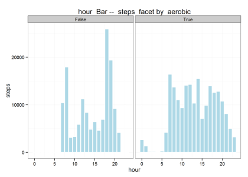
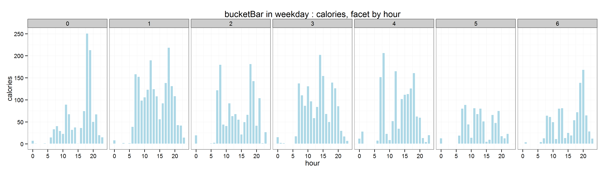
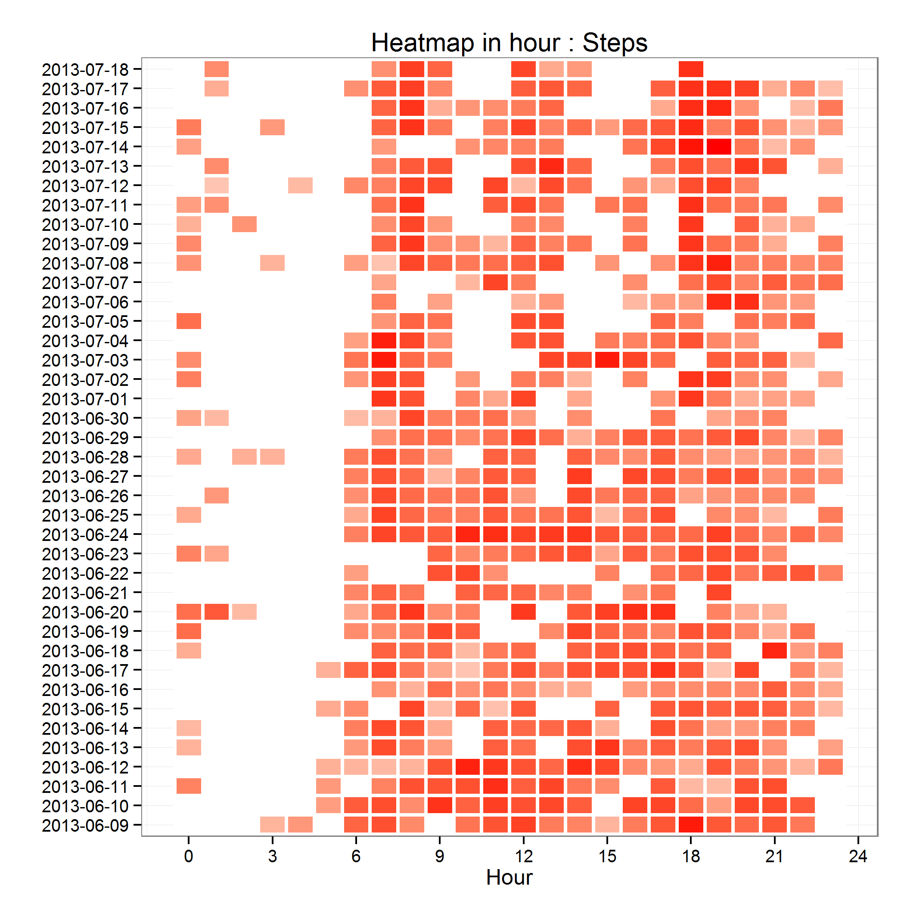

# Jawbone Up 数据的按小时统计及可视化（R 语言实现） #

---

Author : iascchen(at)gmail(dot)com

Date : 2013-07-22

新浪微博 : [@问天鼓](http://www.weibo.com/iascchen)

---

Jawbone up 应用中的 LifeLine 提供了很棒的运动和睡眠的可视化展示，并且在统计部分提供了按日、按月、按周的柱状图。（ API 详情，请参考 [获取Jawbone UP中的个人数据-非官方API](how-to-fetch-jawbone-data-unofficial-api_all.md) ）。

作为一个数据控，决不能满足任何数据瑕疵，所以利用 Python 和 R 语言，对 Jawbone Up 的运动细节数据进行了按小时的统计，并用ggplot 制作了相关的图表。

## 数据获取 ##

可以通过 `user/%userXid%/band` 获得Jawbone Up的运动细节数据，时间颗粒度为分钟。这个 API 有 start_time 和 end_time 两个参数，为 long 型时间，即从1970年以来的秒数。如果这两个参数都不填，服务器端会缺省返回当日的数据。为了获取更多的数据，可以只设置start_time, 这样就能够返回从开始时间至今的所有运动细节详情。

下面的代码采用 Python 实现，用于从服务器端获取 band 数据。

	account = { "email" : "your@email" , "passwd" : "yourpassword" }
	
	startDate = "20130609"
	sDate = time.strptime(startDate, "%Y%m%d")
	start = long( time.mktime(sDate) )
	
	device = DeviceJawboneUp ()
	
	# login
	device.get_users_login(account["email"], account["passwd"])
		
	# Band
	band = device.get_users_band( startTime = start , endTime = None )
	device.saveJsonData( filename = "/users_band_start.json" , data = band)

返回的JSON数据示例如下：

	{
	    "meta": {
	        "code": 200, 
	        "message": "OK", 
	        "user_xid": "RGaCBFg9CsDYVvm2kchbcw", 
	        "time": 1372432014
	    }, 
	    "data": {
	        "ticks": [
	            {
	                "value": {
	                    "distance": 16, 
	                    "active_time": 14, 
	                    "aerobic": true, 
	                    "calories": 0.660000026226, 
	                    "steps": 25, 
	                    "time": 1370721000, 
	                    "speed": 1.14300000668
	                }
	            }, 
	            {
	                "value": {
	                    "distance": 10, 
	                    "active_time": 6, 
	                    "aerobic": true, 
	                    "calories": 0.421000003815, 
	                    "steps": 14, 
	                    "time": 1370958720, 
	                    "speed": 1.66700005531
	                }
	            }
	        ]
	    }
	}

---

## 数据预处理 ##

R 有 RJSONIO 等包可以用于 JSON 数据的处理，不过还是不如Python方便。

下面的代码，采用 Python 实现了将 Band 数据转换成平面CSV文件。

	def list2string(list ):
        ret = ""
        for l in list:
            ret = "%s,%s" % (ret , l)
        return "%s\n" % ret[1:]

    def parseJawboneBand(path , filename ):
        fn = "%s%s.json" % ( path , filename )
        ofn = "%s.csv" % ( filename )

        input = open( fn , 'r' )
        str = input.read()
        v = json.loads(str)

        output = open( ofn , 'w' )
        ticks = v["data"]["ticks"]

        tmps = ticks[0]["value"]
        headerKeys = sorted(tmps , key=lambda tmps:tmps[0] )
        header = list2string(headerKeys)
        print header
        output.write( header )

        for tick in ticks:
            stmp = ""
            for key in headerKeys:
                stmp = "%s,%s" % ( stmp , tick["value"][ key ])

            str = "%s\n" % ( stmp[1:] )
            print str
            output.write( str )

	if __name__ == "__main__":
    	datapath = "../data/jawboneup/"
		parseJawboneBand( path = datapath , filename = "users_band_start" )

处理后的数据文件样本为：

	active_time,aerobic,calories,distance,steps,speed,time
	14,True,0.660000026226,16,25,1.14300000668,1370721000
	10,True,0.580999970436,15,21,1.5,1370721960
	16,True,0.929000020027,24,34,1.5,1370722020
	11,True,0.653999984264,17,23,1.54499995708,1370722080
	12,True,0.666000008583,17,24,1.41700005531,1370730780
	10,True,0.550000011921,14,20,1.39999997616,1370730840
	12,True,0.635999977589,16,23,1.33299994469,1370730900
	12,True,0.544000029564,13,20,1.08299994469,1370731080
	24,True,1.21099996567,30,44,1.25,1370731140

---
## 利用 R 进行数据统计和可视化 ##

下面的代码实现了数据的读取、预处理、并构建了两个相对通用的函数，按照不同时间颗粒度（小时、日、周、月、年）对某项指标进行求 sum、mean 等统计运算，并展现为柱状图（Bar）或热度图（Heatmap）

	# 设置工作路径
	setwd("D:\\PythonWorkspaces\\VisHealth\\R")
	
	# 读取 CSV 文件
	band <- read.csv("users_band_start.csv")
	band$date <- as.POSIXlt( as.POSIXct( band$time , origin='1970-1-1' ) )
	band$wday <- band$date$wday
	head(band)

数据显示样本：

	> head(band)
	  active_time aerobic calories distance steps speed       time                date wday mday hour mon
	1          14    True    0.660       16    25 1.143 1370721000 2013-06-09 03:50:00    0    9    3   6
	2          10    True    0.581       15    21 1.500 1370721960 2013-06-09 04:06:00    0    9    4   6
	3          16    True    0.929       24    34 1.500 1370722020 2013-06-09 04:07:00    0    9    4   6
	4          11    True    0.654       17    23 1.545 1370722080 2013-06-09 04:08:00    0    9    4   6
	5          12    True    0.666       17    24 1.417 1370730780 2013-06-09 06:33:00    0    9    6   6
	6          10    True    0.550       14    20 1.400 1370730840 2013-06-09 06:34:00    0    9    6   6
	
### bucketBar 的实现和使用 ###

bucketBar 实现了一个通用的按时间统计的柱状图函数，能够使用不同的时间颗粒度、采用不同的列作为数据源、用户自定义聚合计算方法，最后形成柱状图。

	# ================================
	# bucketBar
	
	# 参数说明
	# data， 所需展现的数据框
	# dateCol， 用于标识时间的列名，缺省为“date”，可以根据您的数据指定。此列的数据格式为 POSIXlt 格式日期。
	# valueCol， 需要进行统计的列名，此列的数据格式需要是数字。
	# statics， 统计分析函数方法，用于对 valueCol 进行计算，如：sum、mean、sd 等均可。
	# bucketSize， 统计的时间颗粒度，可用值为："hour" 小时,"mday" 日期,"wday" 星期,"yday" 年内日期,"mon" 月,"year" 年
	# facetCol， 按照哪列进行对比
	# islog2， 是否对数据进行 log2 操作，此参数主要用于更好的可视化符合幂律分布的数据
	# picTitle， 图标标题，缺省会根据此图标的 valueCol 等信息自动生成
	bucketBar <- function( data , dateCol = "date" , valueCol = "steps" , statics = "sum", 
		bucketSize = "hour" , facetCol = NA , islog2 = FALSE , picTitle = NA){
		require("ggplot2")
		require("reshape2")
	
		date <- data[, dateCol]
	
		# 设置统计时间颗粒度的转化
		if( bucketSize == "hour" )
			data["sumby"] <- data[, dateCol]$hour
		else if( bucketSize == "mday" )
			data["sumby"] <- data[, dateCol]$mday
		else if( bucketSize == "wday" )
			data["sumby"] <- data[, dateCol]$wday
		else if( bucketSize == "mon" )
			data["sumby"] <- data[, dateCol]$mon + 1
		else if( bucketSize == "year" )
			data["sumby"] <- data[, dateCol]$year + 1900
		else if( bucketSize == "yday" )
			data["sumby"] <- data[, dateCol]$yday
		else {
			print ( "bucketSize MUST in hour, mday , wday , yday , mon, year" )
			return 
		}
		
		# 统计计算和分类对比
		if( is.na(facetCol) )
			data.mtx <- tapply(data[ , valueCol ] , list( data$sumby ) , statics)
		else
			data.mtx <- tapply(data[ , valueCol ] , list(data[ , facetCol ] , data$sumby) , statics)
	
		data.mtx [is.na(data.mtx )]= 0
		
		# 是否对数据进行 log2 操作
		if( islog2 ){
			data.mtx[ data.mtx == 0 ] = 1
			data.mtx <- log(data.mtx , 2)
		}
	
		# print("data.mtx : ")
		# print(data.mtx)
	
		# 作图所需数据格式整理
		m <- melt( data.mtx )
		if( is.na(facetCol) )
	    	names(m) <- c( "sumby" , "values" )
	    else
	    	names(m) <- c( "facet" , "sumby" , "values" )
	
		pic <- ggplot(m, aes(x = sumby , y = values)) +
	  		geom_bar(fill='lightblue', color='white', stat='identity' , binwidth = 1) +    		
	  		theme_bw() + 
	  		xlab( bucketSize ) +
	  		ylab( valueCol )
	
	  	if( is.na(facetCol) )
	  		pic <- pic + 
	  			ggtitle( paste( bucketSize , " Bar -- " , valueCol))
	  	else
			pic <- pic + 
				facet_wrap(~facet, ncol = 7 ) + 
				ggtitle( paste(bucketSize , " Bar -- " , valueCol , " facet by " , facetCol ))
	
		if( ! is.na(picTitle) )
	  		pic <- pic + ggtitle( picTitle )
	
	  	pic
	}
	
显示按不同的时间颗粒度进行计算和可视化展现。

	pic1 <- bucketBar( band , facetCol = "aerobic" , valueCol = "step" , bucketSize = "hour")
	ggsave(plot = pic1, filename = "steps_in_hour_by_aerobic.png" , height=5 , width=7)

	pic2 <- bucketBar( band , facetCol = "wday" , valueCol = "calories" , bucketSize = "hour" , 
		picTitle = "bucketBar in weekday : calories, facet by hour")
	ggsave(plot = pic2, filename = "calories_in_hour_by_wday.png", height=4 , width=14)

	
### bucketHeatmap 的实现和使用 ###

bucketHeatmap 将以小时 Hour 为时间颗粒度，聚合所需展示的数据，并以热度图的形式展现出来。用户可以指定聚合所使用的计算方法。

	# ================================
	# bucketHeatmap
	
	# 参数说明
	# data， 所需展现的数据框
	# dateCol， 用于标识时间的列名，缺省为“date”，可以根据您的数据指定。此列的数据格式为 POSIXlt 格式日期。
	# valueCol， 需要进行统计的列名，此列的数据格式需要是数字。
	# statics， 统计分析函数方法，用于对 valueCol 进行计算，如：sum、mean、sd 等均可。	
	# islog2， 是否对数据进行 log2 操作，此参数主要用于更好的可视化符合幂律分布的数据
	# picTitle， 图标标题，缺省会根据此图标的 valueCol 等信息自动生成
	
	bucketHeatmap <- function( data , dateCol = "date" , valueCol = "steps" , statics = "sum", 
		islog2 = FALSE , picTitle = NA){
		require("ggplot2")
		require("reshape2")
	
		data["sumby"] <- data[, dateCol]$hour
		data["daystr"] <- format ( data[, dateCol] , "%Y-%m-%d")
	
		data.mtx <- tapply(data[ , valueCol ] , list( data$sumby , data$daystr ) , statics)
		data.mtx [is.na(data.mtx )]= 0
		
		if( islog2 ){
			data.mtx[ data.mtx == 0 ] = 1
			data.mtx <- log(data.mtx , 2)
		}
			
		m <- melt( data.mtx )
		names(m) <- c( "sumby" , "daystr" , "values" )
	
	  	pic <- ggplot(m, aes(x = sumby, y = daystr, fill= values)) +
	  		theme_bw() + 
	    	xlab("Hour") +
	    	ylab("") +
	    	scale_x_continuous(breaks = seq( 0, 24 , by = 3 )) +
	    	geom_tile(color="white", size= 1 ) +
	    	scale_fill_gradient(low='white', high='red' , guide="none") +
			ggtitle( paste( "Hour Heatmap -- " , valueCol))
	
		if( ! is.na(picTitle) )
	  		pic <- pic + ggtitle( picTitle )
	
	  	pic
	}
	
显示按小时的可视化展现。为了避免单日运动量特别大的日期，影响可视化展现效果，在这里，对数据使用了 log2 进行处理。

	pic4 <- bucketHeatmap( band , valueCol = "steps", picTitle = "Heatmap in hour : Steps" , islog2 = TRUE)
	ggsave(plot = pic4, filename = "steps_in_hour_by_mday_heatmap.png")

---
## 代码地址 ##

[https://github.com/iascchen/VisHealth/](https://github.com/iascchen/VisHealth/)

数据预处理 R/json2csv.py; 可视化展现 R/vischarts.R 。

---
祝各位玩的开心！