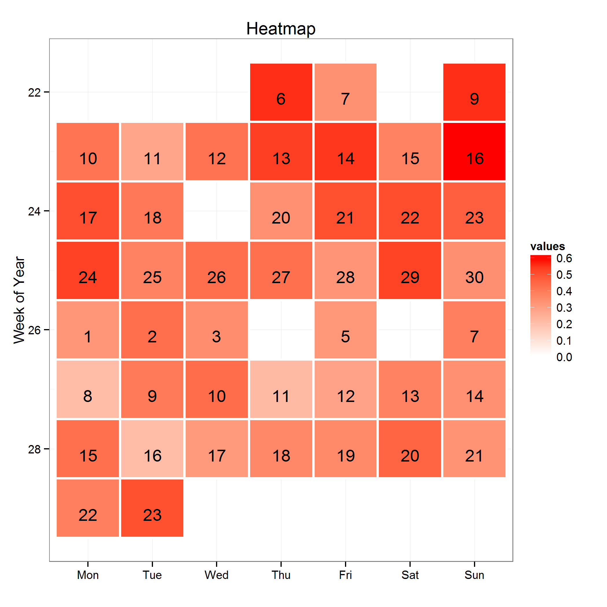
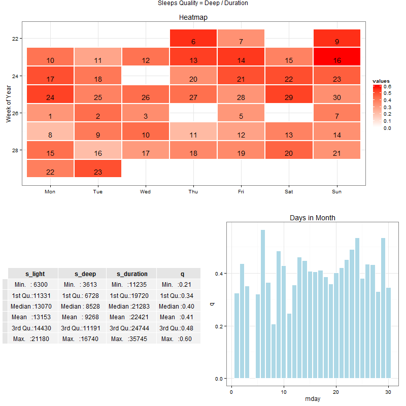

# 你睡眠情况怎么样？Jawbone Up Data， R 实现 #

身边很多朋友都对 Jawbone Up 对睡眠监控的情况很感兴趣，一般会顺带问问：

“你睡眠情况怎么样？”。

“好吧，俺计算一下再告诉你。” 

下面的文中涉及到如何用 R 画基于日历的热度图，以及如何将多个图进行合并的内容。

## 数据获取 ##

需要使用的数据是每日的睡眠情况数据。

要获取这个数据有两个办法，最简单的办法是从 Jawbone.com 网站下载个人的数据文件。详情参见[个人数据官方下载](how-to-fetch-jawbone-data-from-official-site.md) 。

还有一种办法是利用 [非官方API](how-to-fetch-jawbone-data-unofficial-api_all.md) 中的 `user/%userXid%/trends` 方法获取按日统计数据。

下面的代码采用 Python 实现，用于从服务器端获取 Trends 数据。

	account = { "email" : "your@email" , "passwd" : "yourpassword" }
	
	device = DeviceJawboneUp ()
	
	# login
	device.get_users_login(account["email"], account["passwd"])
		
	# Trends
    daytrends = device.get_users_trends( endDate =  None , inRange = "d" , bucketSize = "d"  )
    device.saveJsonData( filename = "/users_trends-day.json" , data = daytrends)

返回的JSON数据示例如下：

	{
	    "meta": {
	        "code": 200, 
	        "message": "OK", 
	        "user_xid": "RGaCBFg9CsDYVvm2xxxxxx", 
	        "time": 1374161411
	    }, 
	    "data": {
	        "earliest": 20130605, 
	        "data": [
	            [
	                20130605, 
	                {
	                    "e_protein": null, 
	                    "weight": 57.0, 
	                    "m_distance": 270.0, 
	                    "s_awakenings": null, 
	                    "height": 1.58, 
	                    "m_lcat": 88.0, 
	                    "n_awakenings": null, 
	                    "s_quality": null, 
	                    "n_deep": null, 
	                    "m_steps": 367.0, 
	                    "e_cholesterol": null, 
	                    "s_light": null, 
	                    "s_deep": null, 
	                    "s_bedtime": null, 
	                    "n_bedtime": null, 
	                    "m_workout_time": 0.0, 
	                    "e_calcium": null, 
	                    "e_sat_fat": null, 
	                    "n_duration": null, 
	                    "n_light": null, 
	                    "e_calories": null, 
	                    "pal": null, 
	                    "m_lcit": 0.0, 
	                    "s_awake_time": null, 
	                    "e_unsat_fat": null, 
	                    "m_calories": 12.3110000491, 
	                    "bmr": 1319.38485068, 
	                    "m_total_calories": 1331.69585073, 
	                    "e_sugar": null, 
	                    "e_sodium": null, 
	                    "s_awake": null, 
	                    "s_asleep_time": null, 
	                    "s_duration": null, 
	                    "gender": 1.0, 
	                    "age": 37.0136986301, 
	                    "e_carbs": null, 
	                    "e_fiber": null, 
	                    "n_quality": null, 
	                    "n_awake_time": null, 
	                    "n_awake": null, 
	                    "n_asleep_time": null, 
	                    "m_active_time": 201.0
	                }
	            ]
	        ], 
	        "links": {
	            "next": "/nudge/api/v.1.34/users/RGaCBFg9CsDYVvm2kchbcw/trends/?end_date=20110724&range=d&range_duration=730&bucket_size=d"
	        }
	    }
	}

---

## 数据预处理 ##

下面的代码，采用 Python 实现了将 Trends 数据转换成平面CSV文件。

	def list2string(list ):
        ret = ""
        for l in list:
            ret = "%s,%s" % (ret , l)
        return "%s\n" % ret[1:]

    def parseJawboneTrends(self , path , filename ):
        fn = "%s%s.json" % ( path , filename )
        ofn = "%s.csv" % ( filename )

        input = open( fn , 'r' )
        str = input.read()
        v = json.loads(str)

        output = open( ofn , 'w' )
        datas = v["data"]["data"]

        tmps = datas[0][1]
        headerKeys = sorted(tmps , key=lambda tmps:tmps[0] )
        header = "datestr,%s" % self.list2string(headerKeys)
        print header
        output.write( header )

        for d in datas:
            tmps = d[1]
            stmp = ""
            for key in headerKeys:
                stmp = "%s,%s" % ( stmp , tmps[ key ])

            str = "%s,%s\n" % (d[0] ,  stmp[1:])
            print str
            output.write( str )

        input.close()
        output.close()

	if __name__ == "__main__":
    	datapath = "../data/jawboneup/"
		parseJawboneTrends( path = datapath , filename = "users_trends-day" )

处理后的数据文件样本为：

	datestr,age,bmr,e_protein,e_calories,e_cholesterol,e_sat_fat,e_calcium,e_unsat_fat,e_sugar,e_sodium,e_carbs,e_fiber,gender,height,m_distance,m_lcat,m_workout_time,m_lcit,m_active_time,m_calories,m_total_calories,m_steps,n_awakenings,n_deep,n_bedtime,n_duration,n_light,n_quality,n_awake_time,n_awake,n_asleep_time,pal,s_awakenings,s_quality,s_light,s_deep,s_bedtime,s_awake_time,s_awake,s_asleep_time,s_duration,weight
	20130605,37.0136986301,1319.38485068,None,None,None,None,None,None,None,None,None,None,1.0,1.58,270.0,88.0,0.0,0.0,201.0,12.3110000491,1331.69585073,367.0,None,None,None,None,None,None,None,None,None,None,None,None,None,None,None,None,None,None,None,57.0
	20130606,37.0164383562,1319.37204082,None,None,None,None,None,None,None,None,None,None,1.0,1.58,8561.0,1129.0,0.0,3480.0,6412.0,336.044000283,1655.4160411,12339.0,None,None,None,None,None,None,None,None,None,None,0.0,71.0,8742.0,11409.0,14.0,374.0,2082.0,41.0,20151.0,57.0
	20130607,37.0191780822,1319.35923096,None,None,None,None,None,None,None,None,None,None,1.0,1.58,8818.0,1450.0,0.0,3660.0,7040.0,346.185998712,1665.54522967,13030.0,0.0,2580.0,1317.0,5342.0,2762.0,18.0,1422.0,1052.0,1333.0,None,2.0,64.0,14160.0,7225.0,1418.0,378.0,3297.0,1429.0,21385.0,57.0
	20130608,37.0219178082,1319.3464211,None,None,None,None,None,None,None,None,None,None,1.0,1.58,4644.0,645.0,0.0,5640.0,3472.0,183.414000019,1502.76042111,6693.0,None,None,None,None,None,None,None,None,None,None,0.0,0.0,0.0,0.0,1410.0,390.0,0.0,1410.0,25200.0,57.0
	20130609,37.0246575342,1319.33361123,15.3100000619,232.0,460.0,4.5640001595,70.0,9.69599956274,0.939999982715,663.0,4.76000010967,0.300000011921,1.0,1.58,7965.0,1662.0,1800.0,7260.0,7917.0,375.598999478,1694.93261071,11611.0,None,None,None,None,None,None,None,None,None,None,2.0,99.0,12406.0,16136.0,1317.0,372.0,2189.0,1321.0,28542.0,57.0

---
## 利用 R 进行数据统计和可视化 ##

下面的代码实现了数据的读取、预处理、并构建了基于日历的热度图（calendarHeatmap）

	# 设置工作路径
	setwd("D:\\PythonWorkspaces\\VisHealth\\R")
	
	# 读取 CSV 文件
	trends.daily <- read.csv("users_trends-day.csv" , as.is=TRUE)

	# 仅选取所需的数据列
	names( trends.daily )
	sleeps <- trends.daily[ , c( "datestr" , "s_light" , "s_deep" , "s_duration" ) ]

	# 数据清洗
	sleeps.clean <- subset( sleeps , ! (is.na( s_duration ) | is.na( s_deep ) | ( s_duration == 0) 
		| ( s_deep == 0) | ( s_deep == "None" ) | ( s_duration == "None" ) ) )

	# 格式转换
	sleeps.clean$s_light <- as.numeric( sleeps.clean$s_light )
	sleeps.clean$s_deep <- as.numeric( sleeps.clean$s_deep )
	sleeps.clean$s_duration <- as.numeric( sleeps.clean$s_duration )
	
	# 去掉忘记切换睡眠模式的数据
	sleeps.clean <- subset( sleeps.clean , s_light > 0.1  )

	# 睡眠质量取值 = 深度睡眠时长 / 完整睡眠时长
	sleeps.clean$q <- sleeps.clean$s_deep / sleeps.clean$s_duration	

	# 设置做图所需的日期变量
	sleeps.clean$date <- strptime ( sleeps.clean$datestr , format="%Y%m%d" )

数据显示样本：

	> head(sleeps.clean , 10)
	    datestr s_light s_deep s_duration         q       date
	2  20130606    8742  11409      20151 0.5661754 2013-06-06
	3  20130607   14160   7225      21385 0.3378536 2013-06-07
	5  20130609   12406  16136      28542 0.5653423 2013-06-09
	6  20130610   13966  10080      24046 0.4191965 2013-06-10
	7  20130611   11393   4408      15801 0.2789697 2013-06-11
	8  20130612   20652  15093      35745 0.4222409 2013-06-12
	9  20130613    9480  11118      20598 0.5397611 2013-06-13
	10 20130614    8840  10967      19807 0.5536931 2013-06-14

	> summary( sleeps.clean[,2:5] )
	    s_light          s_deep        s_duration          q         
	 Min.   : 6300   Min.   : 3613   Min.   :11235   Min.   :0.2052  
	 1st Qu.:11331   1st Qu.: 6728   1st Qu.:19720   1st Qu.:0.3420  
	 Median :13070   Median : 8528   Median :21283   Median :0.3982  
	 Mean   :13153   Mean   : 9268   Mean   :22421   Mean   :0.4065  
	 3rd Qu.:14430   3rd Qu.:11191   3rd Qu.:24744   3rd Qu.:0.4814  
	 Max.   :21180   Max.   :16740   Max.   :35745   Max.   :0.6042  
		
### calendarHeatmap 的实现和使用 ###

calendarHeatmap 将按日聚合数据以热度图的形式展现在日历上。用户可以指定聚合所使用的计算方法。
	
	labelMon <- c("JAN","FEB","MAR","APR","MAY","JUN","JUL", "AUG","SEP","OCT","NOV","DEC")
	# labelMon <- c("一月","二月","三月","四月","五月","六月","七月", "八月","九月","十月","十一月","十二月")
	labelWeek <- c("Mon", "Tue", "Wed", "Thu", "Fri", "Sat" , "Sun")
	# labelWeek <- c("周一","周二","周三","周四","周五","周六","周日")

	# ================================
	# calander heatmap
	# 参数说明
	# data， 所需展现的数据框
	# dateCol， 用于标识时间的列名，缺省为“date”，可以根据您的数据指定。此列的数据格式为 POSIXlt 格式日期。
	# valueCol， 需要进行统计的列名，此列的数据格式需要是数字。
	# statics， 统计分析函数方法，用于对 valueCol 进行计算，如：sum、mean、sd 等均可。	
	# islog2， 是否对数据进行 log2 操作，此参数主要用于更好的可视化符合幂律分布的数据
	# picTitle， 图标标题，缺省会根据此图标的 valueCol 等信息自动生成
	# isguide， 是否显示图例
		
	calendarHeatmap <- function( data , dateCol = "date" , valueCol = "steps" , statics = "sum",
		islog2 = FALSE , picTitle = NA , isguide = FALSE ){
		require("ggplot2")
		require("reshape2")
	
		data["daystr"] <- format ( data[, dateCol] , "%Y-%m-%d")
	
		data.mtx <- tapply(data[ , valueCol ] , list( data$daystr ) , statics)
		data.mtx [is.na(data.mtx )]= 0
		
		if( islog2 ){
			data.mtx[ data.mtx == 0 ] = 1
			data.mtx <- log(data.mtx , 2)
		}
	
		m <- melt( data.mtx )
		names(m) <- c( "daystr" , "values" )
	
		m$date <- strptime ( m$daystr , format="%Y-%m-%d" )
	
		m$mday = m$date$mday
	
		m$month <- m$date$mon + 1
		m$monthf <- factor(m$month , levels=as.character(1:12), labels=labelMon, ordered=TRUE)
	
		m$weekday = m$date$wday
		m$weekday[ m$weekday == 0 ] = 7
		m$weekdayf <- factor( m$weekday ,levels=c(1:7), labels=labelWeek,ordered=TRUE)
	
		m$week <-  as.numeric(format( m$date ,"%W"))
	
		print(head(m))
	
	  	pic <- ggplot(m, aes( weekdayf, week, fill = values)) +
	  		geom_tile(color="white", size= 1 ) +
	  		# facet_wrap(~ monthf ,nrow=3) +
	  		theme_bw() + 
	  		xlab("") +
	  		ylab("Week of Year") +
			scale_y_reverse() +
	    	geom_text(aes(label = round( mday , 2 ) ) , vjust = 1)
	
	    if( isguide )
	      	pic <- pic + scale_fill_gradient(limits=c(0, max(m$values)), low='white', high='red')
	    else
	        pic <- pic + scale_fill_gradient(limits=c(0, max(m$values)), low='white', high='red' , guide="none")
	
		if( ! is.na(picTitle) )
	  		pic <- pic + ggtitle( picTitle )
	
	  	pic
	}
	
对每日睡眠质量的可视化展现。

	pic8 <- calendarHeatmap(  sleeps.clean , valueCol = "q", picTitle = "Heatmap" , islog2 = FALSE , isguide = TRUE)
	ggsave(plot = pic8, filename = "sleep_q_calendarheatmap.png")

### 多图合并 ###

将睡眠质量的柱状图(参见[Jawbone Up 数据的按小时统计及可视化](visualize_hours_summary_of_jawbone_up_In_R.md))、数据Summary，和基于日历的热度图合并在一张图上，以更全面的描述睡眠质量：

	library(gridExtra) 
	g1 <- tableGrob(summary( sleeps.clean[,2:5], digits = 2 ))
	
	pic7 <- bucketBar( sleeps.clean , valueCol = "q" , bucketSize = "mday", statics = "mean" , picTitle = "Days in Month")
	g2 <- arrangeGrob(g1, pic7, ncol=2)
	
	png(file = "sleep_q_all.png", bg = "transparent" , width = 800, height = 800, units = "px")
		grid.arrange(pic8, g2,  ncol=1, main="Sleeps")
	dev.off()

---
## 代码地址 ##

[https://github.com/iascchen/VisHealth/](https://github.com/iascchen/VisHealth/)

数据预处理 R/json2csv.py; 可视化展现 R/vischarts.R 。

---

玩的开心！

---

Author : iascchen(at)gmail(dot)com

Date : 2013-08-05

新浪微博 : [@问天鼓](http://www.weibo.com/iascchen)

---